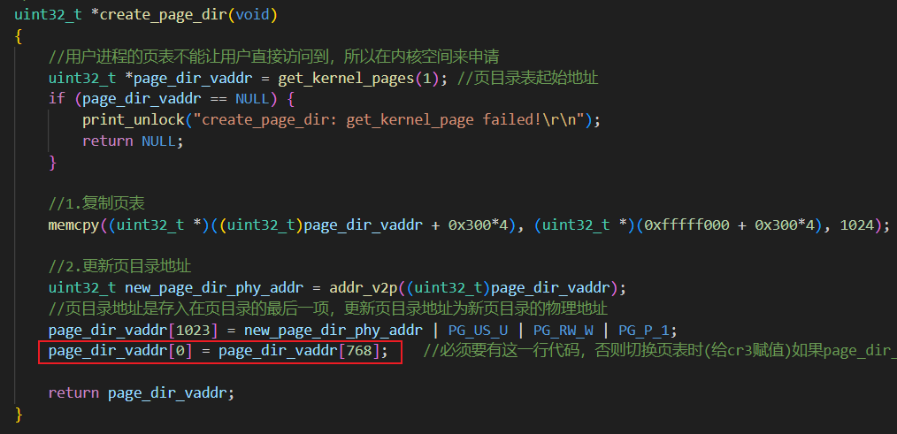

# 1. 中断上下文恢复问题
对应源代码 sha:22bddd2a
## 问题现象
在中断前保存各寄存器，处理完中断函数后，恢复各寄存器时，当执行到 pop ds 这条指令时整个系统重启。比如键盘中断中，只能响应第一次按键中断，如果再按一次按键则直接系统重启；

具体中断中的代码如下：

```
%macro INTERRUPT_HANDLER 2
interrupt_handler_%1:
    %2
    ;以下是保存上下文环境
    push ds
    push es
    push fs
    push gs
    pushad

    ;如果是从片上进入的中断，除了往从片上发送EOI外，主片上也要发送EOI
    mov al, 0x20 ;中断结束命令EOI
    out 0xa0, al ;向从片发送
    out 0x20, al ;向主片发送

    push %1
    call [intr_table + %1*4]

    ;以下是恢复上下文环境
    add esp, 4 ;这里平4个字节的栈是为了让pushad和popad能成对使用，因为在pushad和popad中间多push %1（多压4字节）
    popad
    pop gs
    pop fs
    pop es
    pop ds
    add esp, 4 ;手动跳过错误码
    iret
%endmacro
```

上面的宏调用方式形如：

```
INTERRUPT_HANDLER 0x08, ERROR_CODE; double fault
INTERRUPT_HANDLER 0x09, ZERO; coprocessor segment overrun
```

其中 ERROR_CODE，ZERO 宏定义如下：

```
%define ERROR_CODE nop;不可屏蔽中断发生时如果CPU压入了错误码，则这里什么也不做
%define ZERO push 0;中断发生时若CPU未压入错误码，则这里我们手动压入一个假的错误码来占位
```

## 问题解决
询问GPT，得到如下思路：

> 在x86架构下，在中断处理函数（Interrupt Service Routine，ISR）执行完毕后进行上下文恢复是很重要的，因为中断处理函数会对一些寄存器进行修改，而这些寄存器在中断处理函数执行完毕后需要被还原回原始状态，以确保程序正确执行。
> 
> 问题可能出在 `%macro INTERRUPT_HANDLER 2` 宏展开的代码中的 `pop ds` 指令。在 x86 架构下，`pop ds` 指令会从栈中弹出一个字（16位数据）并将其值加载到 `ds` 寄存器中。由于这个指令可能导致数据和代码段寄存器不正确地设置，从而导致系统异常。
> 
> 有几种可能的原因导致中断处理函数执行完毕后进行上下文恢复时整个系统重启：
> 1. **中断处理函数修改了段寄存器的值**：如果中断处理函数在执行过程中修改了 `ds` 寄存器的值，那么在进行上下文恢复时，`pop ds` 指令会将栈中的值加载到 `ds` 寄存器，如果该值是非法的段选择子，就会导致系统异常，进而重启。
> 2. **中断处理函数改变了栈指针（ESP）的值**：如果中断处理函数修改了栈指针 `esp` 的值，并且在上下文恢复时没有正确地恢复回原始值，那么会导致栈的混乱，可能会导致系统异常和重启。
> 3. **栈溢出**：如果在中断处理函数或其他代码中发生了栈溢出，可能会破坏栈帧和中断处理过程中的关键数据，导致系统重启。
> 
> 为了解决这个问题，需要仔细检查中断处理函数的代码，并确保在执行完中断处理函数后，正确地恢复 `ds` 寄存器和其他相关的寄存器值，以及不发生栈溢出。还可以使用调试工具来定位问题并进行调试。

经过一段时间的调试，发现修改如下代码可以解决。

在 setup.asm 文件中，turn_on_page 函数中，问题代码如下：

```
;开启分页机制
turn_on_page:
    ;先保存未开启分页机制下的gdt表
    sgdt [gdt_ptr]
    ;获取到gdt表在内存中的起始地址，低2字节是GDT界限，所以要加2
    mov ebx, [gdt_ptr + 2]

    ;GDT的第0项为全0,跳过不修改，所以esi从1开始
    mov esi, 1
    mov cx, 3
.modify_gdt_item_base:
    ;修改GDT中每项的段基址，即从0xc000000开始
    ;esi*8代表GDT表中的每一项占8B
    ;+4代表偏移到GDT表中每项的高4个字节
    or dword [ebx + esi*8 + 4], 0xc0000000
    inc esi
    loop .modify_gdt_item_base

    ;修改gdt在内存中的起始地址
    add dword [gdt_ptr + 2], 0xc0000000
    ;记得同时修改栈顶指针
    add esp, 0xc0000000

    ;设置页目录表基地址
    mov eax, PAGE_DIR_TABLE_POS
    mov cr3, eax
    ;设置cr0的最高位为1开启分页机制
    mov eax, cr0
    or eax, 0x80000000
    mov cr0, eax

    lgdt [gdt_ptr]
    ret
```

在看 turn_on_page 函数前，先看下现有的 GDT 表，如下：

```
GDT_BASE:
    db 0, 0, 0, 0, 0, 0, 0, 0
GDT_CODE:
    db 0xFF, 0xFF, 0x00, 0x00, 0x00, 0x98, 0xCF, 0x00
GDT_DATA:
    db 0xFF, 0xFF, 0x00, 0x00, 0x00, 0x92, 0xCF, 0x00
GDT_B8000:
    ;段基址为0xB8000，段界限为0x7FFF，粒度为1B，非系统段(数据段，只读)
    db 0xFF, 0x7F, 0x00, 0x80, 0x0B, 0x92, 0x40, 0x00
```

turn_on_page 函数中，有一段函数的目的是修改上面三个GDT表中的段基址，在段基址的基础上加上0xc0000000；但实际发现只有 GDT_CODE 和 GDT_DATA 这两个表中的段基址加上了 0xc0000000，而 GDT_B8000 的段基址还是 0xb8000，并没有加上 0xc000000。不知道为什么。

把 turn_on_page 函数中如下代码删除了就解决问题了：

```
    ;获取到gdt表在内存中的起始地址，低2字节是GDT界限，所以要加2
    mov ebx, [gdt_ptr + 2]
    ;GDT的第0项为全0,跳过不修改，所以esi从1开始
    mov esi, 1
    mov cx, 3
.modify_gdt_item_base:
    ;修改GDT中每项的段基址，即从0xc000000开始
    ;esi*8代表GDT表中的每一项占8B
    ;+4代表偏移到GDT表中每项的高4个字节
    or dword [ebx + esi*8 + 4], 0xc0000000
    inc esi
    loop .modify_gdt_item_base
```

## 疑问
1. 为什么GDT表中每一项(除第0项)的段基址加上0xc0000000后，在中断恢复上下文时就会失败？
2. 为什么GDT表中的GDT_CODE和GDT_DATA的段基址可以加上0xc0000000，而GDT_B8000这个段基址则加0xc0000000后无变化？

# 2. ORG .data .text 伪指令理解
## 问题现象
在 setup.asm 文件中，使用 [ORG 0x500] 目的是为了让后面的汇编代码依次排布到 0x500 为起始地址的内存处。在 setup.asm 文件的起始外就定义了 GDT 表，但问题是 GDT 表的起始地址并不是 0x500，实际测试 GDT 表的起始地址是 0x67C。

```
[ORG 0x500]

[SECTION .data]
; 略... 一堆宏定义equ, 不占用内存空间
ARDS_NR dw 0
CHECK_BUFFER_OFFER dw 0
; 略... 一堆宏定义equ, 不占用内存空间

;构建GDT表
GDT_BASE:
    db 0, 0, 0, 0, 0, 0, 0, 0
GDT_CODE:
    db 0xFF, 0xFF, 0x00, 0x00, 0x00, 0x98, 0xCF, 0x00
GDT_DATA:
    db 0xFF, 0xFF, 0x00, 0x00, 0x00, 0x92, 0xCF, 0x00
GDT_B8000:
    ;段基址为0xB8000，段界限为0x7FFF，粒度为1B，非系统段(数据段，只读)
    db 0xFF, 0x7F, 0x00, 0x80, 0x0B, 0x92, 0x40, 0x00

GDT_SIZE equ $ - GDT_BASE
GDT_LIMIT equ GDT_SIZE - 1

;gdt指针，前2字节是gdt界限，后4字节是gdt起始地址
gdt_ptr:
    dw GDT_LIMIT
    dd GDT_BASE

; ....略
```

上面代码中，我把 ARDS_NR， CHECK_BUFFER_OFFER 定义的4个字节放在 gdt_ptr 标号后面，如下所示：

```
[ORG 0x500]

[SECTION .data]
; 略... 一堆宏定义equ, 不占用内存空间

; 略... 一堆宏定义equ, 不占用内存空间

;构建GDT表
GDT_BASE:
    db 0, 0, 0, 0, 0, 0, 0, 0
GDT_CODE:
    db 0xFF, 0xFF, 0x00, 0x00, 0x00, 0x98, 0xCF, 0x00
GDT_DATA:
    db 0xFF, 0xFF, 0x00, 0x00, 0x00, 0x92, 0xCF, 0x00
GDT_B8000:
    ;段基址为0xB8000，段界限为0x7FFF，粒度为1B，非系统段(数据段，只读)
    db 0xFF, 0x7F, 0x00, 0x80, 0x0B, 0x92, 0x40, 0x00

GDT_SIZE equ $ - GDT_BASE
GDT_LIMIT equ GDT_SIZE - 1

;gdt指针，前2字节是gdt界限，后4字节是gdt起始地址
gdt_ptr:
    dw GDT_LIMIT
    dd GDT_BASE

ARDS_NR dw 0
CHECK_BUFFER_OFFER dw 0

; ....略
```

因为 ARDS_NR， CHECK_BUFFER_OFFER 占用了4个字节，实际查看 GDT 表的起始地址确实由 0x0x67C 变成了 0x678。但目前还不明白 GDT 表的起始地址为什么不是 0x500。

## 解惑
实际使用 bochs 调试发现，如果使用 [SECTION .data] 修饰后该数据段会被放到 [SECTION .text] 之后；所以在 boot.asm 中使用 jmp 0x500 可以直接跳转到 setup.asm 中 [SECTION .text] 定义的第一行代码处。

但是如果不使用[SECTION .data]的话，那GDT表中的数据也会被CPU当成指令处理，导致程序运行出错，所以要跳过GDT表，这样的话只能在 boot.asm 中的 jmp 0x500 处做个手脚，修改成 jmp 0x500+0x2a 即可。0x2a = 8*4(4个GDT表项，每项8个字节) + 2+4(GDT表结构) + 2 + 2(定义的ARDS_NR和CHECK_BUFFER_OFFER)

修改之前的代码请参考 sha:22bddd2a；修改后的代码请参考 sha:13a98ac4

# 3. 切换用户进程时导致系统重启
具体问题为：切换用户进程时需要更新页表，即重新设置CR3寄存器，但是只要重新设置CR3寄存器时系统就会重启。BOCHS报错信息如下：

```
 exception(): 3rd (14) exception with no resolution, shutdown status is 00h, resetting
```

经过分析，原因是加载CR3的页目录表处于缺页状态，导致产生page fault。

对应代码 sha:e7062d14



page_dir_vaddr 的首地址就是后面要设置到 CR3 寄存器中的值，此时page_dir_vaddr[0]是全0，直接设置到CR3中就会导致系统重启，所以需要加入上图红框的那一行，把page_dir_vaddr的第一项指向页表1的首地址。

