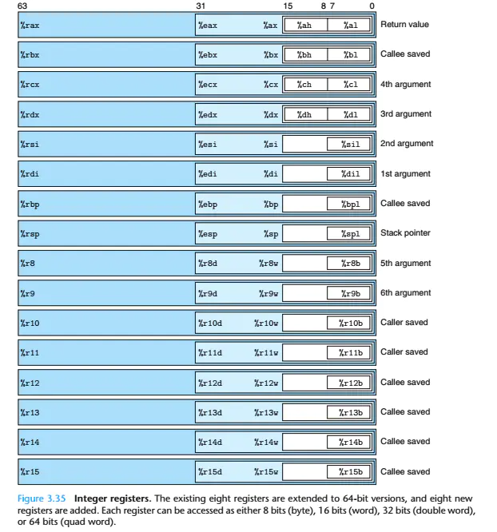
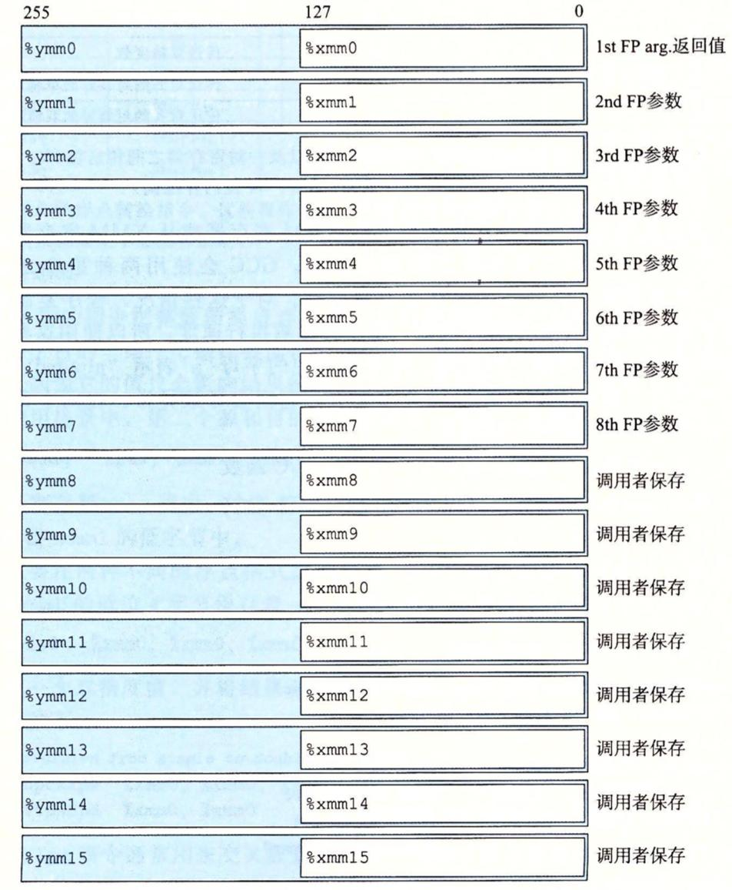
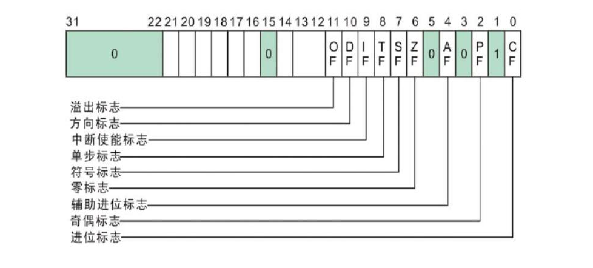
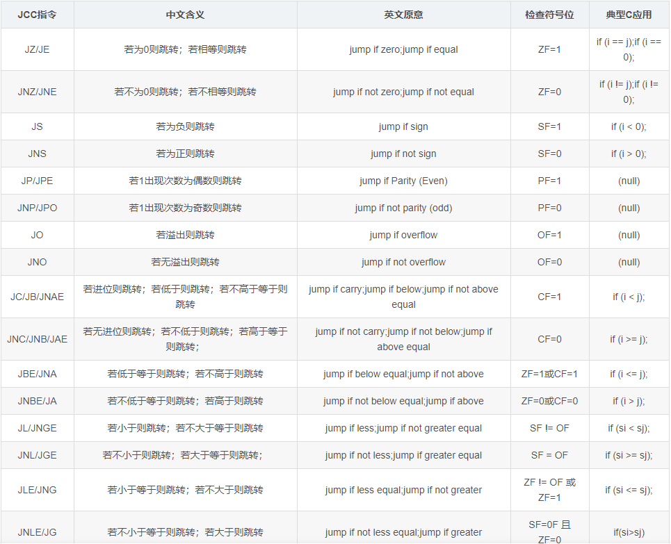

# 背景
x86为32位CPU，x64为64位CPU

# 汇编风格
目前对于复杂指令集(CISC)来说，有三种汇编风格：
```
MASM：  Windows系统下默认的汇编风格，文件后缀名.asm
NASM:   主要对MASM做了优化，比如大小写敏感，主要用于Linux平台, 文件后缀名.asm
ATT:    Linux系统下默认的汇编风格, 文件后缀名.s
```

区别如下：
```
寄存器赋值
NASM风格：
    mov eax, 1
ATT风格：
    mov $1, %eax
可见：ATT风格比较麻烦，立即数前必须加 $ 符号，寄存器前必须加 % 符号，且赋值左右方向相反。
```

还有很多区别，可自行百度。

# 数据宽度
CPU寻址能力经历从16位 -> 32位 -> 64位，导致寄存器兼容16位、32位、64位。

**注意，CPU运行一个程序，一般是从内存中将数据计入合适的寄存器，在寄存器中计算好结果，然后再将结果回写到内存中。**

每个寄存器的常见用途如下：

- rax: 一般存储函数返回值
- rcx: 一般记录重复指令的重复次数，还有一个很重要的用途：在C++中，存储的是this指针。
- rpb: 存储的是栈底地址，rsp: 存储的是栈顶地址，中间的区域就是当前线程执行的这个函数能够使用的栈空间，JVM又称栈帧。

CPU 的通用寄存器如下：



# 浮点寄存器
浮点运算时不是使用通用寄存器，而是使用专用的浮点寄存器，如下：



# eflags 寄存器
这是一个很特殊的寄存器，没有指令能够直接操作这个寄存器，是CPU根据指令的执行结果，自动更新这个寄存器的内容。



标志位|说明
|:--|:--|
CF|进位位；如果运算结果的最高位产生一个进位或者借位，则CF置1，否则CF清零
PF|奇偶位；如果运算结果低8位中"1"的个数为偶数时，则PF置1，否则PF清零
AF|辅助进位位；反应运算结果低四位产生进位或借位的情况
ZF|零值位；如果运算结果为零则ZF置1，否则清零
SF|符号位；如果运算结果为负，即一个数的最高位为1，则SF置1，否则SF清零
OF|溢出位；若运算结果超出补码表示范围(8位：-128\~127；16位：-32768\~32767)。若溢出OF置1，否则清零
TF|单步标志位；用于程序跟踪调试。当TF=1，CPU进入单步方式
IF|中断允许位，当IF=1时，CPU为开中断；当IF=0时，CPU为关中断
DF|方向位

# JCC 指令
任何语言的底层，循环结构及条件判断，都是基于cflags寄存+JCC指令实现的。



# 条件判断 
cmp

```
本质上做减法运算
cmp eax,10 等价于 sub eax,10
差别是 cmp 的运算结果只会更改 eflags 寄存器，不会修改 eax 寄存器的值
通常配合 JCC 指令使用以实现条件跳转
```

test

```
本质上做与运算
test eax,10 等价于 and eax,10
差别在于 test 的运算结果只会更改 eflags 寄存器，不会修改 eax 寄存器的值
通常配合 JCC 指令使用以实现条件跳转
```