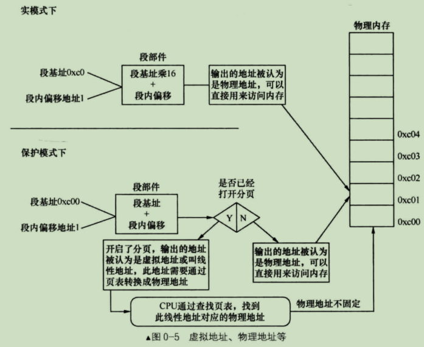

# 操作系统是如何运行起来的？
在主板上电的那一刻，cs:ip 会被强制赋值成 F000:FFF0，而物理内存的 FFFF0 的地址处保存的是一条指令，该指令为 jmp F000:E05B; 所以此时 CPU 会运行 FE05B 地址处的指令，该地址处保存的正在 BIOS 系统。

BIOS 系统主要工作为：

- 检测内存、显卡等外设信息
- 初始化硬件
- 在内存 0x000 ~ 0x3FF 处建立中断向量表IVT，并填写中断例程
- 检验启动盘的0盘0磁道1扇区的最后两个字节是否是 0x55 和 0xaa，如果是，则是 MBR 程序，则搬移 MBR 程序到 0x7C00 处，然后设置 cs:ip 的值为 0:7c00
- BIOS使命完成，退出

此时，CPU 会跳转到 7C00 地址处开始运行。该地址处的 512B 保存的正是 MBR 程序，MBR 程序此时会加载操作系统内核，然后将 CPU 的控制权交由操作系统内核，至此操作系统接管 CPU 控制权。


## 解惑
- CPU 在刚上电时是处于实模式，实模式下总线宽度为 20位，所以最大寻址空间为 2^20^ = 1MB。下图是实模式下的 1MB 的内存空间布局。


- 当操作系统运行起来时，才会把CPU的模式由实模式切换到保护模式
- 实模式下的寻址方式为 "段基址 + 段内偏移地址"经过段部件的处理，输出的地址就是实际内存的**物理地址**；而在保护模式下，"段基址 + 段内偏移地址"称为线性地址，若没有开启地址分页功能，此线性地址就被作物理地址来用，可直接访问内存 若开启了分页功能，此线性地址又多了个名字，就是虚拟地址。虚拟地址、线性地址在分页机制下都是一回事） 虚拟地址要经过 CPU 页部件转换成具体的物理地址，这样 CPU 才能将其送上地址总线去访问内存。如下图：



- BIOS 也是一段代码，其保存在一块 ROM 中，掉电不丢失，是由硬件厂商出厂前烧录进去的，一般情况下不需要更新。此 ROM 被映射在低端 1MB 内存的顶部，即地址 0xF0000 ~ 0xFFFFF 处(见表2-1)。只要访问此时的地址便是访问 BIOS 了，这个映射是由硬件完成的。

# 常用的 BIOS 中断
- 向屏幕输出： int 0x10
- 读写软盘 int 0x13
- 系统调用 int 0x80

## int 0x10
int 0x10 的功能相当复杂，可参考如下文章：

[https://blog.csdn.net/qq_40169767/article/details/101511805](https://blog.csdn.net/qq_40169767/article/details/101511805)

# 自己实现 MBR 并向屏幕输出 hello,world
要想让 CPU 运行我们自己实现的 MBR 程序，只需要把我们实现的程序放置在硬盘的0盘0磁道1扇区处，这样 CPU 上电后，先会运行 F000:FFF0 地址处的指令，然后跳转到 F000:E05B 地址处运行 BIOS 系统，然后 BIOS 把我们写的程序搬移到 0x7c00 处，然后跳转到 0x7c00 处运行我们的程序。输出 hello,world 程序如下：

```
; 文件名为 boot.asm
[ORG  0x7c00]

[SECTION .text]
[BITS 16]
global _start
_start:
    ; 设置屏幕模式为文本模式，清除屏幕
    mov ax, 3
    int 0x10

    mov     ax, 0
    mov     ss, ax
    mov     ds, ax
    mov     es, ax
    mov     fs, ax
    mov     gs, ax
    mov     si, ax

    mov     si, msg
    call    print

    jmp     $

; 如何调用
; mov     si, msg   ; 1 传入字符串
; call    print     ; 2 调用
; 函数原型：print(register si)
print:
    mov ah, 0x0e
    mov bh, 0
    mov bl, 0x01
.loop:
    mov al, [si]
    cmp al, 0
    jz .done
    int 0x10

    inc si
    jmp .loop
.done:
    ret

msg:
    db "hello, world", 10, 13, 0

;clear zero
times 510 - ($ - $$) db 0
dw 0xaa55
```

然后使用如下命令编译：

```
nasm boot.asm -o boot.bin
```

好的，现在有 boot.bin 了，但是又有一个问题，就是如何把 boot.bin 写到硬盘的 0盘0磁道1扇区勒。这里介绍 Linux 下的一个命令：**dd**。 先看一下基本参数：

```
if=FILE :此项是指定要读取的文件
of=FILE :此项是指定把数据输出到哪个文件
bs=BYTES    :此项指定块的大小，dd是以块为单位来进行IO操作的，得告诉dd一块是多少字节。
            也可以单独配置输入块大小ibs 和输出块大小obs
count=BLOCKS    :此项是指定拷贝的块数
seek=BLOCKS     :此项是指定当我们把块输出到文件时想要跳过多少个块
conv=CONVS      :此项是指定如何转换文件。在追加数据时，conv最好用 notrunc方式，也就是不打断文件。
```

使用如下命令将 boot.bin 写入到磁盘：

```
dd if=/your_path/boot.bin of=/your_path/bochs/hd60m.img bs=512 count=1 conv=notrunc
```

其中 your_path 替换为自己的实际路径；hd60m.img 为bochs虚拟出来的硬盘。由于我们想写入第0块，所以没用 seek 指定跳过的块数。


# NASM 脚本
- ORG 有点类似于基址，后面计算偏移都是以 ORG 后面的值为起点进行运算；因为该程序会被 BIOS 搬移到 0x7c00 处运行，所以这里的基址也要写为 0x7c00，保证地址一致。
- SECTION 定义一个段
- BITS 告诉编译器，这个段的代码以多少位汇编进行编译
- \$ 当前指令位置。通过 jmp $ 实现汇编层面的死循环
- \$\$ 所在段的起始地址


# Makefile

推荐学习 Makefile 的学习视频：

[https://www.bilibili.com/video/BV1Xt4y1h7rH](https://www.bilibili.com/video/BV1Xt4y1h7rH)

# gcc

推荐学习 gcc 的学习视频：

[https://www.bilibili.com/video/BV1rJ411V7EV](https://www.bilibili.com/video/BV1rJ411V7EV)