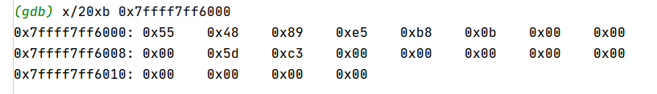

# 内存
## 查看内存
```
x/20xb 0x7ffff7ff6000
第一个x表示查看内存的命令
20表示显示20字节
x表示按十六进制格式显示
b表示单字节
最后的就是显示内存的起始地址
```

- x 按十六进制格式显示变量
- d 按十进制格式显示变量
- u 按十六进制格式显示无符号整形
- o 按八进制格式显示变量
- t 按二进制格式显示变量
- a 按十六进制格式显示变量
- c 按字符格式显示变量
- f 按浮点数格式显示变量


u 参数可以用下面的字符来代替：

- b 表示单字节
- h 表示双字节
- w 表示四字节
- g 表示八字节



# 断点
## 打断点
```
b function_name
```

## 内存地址打断点
```
b *0x400522
b &变量名
```

## 放行
```
c 或 continue
```

## 代码级单步调试
```
s 步入
n 步过
```

## 指令级单步调试
```
si 步入
ni 步过
```

# 寄存器
## 打印所有寄存器
```
info registers
```

## 打印某个寄存器
```
i registers rax
或
p/x $rax
```

## 查看栈
```
x/20 $sp
```

# 汇编
## 查看汇编代码
```
disas
或
disass
```

## 单步调试时显示汇编指令
```
display /i $pc
试下 p/i $pc
```

## 显示硬编码
```
disass /r
disass /sr
disass /mr
```

## 切换显示格式
```
切换intel格式的命令:(即masm格式)
set disassembly-flavor intel
切换成ATT格式的命令：
set dissassembly-flavor att
```

# 相关文章
[Linux下GDB调试指令汇总](https://zhuanlan.zhihu.com/p/71519244)
