# x86/x64 CPU寄存器
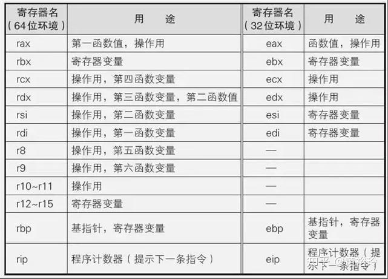

# 应用程序的地址空间
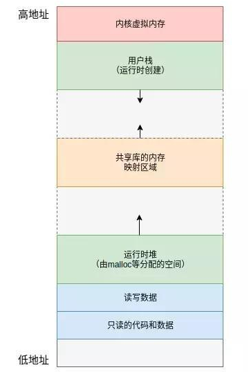

# 函数调用栈
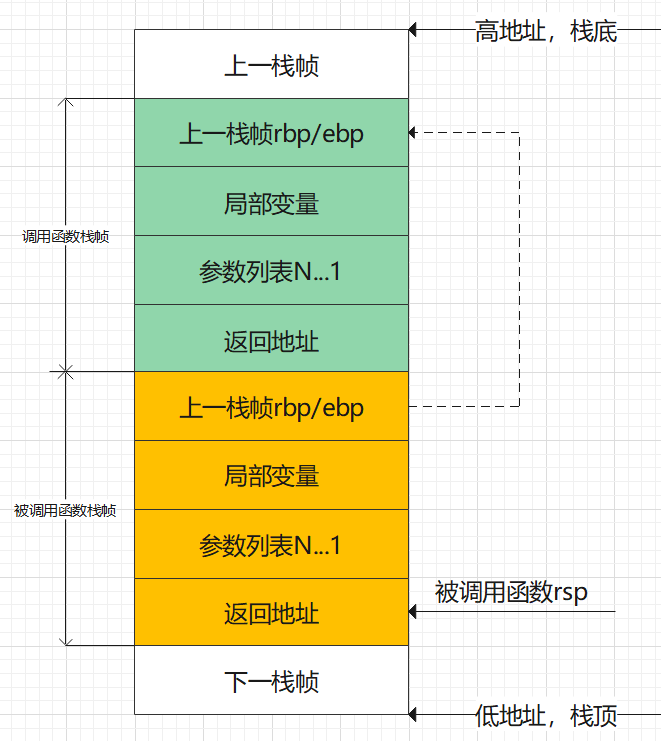

# 示例
示例代码1：

```c
#include <stdio.h>

int add(int x, int y)
{
    int a = x + y;
    return a;
}

int main(int argc, const char **argv)
{
    int a, b;
    a = 10;
    b = 20;
    add(a, b);
    return 0;
}
```

首先使用 gdb 调试，看一下它们的汇编代码是什么样子的：

```
Dump of assembler code for function main:
   0x00000000004004f0 <+0>:	push   rbp
   0x00000000004004f1 <+1>:	mov    rbp,rsp
   0x00000000004004f4 <+4>:	sub    rsp,0x20
   0x00000000004004f8 <+8>:	mov    DWORD PTR [rbp-0x14],edi
   0x00000000004004fb <+11>:	mov    QWORD PTR [rbp-0x20],rsi
   0x00000000004004ff <+15>:	mov    DWORD PTR [rbp-0x8],0xa
   0x0000000000400506 <+22>:	mov    DWORD PTR [rbp-0x4],0x14
   0x000000000040050d <+29>:	mov    edx,DWORD PTR [rbp-0x4]
   0x0000000000400510 <+32>:	mov    eax,DWORD PTR [rbp-0x8]
   0x0000000000400513 <+35>:	mov    esi,edx
   0x0000000000400515 <+37>:	mov    edi,eax
   0x0000000000400517 <+39>:	call   0x4004d6 <add>
   0x000000000040051c <+44>:	mov    eax,0x0
   0x0000000000400521 <+49>:	leave  
   0x0000000000400522 <+50>:	ret 

Dump of assembler code for function add:
   0x00000000004004d6 <+0>:	push   rbp
   0x00000000004004d7 <+1>:	mov    rbp,rsp
   0x00000000004004da <+4>:	mov    DWORD PTR [rbp-0x14],edi
   0x00000000004004dd <+7>:	mov    DWORD PTR [rbp-0x18],esi
   0x00000000004004e0 <+10>:	mov    edx,DWORD PTR [rbp-0x14]
   0x00000000004004e3 <+13>:	mov    eax,DWORD PTR [rbp-0x18]
   0x00000000004004e6 <+16>:	add    eax,edx
   0x00000000004004e8 <+18>:	mov    DWORD PTR [rbp-0x4],eax
   0x00000000004004eb <+21>:	mov    eax,DWORD PTR [rbp-0x4]
   0x00000000004004ee <+24>:	pop    rbp
   0x00000000004004ef <+25>:	ret  
```

先看一下 main：

```
push    rbp
mov     rbp,rsp
sub     rsp,0x20
```

以上3条为**开辟栈帧**，先把 rbp 入栈，即保存上一个函数栈帧的栈底地址；再把 rsp 赋值给 rbp，即记录当前函数的栈底地址；然后 rsp -= 0x10，分配栈空间，因为栈是满减栈，所以减小 rsp 就代表分配栈空间。上述代码执行完后，当前栈空间如下：

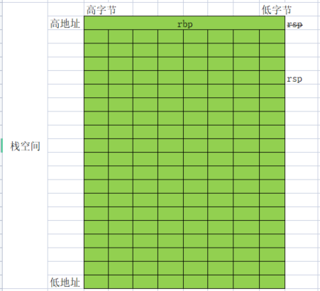

```
mov    DWORD PTR [rbp-0x14],edi
mov    QWORD PTR [rbp-0x20],rsi
```

以上2条为**保存现场**，因为要使用 edi,rsi 这两个寄存器传参数，但又不能破坏当前 edi,rsi 寄存器里面现有的值，所以需要它们的值给保存下来(保存到栈空间中)。上述代码执行完后，当前栈空间如下：

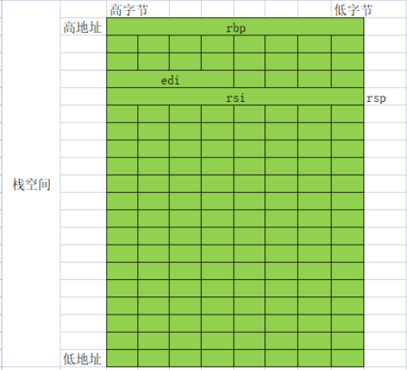

```
mov    DWORD PTR [rbp-0x8],0xa
mov    DWORD PTR [rbp-0x4],0x14
mov    edx,DWORD PTR [rbp-0x4]
mov    eax,DWORD PTR [rbp-0x8]
mov    esi,edx
mov    edi,eax
call   0x4004d6 <add>
mov    eax,0x0
```

以上8行为**业务逻辑**，上述代码的执行过程为，先把常量 10,20 保存到栈中，然后再从栈中取出这2个常量值赋值给 edx，eax，然后把 edx,eax的值再赋值给 esi,edi，然后调用 add 函数。（汇编有点啰嗦，这与优化等级-O0,-O2...有关）。上述代码执行完后，当前栈空间如下：

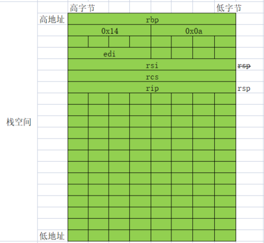

上图中压入了 rcs,rip 的原因是因为调用了 call 命令，如果是长跳转会压入 rcs，如果是短跳转只会压入 rip。上图中压入的 rcs:rip 指向的地址就是 mov eax,0x0 这个地址，即函数返回地址。

然后就调用了 add 函数：

```
push   rbp
mov    rbp,rsp
```

上述代码执行完后，栈空间如下：

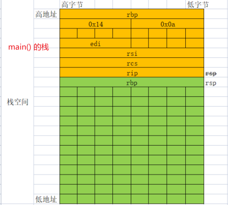

```
mov    DWORD PTR [rbp-0x14],edi
mov    DWORD PTR [rbp-0x18],esi
```

上面2行就是把入参 edi,esi 保存到栈中，栈空间如下：

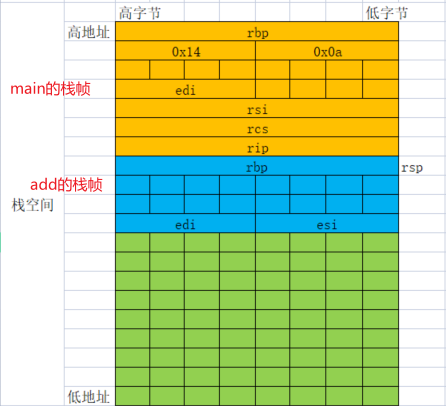

```
mov    edx,DWORD PTR [rbp-0x14]
mov    eax,DWORD PTR [rbp-0x18]
add    eax,edx
mov    DWORD PTR [rbp-0x4],eax
mov    eax,DWORD PTR [rbp-0x4]
```

上面5行代码就是从栈空间中取出刚保存的 edi,esi的值并赋值给 edx,eax，然后进行相加，把相加结果保存到 eax 中，栈空间如下：

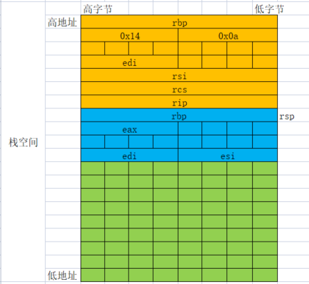

```
pop    rbp
```
栈空间如下：

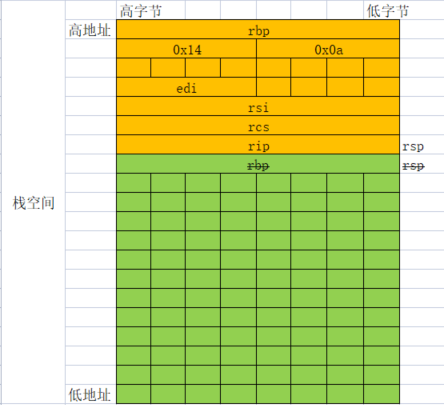

```
ret
```

ret 指令相当于 pop ip, pop cs, 然后 jmp，栈空间如下：

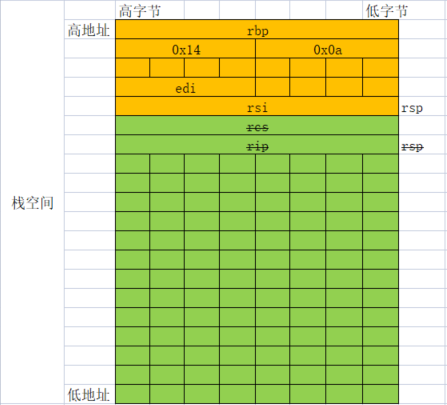

此时 add() 函数已经彻底执行完成并返回，返回值保存在 eax 中。

下面代码回到 main() 的 mov    eax,0x0 这里，就是把 main() 函数的返回值赋值给 eax，然后继续执行：

```
leave
ret
```

上面2行代码为**恢复栈帧与恢复现场**。leave 指令是下面两条指令的组合：

```
mov rsp, rbp
pop rbp
```
所以执行完 leave 后，栈空间如下：

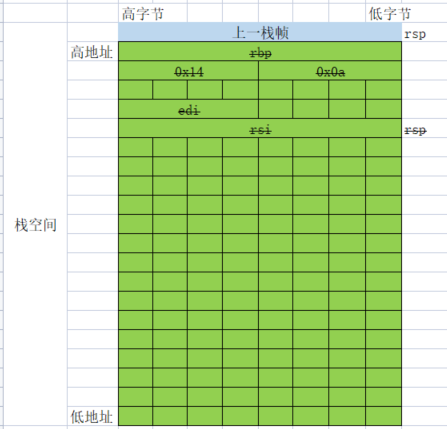

由上图可见，最终栈帧恢复，函数调用前后栈帧不变。

最后执行 ret 使 main() 返回，由运行库接手。

# 问题
## 为什么 add 函数中没有显式的分配栈空间？
add 函数中为什么没有显式的分配栈空间？即没有 sub rsp,0x18 这句代码？是因为 add 函数是叶子函数，没必要显式分配栈空间，如果 add 函数中又调用了其它函数，那就必须显式的分配栈空间，否则，被调用的函数会覆盖掉 add 函数的栈空间。

## main函数中保存了 esi,edi，但为什么没有恢复操作？

# 函数调用约定

## __cdecl
C/C++ 默认方式，参数从右向左入栈，主调函数负责栈平衡，即外平栈。gcc默认使用的方式。

## __stdcall
windows API 默认方式，参数从右向左入栈，被调函数负责栈平衡，即内平栈。

## __fastcall
快速调用方式。所谓快速，这种方式选择将参数优先从寄存器传入(ECX和EDX (x86下))，剩下的参数再从右向左入栈。因为栈是位于内存的区域，而寄存器位于CPU内，故存取方式已于内存，故其名为"__fastcall"。Linux下默认使用这种方式。 在x64下，如果参数小于等于6个，则参数都是用寄存器传递，否则，多余的参数入栈。

