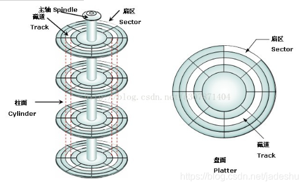
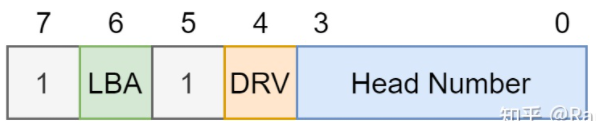
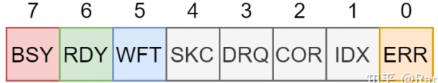
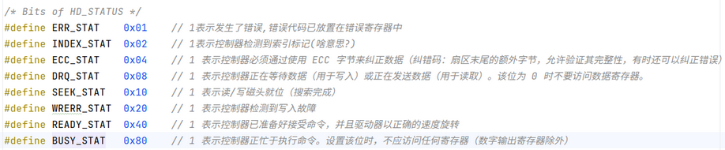

# 硬盘相关概念
很久以前，硬件容量还非常小的时候，人们采用与软盘类似的结构生产硬盘，也就是硬盘盘片的每一条磁道都具有相同的扇区数。由此产生了所谓的 CSH 3D 参数。即磁头数(Heads)、柱面数(Cylinders)、扇区数(Sectors)，以及相应的 CHS 寻址方式。

可以简单的理解，软盘就是只有一张盘面的硬件。

- **磁头(Heads)**: 每张磁片的正反面各有一个磁头，一个磁头对应一张磁片的一个面。因此，用第几磁头就可以表示数据在哪个磁面。
- **柱面(Cylinder)**: 所有磁片中半径相同的同心磁道构成"柱面"，意思是这一系列的磁道垂直叠加在一起就形成一个柱面的形状。简单地理解，柱面数 = 磁道数。
- **扇区(Sector)**: 将磁道划分为若干个小的区段，就是扇区。虽然很小，但实际是一个扇子的形状，故称为扇区。每个扇区的容量都为 512 字节。

下图可以更好的帮助理解：



# 硬盘的寻址方式
## CHS 寻址
上一节中提到的 3D 参数就是 CHS 参数，即柱面、磁头、扇区。由这三个参数可以精确定位到我们想读取的数据。

CHS 寻址的最大容量由 CHS 三个参数决定：

1. 磁头数量最大为255(用8个二进制位存储)。从0开始编号
2. 柱面数量最大为1023(用10个二进制位存储)。从0开始编号
3. 扇区数量最大为63(用6个二进制位存储)。从1开始编号

所以 CHS 寻址方式的最大寻址范围为：

```
255*1023*63*512/(1024*1024) = 7.837GB
```

或用硬盘厂商常的单位：

```
255*1023*63*512/(1000*1000) = 8.414GB
```

## LBA 寻址
**为什么要引入 LBA 概念？**

首先，由于 int 0x13 的限制，三维地址 C/H/S 的最大值只能为 1024/16/63，所以容量最大只能到 1024*16*63Byte = 504MByte。其次，在系统管理文件时记录繁琐的 C/H/S 也很吃力，效率低下，使用逻辑扇区后，可在硬盘读写操作时脱离 C/H/S 硬件参数的制约。

在 LBA 模式下，系统把所有的物理扇区都按照某种方式或规则看做是一线性编号的扇区，即从0到某个最大值方式排列，并连成一条线，把 LBA 作为一个整体来对待，而不再是具体到实际的 C/H/S 值，这样只用一个序数就能确定一个唯一的物理扇区，也就是线性地址的由来。显然线性地址是物理扇区的逻辑地址。

# 硬盘的读写
我们需要通过硬盘对外提供的寄存器去操纵它。硬盘提供的寄存器如下：

|寄存器|端口|功能
|:--|:--:|:--
data寄存器|0x1F0|读操作：已经读取的数据,大小为2字节；<br>写操作：已经写入的数据,大小为2字节。<br>每次读取/写入2字节,反复循环，直到读写完所有数据
features寄存器|0x1F1|读操作：读取时的错误信息<br>写操作：无
sector count寄存器|0x1F2|指定读取或写入的扇区数
LBA low寄存器|0x1F3|LBA地址低8位
LBA mid寄存器|0x1F4|LBA地址中8位
LBA high寄存器|0x1F5|LBA地址高8位
device寄存器|0x1F6|bit0~bit3:LBA地址的最高4位<br>bit4:1-表示从盘 0-表示主盘<br>bit5:1<br>bit7:1-LBA寻址 0-CHS寻址<br>bit7:1
command寄存器|0x1F7|读操作：返回磁盘状态<br>写操作：写入控制命令

- 0x1F0/Data：唯一一个16bit的寄存器，用来传输数据
- 0x1F1/Error:读的时候表示错误，8位，每一位表示一种错误。
- 0x1F2/Sector Count：表示扇区总数，读写的时候指定要操作的扇区数
- 0x1F3,0x1F4,0x1F5:分别表示LBA地址的低中高8位，LBA是28位，还差4位(最高4位)见下。
- 0x1F6/Device/Head:该寄存器结果如下图：


> - bit0~3:为LBA地址的最高4位
> - LBA为1表示采用LBA寻址，为0表示采用CHS寻址；现今一般都采用LBA寻址，所以0x1F3~0x1F5表示LBA地址的24位，否则就表示CHS三个指标
> - bit5,bit7 固定为1

- 0x1F7/Status：其结构如下图：



> - ERR:有错误发生，错误码放在错误寄存器中(0x1F1)
> - WFT:检测到有写错误
> - RDY:表示硬盘就绪，这是在对硬盘诊断的时候用的，表示硬盘检测正常，可以继续执行一些命令
> - BSY:表示硬盘忙，1表示忙，此时其它所有位无效

- 0x1F7/Command：向这个寄存器写入命令来操作硬盘，具体命令如下图：




IDE通道1，读写0x1f0-0x1f7号端口；IDE通道2，读写0x170-0x17f号端口 （IDE是硬盘的物理接口，已淘汰）；现在用的最多的是 STAT 接口。

目前 IO 操作读写硬盘有三种方式：
- CHS 方式：读取范围小于 8G
- LBA28方式：读取范围小于 137G
- LBA48方式：读取范围小于 144,000,000GB

## CHS 方式
```
写0x1f1: 0
写0x1f2: 要读的扇区数
写0x1f3: 扇区号
写0x1f4: 柱面的低8位
写0x1f5: 柱面的高8位
写0x1f6: bit5=1,bit7=1,bit4:0表示主盘,1表示从盘,bit0~3:磁头号
写0x1f7: 0x20为读, 0x30为写
读0x1f7: 第4位为0表示读写完成，否则要一直循环等待
读0x1f0: 每次读取1个word,反复循环，直到读完所有数据
```

## LBA28
即28位寻址

```
写0x1f1: 0
写0x1f2: 要读的扇区数
写0x1f3: LBA参数的0~7位
写0x1f4: LBA参数的8~15位
写0x1f5: LBA参数的16~23位
写0x1f6: 7~5位,111,第4位0表示主盘,1表示从盘,3~0位,LBA参数的24~27位
写0x1f7: 0x20为读, 0x30为写
读0x1f7: 第4位为0表示读写完成，否则要一直循环等待
读0x1f0: 每次读取1个word,反复循环，直到读完所有数据
```

## LBA48
即48位寻址

```
写两次0x1f1端口: 0
写两次0x1f2端口: 第一次要读的扇区数的高8位,第二次低8位
写0x1f3: LBA参数的24~31位
写0x1f3: LBA参数的0~7位
写0x1f4: LBA参数的32~39位
写0x1f4: LBA参数的8~15位
写0x1f5: LBA参数的40~47位
写0x1f5: LBA参数的16~23位
写0x1f6: 7~5位,010,第4位0表示主盘,1表示从盘,3~0位,0
写0x1f7: 0x24为读, 0x34为写
```

# LBA与CHS的转换关系
虽然LBA和CHS的两种定位方式不同，但其实两者间还是有一个转换关系的。

首先要了解线性地址的编码规则：把第一柱面（0柱面）第一磁头(0面)第一扇区（1扇区）编为逻辑“0”扇区...... 直到第一柱面（0柱面）第一磁头（0面）的第63扇区（63扇区），将其编为第“63”扇区，这样编码。

## 从CHS到LBA
用C表示当前柱面号，H表示当前磁头号，S表示当前扇区号，CS表示起始柱面号，HS表示起始磁头号，SS表示起始扇区号，PS表示每磁道有多少个扇区，PH表示每柱面有多少个磁道，计算公式如下：

```
LBA = ( C – CS ) * PH * PS + ( H – HS ) * PS + ( S – SS )
```

例如：

```
C/H/S=0/01 则 LBA = 0
C/H/S=0/0/63 则 LBA = 62
C/H/S=0/1/1 则 LBA = 63
C/H/S=0/5/1 则 LBA = 315
C/H/S=100/0/1 则 LBA = 1606500
C/H/S=100/1/1 则 LBA = 1606563
C/H/S=139/52/48 则 LBA = 2236358
C/H/S=220/156/18则 LBA = 3544145
```

## 从LBA到CHS
变量命名依然同上，则计算公式如下：

```
C = LBA DIV ( PH * PS ) + CS
H = ( LBA DIV PS ) MOD PH + HS
S = LBA MOD PS + SS
```

如果不运行MOD运算符，只用DIV运算符，则：

```
C = LBA DIV ( PH * PS ) + CS
H = LBA DIV PS – ( C – CS ) * PH + HS
S = LBA – ( C – CS ) * PH * PS – H – HS）* PS + SS
```

例如：

```
LBA=0 则 C/H/S = 0/0/1
LBA=62 则 C/H/S = 0/0/63
LBA=63 则 C/H/S = 0/1/1
LBA=315 则 C/H/S = 0/5/1
LBA=1606500 则 C/H/S = 100/0/1
LBA=2236358 则 C/H/S = 139/52/48
LBA=3544145 则 C/H/S = 220/156/18
```