# 1.创建硬盘
系统中安装好 bochs 后，利用 bochs 的命令 bximage 创建硬盘。创建过程如下：

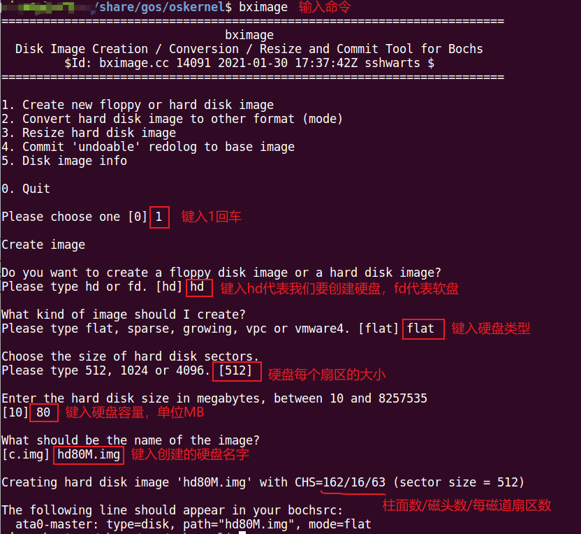

上图中最下面一行，要把 "ata0-master:..." 这一段话配置在 bochsrc 配置文件中。（注，如果是从盘，则把 ata0-master 修改成 ata0-slave）

创建完成后，当前目录下就会生成一个 "hd80M.img" 的文件，如下：

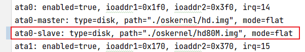

配置完成后，查看物理内存 0x475 处的 1 字节。因为 BOIS 会检测磁盘数量把将其写入到该地址处。

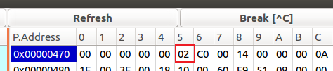

这里的 0x02 代表系统中有两块硬盘，一块是启动盘，一块是我们上面创建的硬盘。

# 2.硬盘分区
使用 linux 命令 fdisk 创建分区，流程如下：

1. 输入 fdisk 磁盘设备， 输入 n 新建分区
   
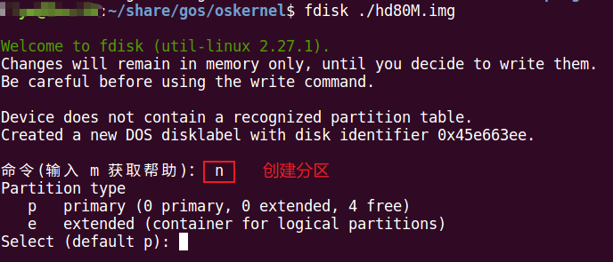

2. 输入p新建主分区，然后直接回车表示从第1柱面开始分区，接着+32表示主分区从第1柱面开始到第32柱面结束，也可以输入+10K，表示第一分区大小为10KB。

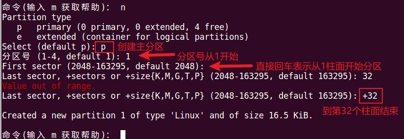

3. 输入w写入

4. 创建扩展分区

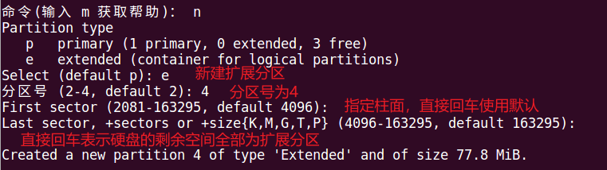

5. 创建逻辑分区

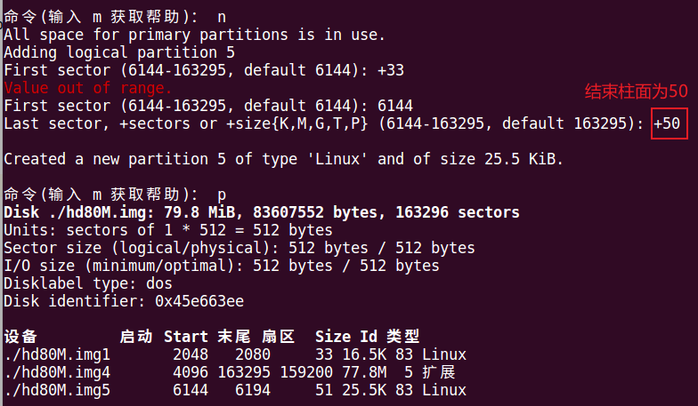

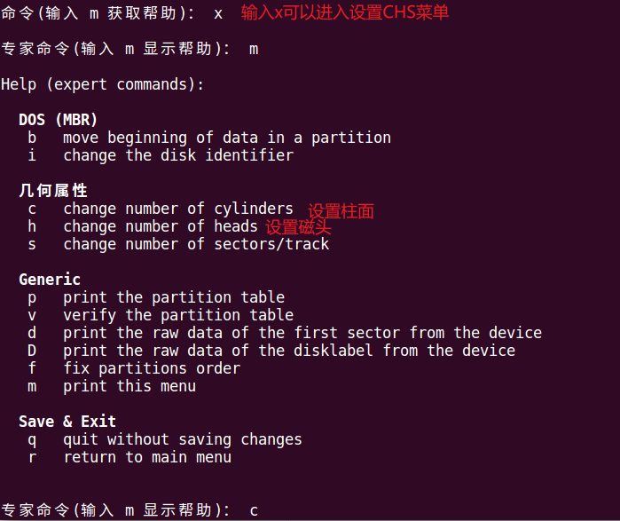

查看分区：

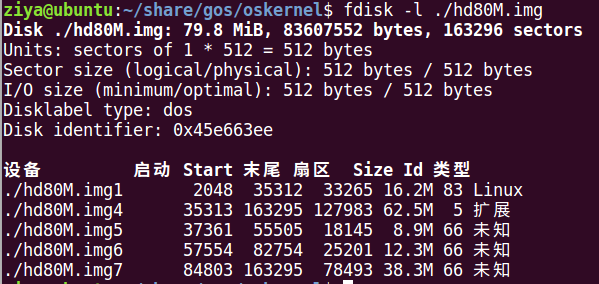

# 3.磁盘分区表浅析
分区表结构如下表：

偏移量|数据宽度|描述
|:--|:--|:--
0|1|活动分区标记，此标记有两种取值，0x80和0 0x80表示活动分区，也就是说此分区的引导扇区包含引导程序，可引导 0表示非活动分区，不可引导 其他值非法
1|1|分区起始磁头号
2|1|分区起始扇区号
3|1|分区起始柱面号
4|1|文件系统类型ID，如0表示不可识别的文件系统，1表示FAT32
5|1|分区结束磁头号
6|1|分区结束扇区号
7|1|分区结束柱面号
8|4|分区起始偏移扇区
12|4|分区容量扇区数

理解以下概念：一个磁盘的0盘0道1扇区(CHS表示)的前446个字节一定是MBR/EBR，然后64字节是4个分区表，最后2个字节是0x55AA。分区表中有4个分区描述符，每个分区描述符占12字节，所以分区表共64字节；4个分区描述符中，有3个描述符称为主分区描述符，另外1个称为扩展分区描述符。扩展分区描述符所描述的分区也可理解为是一个单独的磁盘，其0盘0道1扇区也一定是与MBR同样的结构，但为了与MBR区分被称为EBR，所以在EBR中也有4个分区描述符，其中只用了前2个分区描述符，后2个描述符未使用。前2个分区描述符中的第1个分区描述符记录了本分区的信息(偏移扇区和本分区的扇区数，即容量)，本分区又称为逻辑分区，第2个分区描述符记录了下一个扩展分区的信息(形成单向链表的结构)，即下一个逻辑分区。

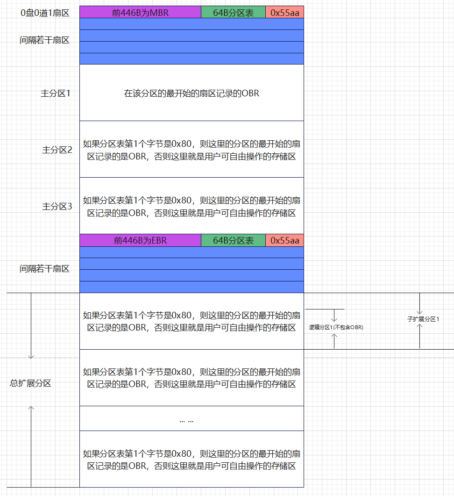

# 4.hd80M.img硬盘分区信息示例
下图是主分区的分区表，因为我们前面的 hd80M.img 主分区中有一个主分区描述符和一个扩展分区描述符，分别为 hd80M.img1 和 hd80M.img4，所以下图中红框中的分区表中第1和第4个描述符是有数据的。
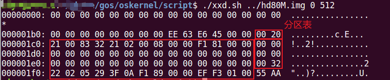

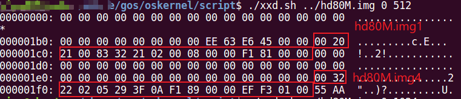

从上图中的两个红框中可以整理出下表：

|分区|分区类型|偏移扇区|扇区数|
|:--|:--|:--|:--|
主分区hd80M.img1|0x83|0x00000800|0x000081F1
总扩展分区hd80M.img4|0x05|0x000089F1|0x0001F3EF

主分区的偏移扇区是相对于0扇区开始偏移的，而扩展分区的偏移扇区是相对于主分区偏移的。从这上表的这些数字就可以看出，总扩展分区的偏移扇区为 0x000089F1，该值等于 主分区扇区数+主分区偏移扇区数 = 0x800 + 0x81F1 = 0x89F1。

我们知道，每个分区相当于一个逻辑硬盘，而每个硬盘的0盘0道1扇区(CHS表示)都是MBR/EBR，所以总扩展分区的偏移扇区的第1个扇区装的必然是EBR。

我们用xxd查看起始地址为：0x89F1 * 512 (转换成字节) = 0x113E200

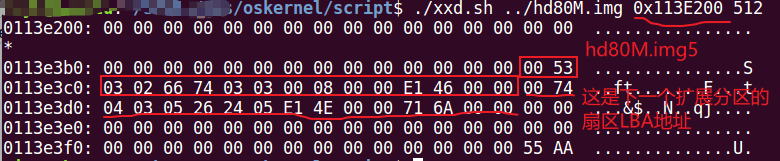

从上图可以看出，这4个分区描述符中只用到了前2个，后2个为全0。前2个分区描述符中第1个代表当前逻辑分区，第2个描述符指下一个逻辑分区，从而形成链式结构。整理如下：

|分区|分区类型|偏移扇区|扇区数|
|:--|:--|:--|:--|
逻辑分区hd80M.img5|0x66|0x00000800|0x000046E1
下一个扩展分区|0x05|0x00004EE1|0x00006A71

注意：逻辑分区的偏移扇区是相对于总扩展分区而言。所以我们用xxd查看hd80M.img6的计算公式为：(0x4EE1 + 0X89F1) * 512 = 0x1B1A400

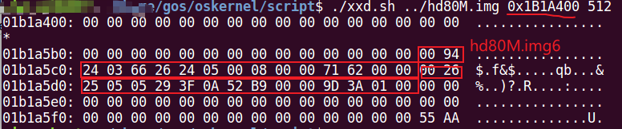

整理如下：

|分区|分区类型|偏移扇区|扇区数|
|:--|:--|:--|:--|
逻辑分区hd80M.img6|0x66|0x00000800|0x00006271
下一个扩展分区|0x05|0x0000B952|0x00013A9D

所以hd80M.img7的起始地址为：(0x0000B952 + 0X89F1) * 512 = 0x2868600

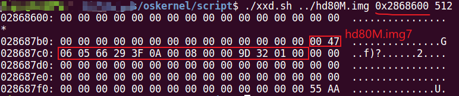

整理如下：

|分区|分区类型|偏移扇区|扇区数|
|:--|:--|:--|:--|
逻辑分区hd80M.img7|0x66|0x00000800|0x0001329D
下一个扩展分区|-|-|-

因为我们的 hd80M.img 磁盘只分了3个逻辑分区，所以上图中的分区表中只有一个描述符。

