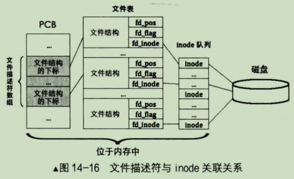

我们知道文件是用 inode 来表示的，一个文件对应一个 inode 结构，用于描述文件的存储、权限等。但 inode 是操作系统用的，普通用户是不接触 inode 的，普通用户操作文件用的是 fd,即文件描述符。

拿 Linux 举例，读写文件的本质是：先通过文件的 inode 找到文件数据块的扇区地址，随后读写该扇区，从而实现文件的读写。为实现文件任意位置的读写，执行读写操作时可以指定偏移量作为该文件内的起始地址，此偏移量相当于文件内的指针。但同一个文件可以被同一进程的多个线程同时打开，也可以被多进程同时打开，每个任务打开此文件时访问文件的偏移量不应该相互影响，所以每个任务每次打开一个文件就会产生一个文件结构，从而实现了"即使同一个文件被同时多次打开，各自操作的偏移量也互不影响"的灵活性。

Linux 把所有的"文件结构"组织到一起形成数组统一管理，该数据称为文件表。比如一个文件结构中的内容如下图：

总结一下：一个文件对应一个 inode，一个 inode 对应一个文件；一个文件可以被多次打开，因此一个 inode 可以有多个文件结构，多个文件结构可以对应同一个 inode。

在 Linux 中每个进程都有单独的、完全相同的一套文件描述符，因此它们与其他进程的文件描述符互不干涉，这些文件描述符组织成文件描述符数组统一管理。想一下，为什么进程 PCB 中要装入的是文件描述符数组而不是文件结构数组？因为一个文件结构最小也要十几个字节，一个进程可能会打开很多文件，所以文件结构数组(文件表)也会很大，这也就会导致进程的 PCB 会很大，而一般情况下进程 PCB 也就分配一到二个页框，所以注定不能把文件结构数组(文件表)放入到 PCB。

所以，我们放入 PCB 的就不是文件结构数组(文件表)，而是文件描述符数组。文件描述符就是用来从文件描述符数组中索引其中的某一项的，拿到该项的值后在文件结构数组(文件表)中去索引文件结构，而文件结构中保存的有 inode 信息，所以就拿到了 inode，而 inode 与文件是一一对应的关系，所以就可以访问到文件了。

画成图如下：

上图中涉及到三个数组结构，它们都是位于内存的。
- 1. PCB中的文件描述符数组
- 2. 存储所有文件结构的文件表
- 3. inode队列，也就是inode缓存