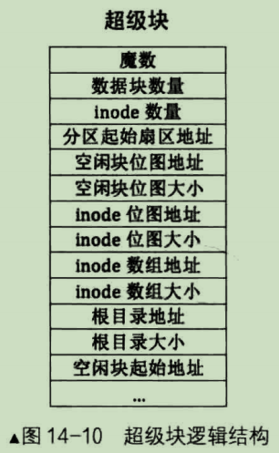
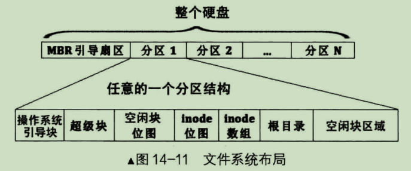

# inode
一个文件会被分成多个块，各个块在硬盘中分布是分散不连续的，要想访问此文件，文件系统为每个文件的所有块建立一个索引表，索引表就是块的地址数组，每个数组元素就是块的地址，数组元素下标是文件块的索引。此索引结构就是 inode，即 idex node，该结构就是用来索引、跟踪一个文件的所有块，所以一个文件对应一个 inode 结构，一个 inode 结构对应一个文件。

用索引结构的缺点是索引表本身要占用一定的存储空间，文件很大时，块就比较多，索引表项就要跟着增多。UNIX为解决这个问题，将一部分块放在索引表中，如果文件很大，将其他块放在另一个索引表，具体做法是：每个索引表中共15个索引项，暂时称此索引表为老索引表，它们是文件的直接块，即可直接获取地址的块。若文件大于12个块，那就再建立个新的块索引表，新索引表称为一级间接块索引表，表中可容纳256个块地址，各表项都是块地址，而此表也要占用一个物理块来存储，该物理块的地址存储到老索引表的第13个索引项中。有了一级间接索引表，文件最大可达 12+256 块。要是文件超过了268块后，可以再建立二级间接索引表，此表中各表项存储的是一级间接索引表，然后在老索引表中第14个索引项存储二级间接索引表地址。有了二级间接索引表，文件最大可达 12+256+256\*256; 同理还有三级间接索引表，此表地址保存在老索引表的第15个索引项中，此时文件最大可达 12+256+256\*256+256\*256\*256。

其 inode 的大致结构如下：

inode 的数量等于文件的数量，为方便管理，硬盘分区中所有文件的 inode 通过一个大表格来维护，此表格称为 inode_table，其数组元素的下标便是文件 inode 的编号。

# 目录项与目录
用户访问文件是通过文件名访问的而不是 inode 编号，用户一般也不关注这个 inode 编号，但是 inode 结构中并没有文件名这一属性。

inode 是文件系统需要的东西，而不是给用户准备的。用户需要通过文件名访问文件，所以需要把文件名与 inode 关系到一起。

想想看，我们要查找一个文件，无论文件在哪个路径，它肯定要位于某个目录中，因此文件名应该存储在和目录相关的地址，那什么是目录？

在 Linux 中，目录和文件都用 inode 来表示，因此目录也是文件，只是目录是包含文件的文件。注意，硬盘上的文件系统并没有一种专门的称为目录的数据结构，硬盘上有的只是 inode，inode 用于描述一个文件实体的数据块，至于该数据中记录的是什么，这并不是 inode 决定的，inode 也不关心它是什么。既然同一种 inode 既可以用来表示普通文件，又可以用来表示目录文件，而 inode 结构又是相同的，**因此区分 inode 是什么文件唯一的地方只能是数据块本身的内容了**。

如果 inode 表示的是普通文件，此 inode 指向的数据块中的内容就是普通文件自己的数据；如果 inode 表示的是目录文件，此 inode 指向的数据块中的内容就是该目录下的目录项。

那什么是目录项？

所谓的目录项就是在目录中使用 "ls -al" 列出的一项一项的内容，每一项内容就是一项目录项。

因为 inode 不关心数据块中记录的是什么，但目录项知道。

目录相当于文件列表(或者是表格)，每个文件在目录中都是一个 entry（条目、项），各个 entry 中的内容包括文件名、文件类型、为了定位文件的数据，entry 中至少还要包括 inode 编号，这个 entry 是目录中各个文件的描述，它称不目录项。目录项的大致结构如下：

上图中，目录项的关键信息有"文件名、文件类型、inode编号"，它们作用有两个：一是标识此inode表示的文件是目录还是普通文件，也就是inode所指向数据块中的内容是什么。二是将文件名与inode做个绑定关联，这样用户便可以通过文件名来找到文件的实体数据。

有了目录项后，通过文件名找文件实体数据块的流程是：
1. 在目录中找到文件名所在的目录项
2. 从目录项中获取inode编号
3. 用inode编号作为inode数组的索引下标，找到inode
4. 从该inode中获取数据块的地址，读取数据块

总结一下：
1. 每个文件都有自己单独的inode,inode是文件实体数据块在文件系统上的元信息
2. 所有文件的inode集中管理，形成inode数组，每个inode的编号就是该inode数组中的下标
3. inode中的前12个直接数据块指针和后3个间接块索引表用于指向文件的数据块实体
4. 文件系统中并不存在具体称为"目录"的数据结构，同样也没有称为"普通文件"的数据结构，统一用同一种inode表示。inode表示的文件是普通文件还是目录文件，取决于inode所指向数据块中的实际内容是什么，即数据块中的内容要么是普通文件本身的数据，要么是目录中的目录项(这里没考虑其它类型的文件，如socket...)
5. 目录项仅存在于inode指向的数据块中，有目录项的数据块就是目录，目录项所属的inode指向的所有数据块便是目录
6. 目录项中记录的是文件名、文件inode编号和文件类型，目录项起到的作用有两个，一是粘合文件名及inode，使文件名和inode关联，二是标识此inode所指向的数据块中的数据类型(比如是普通文件，还是目录，当然还有更多类型)
7. inode是文件的"实质"，但它并不能直接引用，必须通过文件名找到文件名所在的目录项，然后从该目录项中获得inode编号，然后用此编号到inode数组中去找相关的inode，最终找到文件的数据块。

inode和目录项的关系如下图：

看上图可能会发现一个问题：要想找到文件的数据块，必须找到文件的inode。inode之所以被找到，是因为在文件名所在的目录项中有记录它的编号，但是目录项是在目录文件的数据块中，而数据块必须通过 inode 才能找到...，寻找过程似乎陷入了死循环。任何看似循环的流程都有个初始，就像心脏的第一次跳动一样。解决这个问题只需要有一个固定目录，这个目录就是根目录 "/"。它是所有目录的父目录，每个分区都有自己的根目录，创建文件系统之后它的位置就是固定不变的，查找任意文件时，都直接到根目录的数据块中找相关的目录项，然后递归查找，最终可以找到任意子目录中的文件。

# 超级块
我们知道每个文件都有一个 inode，所有的 inode 都存放在 inode 数组中，那么请问，inode 数组保存在哪里？大小又是多少？还有就是根目录的地址是固定写死的，但不同的分区都有自己的根目录，并不能保证每个分区中的根目录地址都是一样的。既然每个分区中的根目录地址并不统一，那就说明该地址必然在某处存放，在各个分区中这上某处地址一定是固定且统一的，以备随时读取。总之，表面上看似变化复杂的事物被追溯到根源时都是极其固定简单的，大道至简。

所以，这里就需要在某个固定地方写入上述提到的文件系统的配置信息，**这此信息就属于文件系统元信息的元信息，这就是超级块**。越复杂的文件系统，其超级块保存的配置信息就越复杂。

文件系统是针对分区管理的，各个分区能管理的最大文件数量是固定的，即 inode 数量是有限的，所以就需要一种管理 inode 使用情况的方法，这里可以使用位图来管理，所以现在又多了一个元信息，inode 位图。

除了文件系统的元信息，剩下的就是空闲块了，文件系统被创建出来的目的就是科学合理的管理这些空闲块，空闲块也是有限的，所以空闲块的使用情况也需要被跟踪，所以也需要一个位图来管理空闲块的使用情况。

总结一下，超级块中至少要包含但不限于以下成员：inode数组的地址及大小，inode位图地址及大小，根目录的地址及大小，空闲块位图的地址和大小。超级块的基本结构如下图：

简单说一下超级块中的"魔数"的作用，通常情况下魔数用来确定文件系统的类型的标志，比如某个操作系统支持多种文件系统，通常就是先根据此魔数判断文件系统类型，然后调用不同的文件系统驱动程序访问该分区。

超级块是文件系统元信息的"配置文件"，它是在为分区创建文件系统时创建的，所有有关文件系统元信息的配置都在超级块中，因此超级块的位置和大小不能再被"配置"了，必须是固定的，**它被固定存储在各分区的第2个扇区**，通常是占用一个扇区的大小，具体大小与实际文件系统类型为准。

# 文件系统在硬盘分区中的布局
文件系统在硬盘分区中的布局如下图：

上图中只是一个分区文件系统元信息的布局，其他分区都是一样的。操作系统引导块就是操作系统引导记录OBR所在的地址，即操作系统引导扇区，它位于各分区最开始的扇区，根据文件系统类型的不同，引导程序可能占用多个扇区，这多个扇区组成一个数据块，因此这里标出的是引导"块"，而不是引导"扇区"。在操作系统引导块后面的依次是超级块，空闲块的位图，inode位图，inode数组，根目录，空闲块区域。**根目录和空闲块区域是真正用于存储数据的区域**，除了这两部分，其他几部分占用的扇区数取决于分区的容量大小，或者是在创建文件系统的过程中手动设置。

