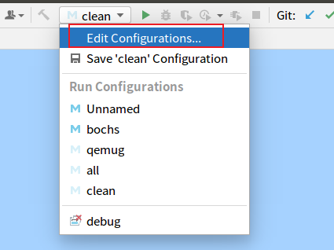
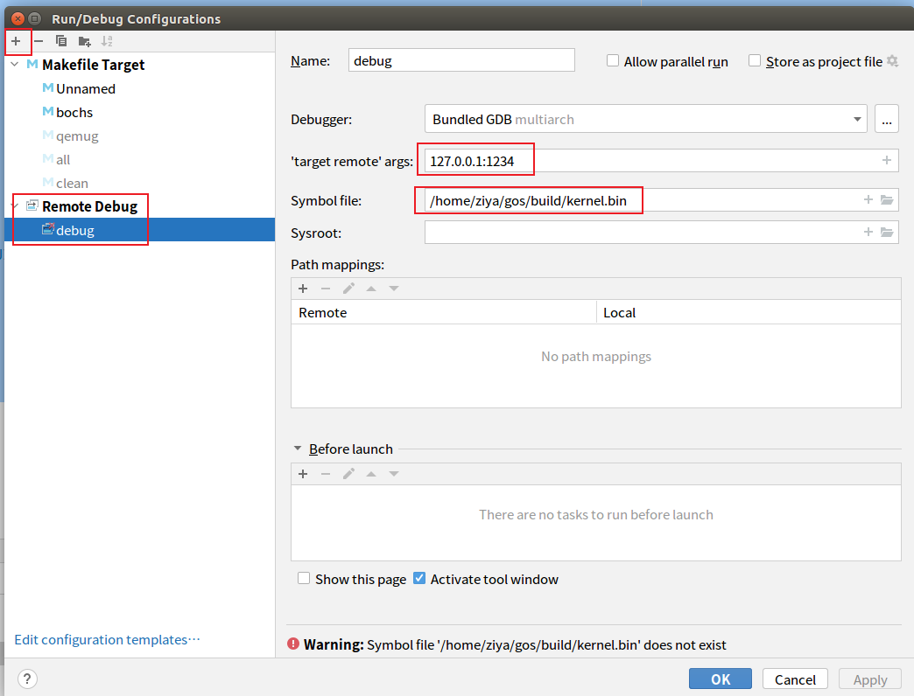
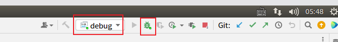

本文对应的代码为 sha:282fd9a2

进入保护模式需要的三件事：
- 1. 构建 GDT 表，至少要有代码段、数据段
- 2. 打开 A20 总线
- 3. 开启保护模式，设置 CR0 的 PE 位为1

我们知道，CPU上电后会自动运行 BIOS 程序，而 BIOS 程序会把硬盘中的 0盘0道1扇区的 MBR 程序搬移到内存的 0x7C00处，而我们自己实现的 MBR 程序的主要功能就是把硬盘中的 0盘0道2扇区开始的 setup.asm 程序(内核加载程序)搬移到内存的 0x500 处，而然后跳转程序到 0x500 处去执行。

在 setup.asm 中，我们主要的工作是让 CPU 的工作模式由实模式进入到保护模式，然后把位于硬盘的 0盘0道4扇区起始的内核程序搬移到内存的 0x1200 起始处，然后移交CPU控制权给内核。

具体代码如下：

```c
; 0柱面0磁道2扇区
[ORG 0x500]

[SECTION .data]
KERNEL_BASE_ADDR equ 0x1200
STACK_TOP_ADDR equ 0x9fbff
TI_GDT equ 000b
TI_LDT equ 100b
RPL0 equ 00b
RPL1 equ 01b
RPL2 equ 10b
PRL3 equ 11b

SELECTOR_CODE equ (0x0001 << 3) + TI_GDT + RPL0
SELECTOR_DATA equ (0x0002 << 3) + TI_GDT + RPL0
```
上述代码中定义了向个常量，如 KERNEL_BASE_ADDR 内核入口地址 0x1200，STACK_TOP_ADDR 栈顶地址 0x9fbff，两个段选择子 SELECTOR_CODE、SELECTOR_DATA。

```c
;构建GDT表
GDT_BASE:
    db 0, 0, 0, 0, 0, 0, 0, 0
GDT_CODE:
    db 0xFF, 0xFF, 0x00, 0x00, 0x00, 0x98, 0xCF, 0x00
GDT_DATA:
    db 0xFF, 0xFF, 0x00, 0x00, 0x00, 0x92, 0xCF, 0x00

GDT_SIZE equ $ - GDT_BASE
GDT_LIMIT equ GDT_SIZE - 1

;gdt指针，前2字节是gdt界限，后4字节是gdt起始地址
gdt_ptr:
    dw GDT_LIMIT
    dd GDT_BASE
```
上述代码就是构建 GDT 表。GDT_BASE 必须是全0，GDT_CODE,GDT_DATA是自定义的代码段和数据段，里面具体的字节代表的含义可对着GDT结构查看。

gdt_ptr 是记录了 GDT在内存中的起始地址，其结构是 48位，高2个字节是GDT的大小，低4字节是 GDT 表在内存中的首地址。有了 gdt_ptr后，可以使用 lgdt 指令该结构保存到 GDTR 寄存器中。

```
enter_protected_mode:
    ; 打开A20
    in al, 0x92
    or al, 0000_0010b
    out 0x92, al
    ; 加载gdt
    lgdt [gdt_ptr]
    ; cr0第0位置1
    mov eax, cr0
    or eax, 0x00000001
    mov cr0, eax

    ; 刷新流水线
    jmp SELECTOR_CODE:p_mode_start
```
上述代码在开启保护模式后，执行一个 jmp 指令，从注释上可以看到，这个jmp指令起到一个刷新流水线的功能。流水线是CPU为提高效率而采取的一种工作方式，CPU将当前指令及其后面的几条指令同时放在流水线中重叠执行。由于在实模式下，指令按照16位指令格式来译码，所以在真正开启保护模式前，jmp后两条指令也是以16位译码格式放在了流水线中，而 jmp 后就是保护模式，所以流水线把32位指令按照16位译码就会出错，解决这个问题的方法就是用无条件跳转指令清空流水线。

```
[BITS 32]
p_mode_start:
    mov ax, SELECTOR_DATA
    mov ds, ax
    mov ss, ax
    mov es, ax
    mov fs, ax
    mov gs, ax
    mov esp, STACK_TOP_ADDR

    mov ecx, 3  ;从硬盘的第3个扇区开始读
    mov bl, 60  ;共读取60个扇区
    mov edi, KERNEL_BASE_ADDR    ;从硬盘读取到的数据存放在内在的起始地址处
    call read_hd

    jmp SELECTOR_CODE:KERNEL_BASE_ADDR
```
上述代码即进入了保护模式，然后从硬盘的第3个扇区(LBA模式)读取60个扇区内容存入到内存的 0x1200 处。然后跳转到 0x1200 处执行内核代码。


下面看一下真正进入内核后的代码：（进入内核的代码在 head.asm 文件中）

```
[SECTION .text]
[BITS 32]
extern kernel_main

global _start
_start:
    call kernel_main
    jmp $
```
该代码主要作用就是跳转到 kernel_main() 这个函数去执行，而这个 kernel_main() 是用 C 语言写的，这样就成功进入了C语言的环境了。


Makefile 如下：
```
BUILD:=./build

CFLAGS := -m32	#32位程序
CFLAGS += -masm=intel
CFLAGS += -fno-builtin	#不需要gcc内置函数
CFLAGS += -nostdinc	#不需要标准头文件
CFLAGS += -fno-pic	#不需要位置无关代码
CFLAGS += -fno-pie	#不需要位置无关可执行程序
CFLAGS += -nostdlib	#不需要标准库
CFLAGS += -fno-stack-protector	#不需要栈保护
CFLAGS := $(strip ${CFLAGS})

DEBUG := -g

HD_IMG_NAME := hd.img

all: ${BUILD}/boot/boot.o ${BUILD}/boot/setup.o ${BUILD}/system.bin
	$(shell rm -rf $(BUILD)$(HD_IMG_NAME))
	bximage -q -hd=16 -func=create -sectsize=512 -imgmode=flat $(BUILD)/$(HD_IMG_NAME)
	dd if=$(BUILD)/boot/boot.o of=$(BUILD)/$(HD_IMG_NAME) bs=512 seek=0 count=1 conv=notrunc
	dd if=$(BUILD)/boot/setup.o of=$(BUILD)/$(HD_IMG_NAME) bs=512 seek=1 count=2 conv=notrunc
	dd if=$(BUILD)/system.bin of=$(BUILD)/$(HD_IMG_NAME) bs=512 seek=3 count=60 conv=notrunc

${BUILD}/system.bin:${BUILD}/kernel.bin
	objcopy -O binary ${BUILD}/kernel.bin $@
	nm ${BUILD}/kernel.bin | sort > ${BUILD}/system.map

${BUILD}/kernel.bin:${BUILD}/boot/head.o ${BUILD}/init/main.o
	ld -m elf_i386 $^ -o $@ -Ttext 0x1200

${BUILD}/init/main.o:oskernel/init/main.c
	$(shell mkdir -p ${BUILD}/init)
	gcc ${CFLAGS} ${DEBUG} -c $^ -o $@

${BUILD}/boot/head.o:oskernel/boot/head.asm
	nasm -f elf32 -g $< -o $@

${BUILD}/boot/%.o: oskernel/boot/%.asm
	$(shell mkdir -p ${BUILD}/boot)
	nasm $< -o $@

clean:
	$(shell rm -rf ${BUILD})

bochs:
	bochs -q -f bochsrc

qemug: all
	qemu-system-x86_64 -m 32M -hda $(BUILD)/$(HD_IMG_NAME) -S -s

qemu: all
	qemu-system-i386 \
	-m 32M \
	-boot c \
	-hda $(BUILD)/$(HD_IMG_NAME)
```

注意，上面的代码中，我们是先由 setup.asm 跳转到 head.asm，然后在 head.asm 中仅写了一个跳转指令，即跳转到 kernel_main；这里有没有一个疑问？就是 head.asm 与 main.c 进行链接后，CPU是如何知道其程序的入口地址在哪里？即CPU从setup.asm跳转到 0x1200(由ld参数-Ttext指定)地址处后，到底该先执行 _start 这个标号还是该先执行 kernel_main 这个标号？实验证明，是先执行 _start 这个标号处的指令，原因是因为：我们使用链接器ld进行链接时，如果没有手动指令程序的入口地址，则ld会默认把名为 _start 的函数作为程序的入口地址，即默认的 entry symbol是_start，除非另行指定。

因为我们可以手动指定程序的入口地址，所以我们可以不需要 head.asm 这个文件，而直接由 setup.asm 跳转到 C 语言中。这里我们在 ld 时就需要手动指定程序的入口地址，只需要添加

```
-e kernel_main
```

即可。具体程序参见分支 enter_c 。

使用 CLion 调试内核如下：







先运行 qemuq, 然后再按上图中进行 debug。
