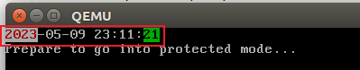

# 封装IO接口
向终端输出字符串等信息，实际操作的是屏幕，对于CPU来说，屏幕就是外设，属于外部硬件。访问外设有两种方式：1.内存映射；2. in、out。为了方便我们使用C语言操作IO接口，先封装一套接口，如下：

```asm
[bits 32]
[SECTION .text]

global read_byte
;从端口读一字节
read_byte:
    push ebp
    mov ebp, esp
    xor eax, eax
    mov edx, [ebp + 8]  ;port
    in al, dx
    leave
    ret

global write_byte
;向端口写一字节
write_byte:
    push ebp
    mov ebp, esp
    mov edx, [ebp + 8]  ;port
    mov eax, [ebp + 12] ;value
    out dx, al
    leave
    ret

global read_word
;从端口读一个字
read_word:
    push ebp
    mov ebp, esp
    xor eax, eax
    mov edx, [ebp + 8]  ;port
    in ax, dx
    leave
    ret

global write_word
;向端口写一个字
write_word:
    push ebp
    mov ebp, esp
    mov edx, [ebp + 8]  ;port
    mov eax, [ebp + 12] ;value
    out dx, ax
    leave
    ret
```

在C语言中，我们可以使用如下函数进行调用:

```c
char read_byte(int port);
short read_word(int port);

void write_byte(int port, int value);
void write_word(int port, int value);
```

至于为什么可以这样调用，请参考专题一中的《函数调用栈.md》一文。

接下来就是测试这些接口，测试程序是读取 COMS RAM 芯片，从中读取当前时间。

CMOS RAM中存储的时间信息为：年 月 日 时 分 秒，每个信息长1个字节，存放单元为：秒 0，时 4，日 7，月 8，年 9。这些数据是 BCD 码，高4位代表十位，低4位代表个位。

示例程序是向屏幕中动态显示当前时间。比如要读月信息，分以下两步：

1. 要向地址端口 0x70 写入要访问的单元地址： mov al, 8  out 70h, al
2. 然后从数据端口 0x71 中取出指定单元中的数据：in al, 71h

具体代码如下：

```c
#include "io.h"

void kernel_main(void)
{
    char year, month, day, hour, minute, second;
    char cyear[2], cmonth[2], cday[2], chour[2], cminute[2], csecond[2];
    char* video = (char*)0xb8000;

    while (1) {
        write_byte(0x70, 9);    //年
        year = read_byte(0x71);
        year = (year >> 4) * 10 + (year & 0x0f);
        cyear[0] = year / 10 + 0x30;
        cyear[1] = year % 10 + 0x30;

        write_byte(0x70, 8);    //月
        month = read_byte(0x71);
        month = (month >> 4) * 10 + (month & 0x0f);
        cmonth[0] = month / 10 + 0x30;
        cmonth[1] = month % 10 + 0x30;

        write_byte(0x70, 7);    //日
        day = read_byte(0x71);
        day = (day >> 4) * 10 + (day & 0x0f);
        cday[0] = day / 10 + 0x30;
        cday[1] = day % 10 + 0x30;

        write_byte(0x70, 4);    //时
        hour = read_byte(0x71);
        hour = (hour >> 4) * 10 + (hour & 0x0f) + 8;    //时区
        chour[0] = hour / 10 + 0x30;
        chour[1] = hour % 10 + 0x30;

        write_byte(0x70, 2);    //分
        minute = read_byte(0x71);
        minute = (minute >> 4) * 10 + (minute & 0x0f);
        cminute[0] = minute / 10 + 0x30;
        cminute[1] = minute % 10 + 0x30;

        write_byte(0x70, 0);    //秒
        second = read_byte(0x71);
        second = (second >> 4) * 10 + (second & 0x0f);
        csecond[0] = second / 10 + 0x30;
        csecond[1] = second % 10 + 0x30;

        *(video + 0) = '2';
        *(video + 2) = '0';
        *(video + 4) = cyear[0];
        *(video + 6) = cyear[1];
        *(video + 1) = 0x74;        //白底红字
        *(video + 3) = 0x74;
        *(video + 5) = 0x74;
        *(video + 7) = 0x74;
        *(video + 8) = '-';
        *(video + 10) = cmonth[0];
        *(video + 12) = cmonth[1];
        *(video + 14) = '-';
        *(video + 16) = cday[0];
        *(video + 18) = cday[1];
        *(video + 20) = ' ';
        *(video + 22) = chour[0];
        *(video + 24) = chour[1];
        *(video + 26) = ':';
        *(video + 28) = cminute[0];
        *(video + 30) = cminute[1];
        *(video + 32) = ':';
        *(video + 34) = csecond[0];
        *(video + 36) = csecond[1];
        *(video + 35) = 0x20;       //绿底黑字
        *(video + 37) = 0x20;
    }
}

```

运行结果如下图：



对应代码 sha: 9d09ba34