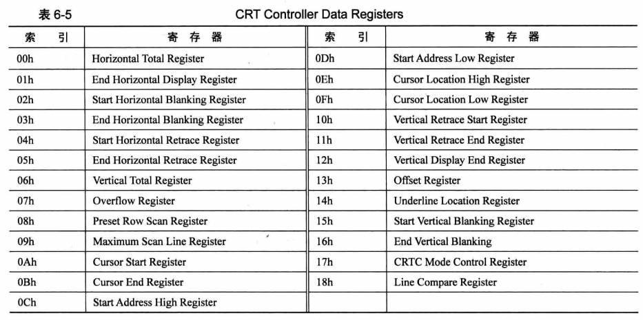

# 显卡
CGA, EGA, VGA 是"显卡"的性能指标。

CGA（彩色图形适配器）是第一个IBM PC上的计算机显示标准；VGA（视频图形阵列）是使用类比信号的电脑显示标准；EGA（增强图形适配器）是IBM PC计算机显示标准定义，性能介于CGA和VGA之间。

下面以windows10系统、thinkpad t480电脑为例，为大家详细介绍一下：

## CGA(彩色图形适配器)
彩色图形适配器（英语：CGA, Color Graphics Adapter），是IBM公司于1981年上市的第一个彩色图形卡，也是第一个IBMPC上的计算机显示标准。标准IBM CGA图形卡具有16千字节显示内存。CGA卡提供多种图形和文字显示模式，以及可达640×200的显示分辨率，最高16色的显示能力（通常不能显示在最大分辨率下）。CGA的通常显示能力是在320×200分辨率下同时显示最多4种颜色，但是也有很多其他的方法模拟显示更多种颜色。

CGA提供两种标准文字显示模式：40×25×16色和80×25×16色；以及两种常用的图形显示模式：320×200×4色和640×200×2色。

随着计算机工艺的发展，CGA也被IBM于1984年推出的增强图形适配器（EGA, Enhanced Graphics Adapter）取代。

## VGA(视频图形陈列)
视频图形阵列（英语：Video Graphics Array，简称VGA）是IBM于1987年提出的一个使用类比信号的电脑显示标准。这个标准已对于现今的个人电脑市场已经十分过时。即使如此，VGA仍然是最多制造商所共同支持的一个标准，个人电脑在加载自己的独特驱动程序之前，都必须支持VGA的标准。例如，微软Windows系列产品的引导画面仍然使用VGA显示模式，这也说明其分辨率和载色数的不足。

VGA这个术语常常不论其图形设备，而直接用于指称640×480的分辨率。VGA设备可以同时存储4个完整的EGA色版，并且它们之间可以快速转换，在画面上看起来就像是即时的变色。

## EGA(增强图形适配器)
增强图形适配器（Enhanced Graphics Adapter或EGA）是IBM PC计算机显示标准定义，在显示性能方面（颜色和解析度）介于CGA和VGA之间。

它是IBM在1984年为其新型PC-AT计算机引入的技术。EGA可以在高达640x350的分辨率下达到16色。EGA包含一个16KB的只读存储器（ROM）来扩展系统BIOS以便实现附加的显示功能，并包含一个Motorola MC6845视频地址生成器。

# CGA
在代码中我们使用的是CGA，所以下面详细介绍一下CGA的使用：

在 CGA 文本模式下，屏幕为 80*25彩色字符模式显示缓冲区(以下简称为显示缓冲区)的结构：内存在址空间范围：B800H ~ BFFFH，共32KB。此空间即为显示缓冲区。向这个地址写入的数据会立即出现在显示器上。

80代表屏幕一行可以显示80个字符，25代表屏幕共可以显示25行。每个字符可以有256种属性，这样，一个字符在显示缓冲区中就要占用两个字节，分别存放字符的ASCII码和属性。如下：

```
显示缓冲区地址 B800  B803  B805 ...
              3101  3202  3303
```
显示缓冲区B8000地址处的31代表了字符的ASCII，而B8001地址处的01代表了31这个字符的属性，依次类推...

所以可以有以下简单的结论：显示缓冲区的偶数地址都是存放字符的ASCII码，而奇数地址则存放字符的属性(如颜色等)

所以说，屏幕的一行可以显示80个字符，那一行共需要80\*2=160个字节，这样的话，一个屏幕所占用的字节数就是：80\*2\*25=4000B（约4KB）。

显示缓存区分为8页，每页4KB，显示器可以显示任意一页的内容，一般情况下，显示第0页的内容。

字符属性说明：
```
0000 0000   ;字符属性共占用一个字节
 rgb  rgb   ;bit4~bit6为背景(底色)，bit0~bit2为前景(字体颜色) bit7为闪烁(只有全屏dos下才能看到效果)，bit3为高亮
```

例如：
```
0100 0010   ;红底绿字
0100 1010   ;红底高亮绿字
0000 0111   ;黑底白字
0111 0001   ;白底蓝字
```

字符及其属性如下图：


# 如何操作显卡
显卡是通过IO端口进行操作的，IO端口是与硬件内部的寄存器通信。下面是IO端口地址分配图：


CGA使用的是MC6845芯片，重要的寄存器有：

```
● CRT 地址寄存器 0x3D4
● CRT 数据寄存器 0x3D5
● CRT 光标位置 - 高位 0xE
● CRT 光标位置 - 低位 0xF
● CRT 显示开始位置 - 高位 0xC
● CRT 显示开始位置 - 低位 0xD
```

这些信息来自下图：





# 代码操作屏幕
代码直接贴出来，想看就看看，感觉没有研究的必要。

```c
/*
 * create by gaoxu on 2023.05.10
 * 该文件主要是对终端的显示进行操作
 * */

#include "io.h"
#include "types.h"

#define CRT_ADDR_REG 0x3D4 // CRT(6845)索引寄存器
#define CRT_DATA_REG 0x3D5 // CRT(6845)数据寄存器

#define CRT_START_ADDR_H 0xC // 显示内存起始位置 - 高位
#define CRT_START_ADDR_L 0xD // 显示内存起始位置 - 低位
#define CRT_CURSOR_H 0xE     // 光标位置 - 高位
#define CRT_CURSOR_L 0xF     // 光标位置 - 低位

#define MEM_BASE 0xB8000              // 显卡内存起始位置
#define MEM_SIZE 0x4000               // 显卡内存大小
#define MEM_END (MEM_BASE + MEM_SIZE) // 显卡内存结束位置
#define WIDTH 80                      // 屏幕文本列数
#define HEIGHT 25                     // 屏幕文本行数
#define ROW_SIZE (WIDTH * 2)          // 每行字节数
#define SCR_SIZE (ROW_SIZE * HEIGHT)  // 屏幕字节数

#define ASCII_NUL 0x00
#define ASCII_ENQ 0x05
#define ASCII_BEL 0x07 // \a
#define ASCII_BS 0x08  // \b
#define ASCII_HT 0x09  // \t
#define ASCII_LF 0x0A  // \n
#define ASCII_VT 0x0B  // \v
#define ASCII_FF 0x0C  // \f
#define ASCII_CR 0x0D  // \r
#define ASCII_DEL 0x7F

static uint screen; // 当前显示器开始的内存位置
static uint pos; // 记录当前光标的内存位置
static uint x, y; // 当前光标的坐标

//设置当前显示器开始的位置
static void set_screen(void)
{
    write_byte(CRT_ADDR_REG, CRT_START_ADDR_H);
    write_byte(CRT_DATA_REG, ((screen - MEM_BASE) >> 9) & 0xff);
    write_byte(CRT_ADDR_REG, CRT_START_ADDR_L);
    write_byte(CRT_DATA_REG, ((screen - MEM_BASE) >> 1) & 0xff);
}

//设置光标的位置
static void set_cursor(void)
{
    write_byte(CRT_ADDR_REG, CRT_CURSOR_H);
    write_byte(CRT_DATA_REG, ((pos - MEM_BASE) >> 9) & 0xff);
    write_byte(CRT_ADDR_REG, CRT_CURSOR_L);
    write_byte(CRT_DATA_REG, ((pos - MEM_BASE) >> 1) & 0xff);
}

//清屏
void console_clear(void)
{
    screen = MEM_BASE;
    pos = MEM_BASE;
    x = y = 0;
    set_cursor();
    set_screen();

    u16 *ptr = (u16 *)MEM_BASE;
    while (ptr < (u16 *)MEM_END) {
        *ptr++ = 0x0720;
    }
}

// 向上滚屏
static void scroll_up(void)
{
    char *dest, *src;
    size_t count;

    if (screen + SCR_SIZE + ROW_SIZE < MEM_END) {
        u32 *ptr = (u32 *)(screen + SCR_SIZE);
        for (size_t i = 0; i < WIDTH; i++) {
            *ptr++ = 0x0720;
        }
        screen += ROW_SIZE;
        pos += ROW_SIZE;
    } else {
        dest = (char *)MEM_BASE;
        src = (char *)screen;
        count = SCR_SIZE;
        while (count--) {
            *dest++ = *src++;
        }
        pos -= (screen - MEM_BASE);
        screen = MEM_BASE;
    }
    set_screen();
}

static void command_lf(void)
{
    if (y + 1 < HEIGHT) {
        y++;
        pos += ROW_SIZE;
        return;
    }
    scroll_up();
}

static void command_cr(void)
{
    pos -= (x << 1);
    x = 0;
}

static void command_bs(void)
{
    if (x) {
        x--;
        pos -= 2;
        *(u16 *)pos = 0x0720;
    }
}

static void command_del(void)
{
    *(u16 *)pos = 0x0720;
}

void console_write(char *buf, u32 count)
{
    char ch;
    char *ptr = (char *)pos;

    while (count--) {
        ch = *buf++;
        switch (ch) {
            case ASCII_NUL:
                break;
            case ASCII_BEL:
                break;
            case ASCII_BS:      //退格
                command_bs();
                break;
            case ASCII_HT:
                break;
            case ASCII_LF:      //换行
                command_lf();
                command_cr();
                break;
            case ASCII_VT:
                break;
            case ASCII_FF:      //换页
                command_lf();
                break;
            case ASCII_CR:      //回车
                command_cr();
                break;
            case ASCII_DEL:     //删除
                command_del();
                break;
            default:
                if (x >= WIDTH) {
                    x -= WIDTH;
                    pos -= ROW_SIZE;
                    command_lf();
                }

                *ptr = ch;
                ptr++;
                *ptr = 0x07;
                ptr++;

                pos += 2;
                x++;
                break;
        }
    }
    set_cursor();
}
```


