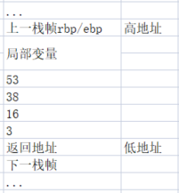

# 变长参数
变长参数是C语言的特殊参数形式，例如如下函数声明：

```c
int printf(const char *format, ...);
```

如此声明表明，printf函数除了第一个参数类型为const char \*之外，其后可以追加任意数量、任意类型的参数。在函数的实现部分，可以使用stdarg.h里的多个宏来访问各个额外的参数：假设lastarg是变长参数的最后一个具名参数(例如printf里的format <在函数参数中format是第一个参数，但真正压栈后format是最后一个入栈的>)，那么在函数内部定义类型为va_list的变量：

```c
va_list ap;
```

该变量以后将会依次指向各个可变参数。ap必须用宏va_start初始化一次，其中lastarg必须是函数的最后一个具名的参数。

```c
va_start(ap, lastarg);
```

此后，可以使用va_arg宏来获得下一个不定参数(假设已知类型为type):

```c
type next = va_arg(ap, type);
```

在函数的结束前，还必须用宏va_end来清理现场。在这里我们可以讨论几个宏的实现细节。

在研究这几个宏之前，我们要先了解变长参数的实现原理。变长参数的实现原理得益于C语言默认的cdecl调用惯例的**自右向左压栈**传递方式。设想如下的函数。

```c
int sum(unsigned num, ...);
```

其语义如下：

```
第一个参数传递一个整数num，紧接着后面会传递num个整数，返回num个整数的和。
```

当我们调用：

```c
int n = sum(3, 16, 38, 53);
```

参数在栈上会形成如下图所示的布局：



在函数内部，函数可以使用名称num来访问数字3，但无法使用任何名称访问其他的几个不定参数。但此时由于栈上其他的几个参数实际恰好依序排列在参数num的高地址方向，因此可以很简单地通过num地址计算出其他参数的地址。sum函数的实现如下：

```c
int sum(unsigned num, ...)
{
    int *p = &num + 1;  //此时p指向16的地址
    int ret = 0;
    while (num--) {
        ret += *p++;
    }
    return ret;
}
```

在这里我们可以观察得到两个事实：

（1）sum函数获取参数的量仅取决于num参数的值，因此，如果num参数的值不等于实际传递的不定参数的数量，那么sum函数可能取到错误的或不足的参数。
（2）cdecl调用惯例保证了参数的正确清除。我们知道有些调用惯例(如stdcall)是由被调用方负责清除堆栈的参数，然而被调用方在这里其实根本不知道有多少参数被传递进来，所以没有办法清除堆栈。而cdecl恰好是调用方负责清除堆栈，因此没有这个问题。

printf的不定参数比sum要复杂得多，因为printf的参数不仅数量不定，而且类型也不定。所以printf需要在格式字符串中注明参数的类型，例如用%d表明一个整数。printf里的格式字符串如果将类型描述错误，因为不同参数的大小不同，不仅可能导致这个参数的输出错误，还有可能导致其后的一系列参数错误。

下面我们来看一下va_list等宏应该如何实现。

va_list实际是一个指针，用来指向各个不定参数。由于类型不同，因此这个va_list以void\*或char\*为最佳选择。

va_start将va_list定义的指针指向函数的最后一个参数后面的位置，这个位置就是第一个不定参数。

va_arg获取当前不定参数的值，并根据当前不定参数的大小将指针移向下一个参数。

va_end将指针清0。

按照以上思路，va系列宏的一个最简单的实现如下：

```c
#define va_list char *
#define va_start(ap, arg)   (ap = (va_list)&arg + sizeof(arg))
#define va_arg(ap, t)   (*(*t)((ap += sizeof(t)) - sizeof(t)))
#define va_end(ap) (ap = (va_list)0)
```

对应的代码 sha:b6c0220a

参考《专题一：函数调用栈》

