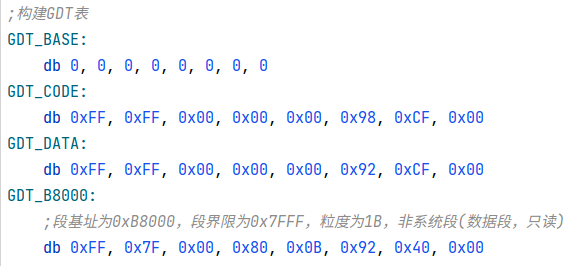
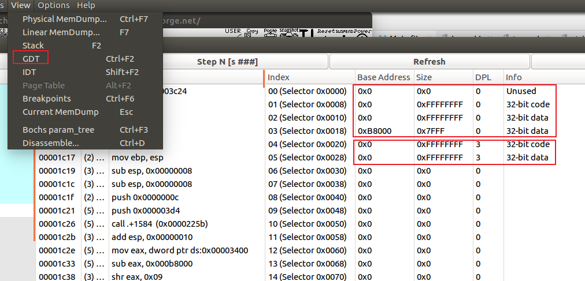

关于GDT表请参考《专题二 CPU的段页门》的"段选择子、段描述符、GDT LDT表.md"一文。

使用C语言接管GDT表主要就是创建好段描述符，GDT等数据结构，如下：

段描述符结构如下：

```c
typedef struct {
    unsigned short limit_low;           // 段界限 bit0~bit15
    unsigned int base_low : 24;         // 段基址 bit16~bit39
    unsigned char type : 4;             // 段类型 bit40~bit43（系统段，非系统段）
    unsigned char segment : 1;          // S bit44 1-非系统段(代码段或数据段) 0-系统段
    unsigned char dpl : 2;              // DPL bit45~bit46 描述符特权级0~3
    unsigned char present : 1;          // P bit47 存在位 1-在内存 0-在磁盘
    unsigned char limit_high : 4;       // 段界限 bit48~bit51
    unsigned char available : 1;        // AVL bit52 保留
    unsigned char long_mode : 1;        // L bit53 1-64位代码段 0-32位代码段
    unsigned char big : 1;              // D/B bit54 0-16位 1-32位
    unsigned char granularity : 1;      // G bit55 0-粒度1B 1-粒度4KB
    unsigned char base_high;            // 段基址 bit56~bit63
} __attribute__((packed)) gdt_item_t;
```

GDTR结构如下：

```c
typedef struct {
    short limit;
    int base;       //这个base需要大端存储，默认是小端存储
} xdt_ptr_t;
```

段选择子结构如下：

```c
typedef struct {
    char RPL : 2;           //请求特权级(当前特权级)
    char TI : 1;            //0-在GDT表索引 1-在LDT表索引
    short index : 13;       //索引值，即GDT/LDT的下标
}__attribute__((packed)) gdt_selector_t;
```

然后分配一个存放GDT表的内存空间，然后把我们创建的段描述符都装入GDT表中，然后把该表地址存入到 GDTR 寄存器中。代码如下：

```c
//构建一张gdt表，这里限制了最多可保存256个段描述符
#define GDT_SIZE 256
gdt_item_t gdt[GDT_SIZE];

//定义gdtr结构
xdt_ptr_t gdt_ptr;
```

初始化gdt时，先利用 sgdt 指令读取当前已创建好的段描述符，然后将其保存到 gdt[] 这个数组中，然后自己用C语言创建的段描述符依次存放到 gdt[] 这个数组中，代码如下：

```c
void gdt_init(void)
{
    __asm__ volatile ("sgdt gdt_ptr;"); //从gdtr寄存器中读出gdt表的地址
    memcpy(&gdt, (char *)gdt_ptr.base, gdt_ptr.limit); //保存在实模式时创建好的段描述符到gdt中

    //创建r3用的段描述符：代码段，数据段
    create_code_gdt_item_r3(4, 0, 0xfffff);
    create_data_gdt_item_r3(5, 0, 0xfffff);

    //创建r3用的选择子：代码段，数据段
    r3_code_selector.RPL = 3;
    r3_code_selector.TI = 0;
    r3_code_selector.index = 4;
    r3_data_selector.RPL = 3;
    r3_data_selector.TI = 0;
    r3_data_selector.index = 5;

    gdt_ptr.base = (int *)&gdt;
    gdt_ptr.limit = sizeof(gdt) - 1;

    __asm__("lgdt gdt_ptr;");   //保存gdt到gdtr寄存器中
}
```

创建段描述符代码如下：

```c
/*
* gdt_index: 段描述符在GDT表中的下标
* base: 段基址
* limit: 段界限
*/
static void create_code_gdt_item_r3(int gdt_index, int base, int limit)
{
    //实模式下已经创建了4个全局描述符，所以前4个不能再用了
    if (gdt_index < 4) {
        printk("the gdt_index:%d has been used...\n", gdt_index);
        return;
    }

    gdt_item_t *item = (gdt_item_t *)&gdt[gdt_index];
    item->limit_low = limit & 0xffff;
    item->base_low = base & 0xffffff;
    item->type = 0b1000;
    item->segment = 1;
    item->dpl = 0b11;
    item->present = 1;
    item->limit_high = limit >> 16 & 0xf;
    item->available = 0;
    item->long_mode = 0;
    item->big = 1;
    item->granularity = 1;
    item->base_high = base >> 24 & 0xff;
}
```

实模式下已创建过4个段描述符，它们如下：



使用C语言创建的段描述符，使用bochs调试如下：



完整的工程代码 sha:538ee49f (使用C语言接管GDT表)