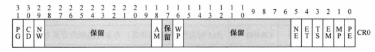
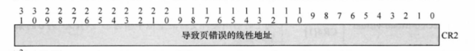
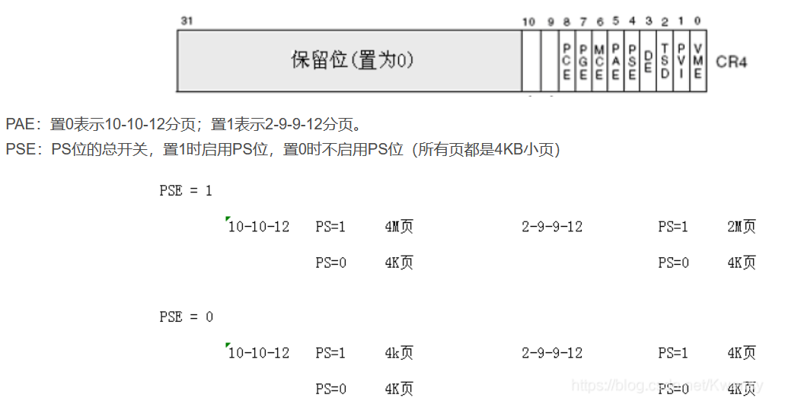

控制寄存器有5个，CR0~CR4

CR1保留，CR3为页目录基地址寄存器，用来切换和定位当前正在使用的页表。

# CR0
结构图如下：



```
PE位：启用保护(Protection Enable)标志, 1-保护模式 0-实模式
这个标志仅开启段级保护，而没有启用分页机制，若要启用分页机制，那么PE和PG标志都要置位

PG位：分页西岭雪山标志 1-开启分页机制 0-未开启分页机制

WP位：写保护标志
当设置该标志时，处理器会禁止超级用户程序(R0)向用户级只读页面执行写操作；
当 CPL < 3 时：
    如果 WP=0 可以读写任意用户级物理页，只要线性地有效
    如果 WP=1 可以读取任务用户级物理页，但对于只读的物理页则不能写
```

# CR2
当CPU访问某个无效页面时，会产生缺页异常，此时，CPU会引起异常的线性地址存放在CR2中。

结构图：



举例：当CPU访问某个物理页，但PDE/PTE的P位为0时，产生缺页异常。缺页异常一旦发生，CPU会将引起缺页异常的线性地址存储到CR2中，此时，操作系统的处理程序开始对异常进行处理，若处理结束后，虽然PDE/PTE的P位为0，但实际上它被写进了页面，这时，处理程序会将数据从页面中读出，再挂上一个有效的物理页，让程序接着往下运行。程序继续运行时，操作系统必须要记录程序原先已经执行到了哪里，此时，CR2便派上了用场，因为产生异常时的线性地址存在了CR2中，但如果异常处理程序检测到用户访问的页面时一个未分配的页面，这时，操作系统会报告一个异常，告诉我们在哪里发生了错误，若没有CR2寄存器，当进入异常处理程序时，将找不到加去的线性地址。

# CR4

