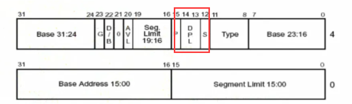
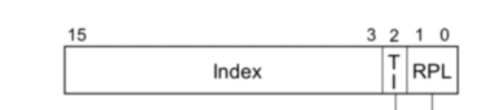

# DPL
DPL：描述符特级级(Descriptor Privilege Level)，存储在描述符中的权限位，用于描述代码的所属的特权等级，也就是代码本身真正的特权级。一个程序可以多个段(Data, Code, Stack)也可以只用一个 Code 段等。正常情况下，当程序的环境建立好后，段描述符都不需要改变 —— 当然 DPL 也不需要改变，因此每个段的 DPL 值是固定的。

# RPL
RPL:请求特权级(Request Privilege Level)，RPL 保存在选择子的最低两位。RPL 说明的是进程对段访问的请求权限，意思是当前进程想要的请求权限。RPL 的值由程序员自由设置，并不一定 RPL >= CPL，但是当 RPL < CPL 时，实际起作用的就是 CPL 了，因为访问时的特权检查是判断：max(RPL, CPL) <= DPL 是否成立，所以 RPL 可以看成是每次访问时的附加限制，RPL=0 时附加限制最小，RPL=3 时附加限制最大。所以你不要想通过随便设置一个 RPL 来访问一个比 CPL 更内层的段。

因为你不可能得到比自己更高的权限，你申请的权限一定要比你实际权限低才能通过 CPU 的审查，CPU 才能对你放行。所以实际 RPL 的作用是程序员可以把自己的程序降级运行 —— 有些时候为了更好的安全性，程序可以在适当的时机把自身降低权限(RPL 设成更大的值)。

# CPL
CPL:当前任务特权级(Current Privilege Level)，表示当前正在执行的代码段所处的特权级。CPL 保存在 CS 中的最低两位，是针对 CS 而言的。当选择子成功装入 CS 寄存器后，相应的选择子中的 RPL 就变成了 CPL。因为它的位置变了，已经装入到 CS 寄存器了，所表达的意思也发生了变化 —— 原来的要求等级已经得到了满足，就是当前自己的等级。

选择子可以有许多个，因此 RPL 也就有许多个。而 CPL 就不同了，正在执行的代码在某一时刻就只有这个值唯一的代表程序的 CPL。

