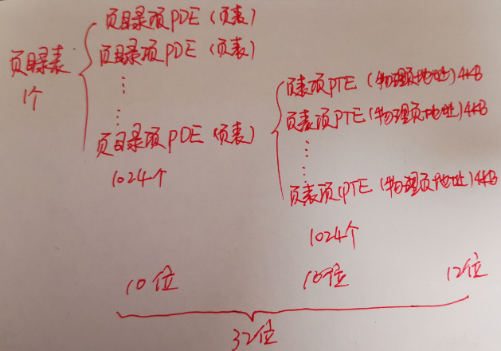

# 内存为什么要分页
内存为什么要分页？我们知道 x86 的寻址方式是 段基址:段内偏移地址，这是 x86 基因里的东西，是无法改变的。所以，x86 首先必须支持内存分段机制，以适配它基因里的东西。但对于32位的内存平坦模型来说，一个段最大可达到 4GB，程序员写的程序也是分段的，如数据段，代码代段，栈段等，每个段大小不定。当在内存中运行多个进程时，内存中同时存在多个进程的段，当内存不足时就需要唤出部分段到外存(硬盘)中，但对于整个段的换入与换出代价太大，所以需要粒度更细一点的页登场。

# 一级页表
首先说明一点，分页也是基于分段进行的，因为 x84 的寻址方式是基因里的东西。为什么这么说，请看下图：

CPU 在不打开分页机制的情况下，是按照默认的分段方式进行的，段基址和段内偏移地址经过段部件处理后所输出的线性地址，CPU 就认为是物理地址。如果打开了分页机制，段部件输出的线性地址就不再等同于物理地址了，我们称之为虚拟地址，它是逻辑上的，是假的，不应该被送上地址总线。CPU 必须拿到物理地址才行，此虚拟地址对应的物理地址需要在页表中查找，这项查找工作是由页部件自动完成的。

为搞清页部件的工作原理，需要理解下面两个问题：
- (1) 分页机制的原理
- (2) 页表的结构

分页机制的思想是：通过映射，可以使连续的线性地址与任意物理内存地址相关联，逻辑上连续的线性地址其对应的物理地址可以不连续。

分页机制的作用有两个方面：1. 将线性地址转换成物理地址 2. 用大小相等的页代替大小不等的段。如下图：

从虚拟地址到物理地址是有一种映射关系的，这种映射关系就保存在页表中。页表是一张表，其中的每一项称为页表项(Page Table Entry, PTE)。保护模式下 CPU 是 32 位，最大寻址空间为 4GB，可以将 32 位地址分成高低两部分，低地址部分是内存块大小，高地址部分是内存块数量，它们的关系为：**内存块数\*内存块大小=4GB**，这里说的内存块数就是 PTE，即每一个内存块就是页表中的一个页表项。

我们规定一页的内存大小为 4KB，所以，页表共需要保存 1M 个页表项(1M\*4KB=4GB)，另外，每个页表项占 4 个字节，如下图：

那页表该怎么用? 我们知道，现在页表项有 1M(1048756) 个，每个页表项对应的物理页是 4KB。所以对于一个 32 位的线性地址来说，刚好可以用其高 20 位来索引到哪个页表项，低 12 位用来在索引到页表项对应的物理地址中的偏移(12位最大偏移 4KB，刚好可以把 4KB 的物理页给寻址完)。

所以，经以上分析，虚拟地址的高 20 位可用来定位一个物理页，低 12 位可用来在该物理页内寻址。这是如何实现的？物理地址写在页表的页表项中，段部件输出的只是线性地址，所以问题就变成了：怎样用线性地址找到页表中对就在的页表项。

在此之前，需要知道下面两件事：

- (1) 分页机制打开前要将页表地址加载到控制寄存器 CR3 中，这是启用分页机制的先决条件之一。所以，在打开分页机制前加载到寄存器 CR3 中的是页表的物理地址，页表中页表项的地址自然也是物理地址。
- (2) 虽然内存分页机制的作用是将虚拟地址转换成物理地址，但其转换过程相当于在关闭分页机制下进行，过程中所涉及到的页表及页表项的寻址，它们的地址都被 CPU 当作最终的物理地址直接送到地址总线上，不会被分布机制再次转换(否则会递归转换下去)。

页表本身属于线性表结构，相当于页表项数组，访问其中任意页表项成员，只要知道该表的索引(下标)就够了。

地址转换过程原理如下：

一个页表对应一个页，所以，用线性地址的高 20 位作为页表项的索引，每个页表项要占用 4 字节大小，所以这高 20 位的索引乘以 4 后才是该页表物理地址的字节偏移量。用 CR3 寄存器中的页表物理地址加上此偏移量便是该页表项的物理地址，从该页表项中得到映射的物理页地址，然后用线性地址的低 12 位与该物理页地址相加，所得的地址之和便是最终要访问的物理地址。  绝绝子~

# 二级页表
引入二级页表的原因是因为一级页表还是有点占空间，一级页表共 1M 个页表项，每个页表项 4 字节，总给需要 4MB，且每个进程都需要有自己的页表，所以占用的空间还是很可观的。

有了一级页表的基础，二级页表就简单点说。二级页表引入了新的概念，叫做页目录表，页目录表只有一个，该表中的每一项被称为页目录项(Page Drictory Entry, PDE)，每个页目录项占 4 字节，每个项目录项中保存着一个页表所在的物理地址，然后就到一级页表的知识了。有感觉了吗？这里设计成：1个页目录表中包含 1K 个页目录项，每个页目录项中保存着1个页表物理地址，每个页表中包含 1K 个容量为 4KB 的物理页，所以最终： 1\*1KB\*1KB\*4KB=4GB。

所以，控制寄存器 CR3 保存的就不再是页表所在的物理地址了，而是保存页目录表在内存中的物理地址。

二级页表其数据结构如下图：

二级页表的虚拟地址转换为物理地址时，还是使用 32 位虚拟地址的不同部分来定位物理页的。二级页表地址转换原理是将 32 位虚拟地址拆分成高 10 位，中间 10 位，低 12 位三部分，它们的作用是：高10位作为页目录表的索引，用于在页目录表中定位一个页目录项PDE，页目录项中有页表物理地址，也就是定位到了某个页表。中间10位作为页表的索引，用于在页表内定位到某个页表项PTE，页表项中有分配的物理页地址，也就是定位到了某个物理页。低12位作为页内偏移量用于在已经定位到的物理页内寻址。

由于页目录项PDE和页表项PTE都是4字节大小，给出了PDE和PTE索引后，还需要在背后悄悄乘以4，再加上页表物理地址，这才是最终要访问的绝对物理地址。转换过程背后的具体步骤如下：
- (1) 用虚拟地址的高10位乘以4，作为页目录表内的偏移地址，加上页目录表的物理地址，所得到的和便是页目录项的物理地址。读取该页目录项，从中获取到页表的物理地址。
- (2) 用虚拟地址的中间10位乘以4，作为页表内的偏移地址，加上在第1步中得到的页表物理地址，所得到的和便是页表项的物理地址。读取该页表项，从中获取到分配的物理页地址。
- (3) 虚拟地址的高10位和中间10位分别是PDE和PTE的索引值，所以它们需要乘以4。但低12位就不是索引值了，其表示的范围是0~0xfff，作为页内偏移最合适，所以虚拟地址的低12位加上第2步中得到的物理地址，所得到的和便是最终转换的物理地址。

下面是一个二级页表转换成物理地址的示例图：

# PDE PTE 结构
PDE，PTE 有什么好说的？不就是页目录表和页表中的各个项嘛，每项占4个字节，保存着页表和物理页的地址吗？4个字节刚好可以保存 4G 在内的所有物理地址。然而 PDE，PTE 的 32 位中只用到了高 20 位用来保存页表物理地址及实际物理页地址，为什么勒？因为 CPU 规定一页大小为 4KB，即 4KB 对齐，所以线性地址中的 32 位的低 12 位全部为0(即没用)，只用高 20 位即可表示物理地址。那既然低 12 位没用，也别浪费，代表一些属性也是极好的，所以就有了 PDE 和 PTE 的结构，如下图：

- P，Present，意为存在位。若为1表示该页存在于物理内存中，若为0表示该页不在物理内存中。操作系统的页式虚拟内存管理便是通过 P 位和相应的 pagefault 异常来实现的。
- RW，Read/Write，意为读写位。若为1表示可读可写，若为0表示可读不可写。
- US，User/Supervisor，意为普通用户/超级用户位。若为1时，表示处于 User 级，任意级别(0,1,2,3)特权的程序都可以访问该页。若为0，表示处于 Supervisor级，则该页只允许特权级为0,1,2的程序访问。
- PWT，Page-level Write-Through，意为页级通写位，也称为页级写透位。若为1表示此项采用通写方式，表示该页不仅是普通内存，还是高速缓存。此项和高速缓存有关，“通写”是高速缓存的一种工作方式，本位用来间接决定是否用此方式改善该页的访问效率。这里我们直接置为0。
- PCD，Page-level Cache Disable，意为页级高速缓存禁止位。若为1表示该页启用高速缓存，为0表示禁止将该页缓存。这里我们直接置为0。
- A，Accessed，意为访问位。若为1表示该页被CPU访问过了，所以该是由CPU设置的。操作系统根据 A 和 P 这两位可以实现虚拟内存管理。利用页目录项和页表项中的A位可以记录某一内存页的使用频率(操作系统定期将该位清0，统计一段时间内变成1的次数)，从而当内存不足时，可以将使用频率较低的页面换出到硬盘，同时将页目录项或页表项的 P 位置0，下次访问该页引起 pagefault 异常时，中断处理程序将硬盘上的页再次换入，同时将 P 位置1。
- D，Dirty，意为脏页位。当 CPU 对一个页面执行写操作时，就会设置对应页表项的 D 位为1。此项仅针对页表项有效，并不会修改页目录项中的 D 位。
- PAT，Page Attribute Table，意为页属性表位，能够在页面一级的粒度上设置内存属性。比较复杂，将此位置0即可。
- G，Global，意为全局位。由于内存地址转换也是颇费周折，所以为了提高获取物理地址的速度，将虚拟地址与物理地址转换结果存储在 TLB (Translation Lookaside Buffer)中。TLB就是我们说的快表。此 G 位用来指定该页是否为全局页，为1表示是全局页，为0表示不是全局页。页为全局页，该页将在高速缓存TLB中一直保存，给出虚拟地址就直接给出物理地址，无需转换。由于TLB容量比较小，所以这里面就存放使用频率较高的页面。by the way，清空TLB有两种方式，一是用 invlpg 指令针对单独虚拟地址条目清理，或者是重新加载 CR3 寄存器，这将直接清空TLB。
- AVL，意为 Availabl 位，表示可用，操作系统可用该位，CPU不理会该位的值。

启用分页机制，我们按顺序做好三件事：
- 1. 准备好页目录表及页表
- 2. 将页目录表地址写入控制寄存器 CR3
- 3. 寄存器 CR0 的 PG 位置 1

CR3 用于存储页表物理地址，所以 CR3 寄存器又称为页目录基址寄存器(Page Directory Base Register, PDBR)，其结构如下图：

