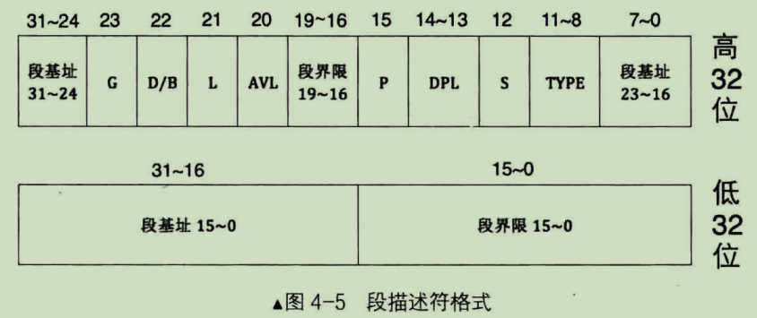
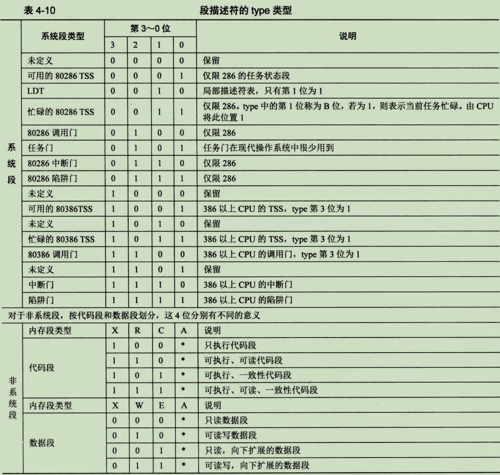
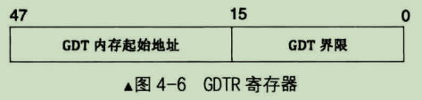
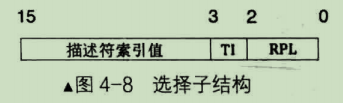

# 段描述符
段描述符由连续的 8 个字节组成，其格式如下：


其各字段含义：

- **段界限**：表示段边界的扩展最值，即最大扩展到多少或最小扩展到多少。扩展方向只有上下两种。对于数据段和代码段，段的扩展方向是向上，即地址越来越高，此时的段界限用来表示段内偏移的最大值。对于栈段，段的扩展方向是向下，即地址越来越低，此时的段界限用来表示段内偏移的最小值。段界限用 20 个二进制位来表示。只不过此段界限只是个单位量，它的单位有两种：单位字节 和 单位4KB，具体表示哪种单位由描述符的 G 位来指定。最终段的边界是此**段界限值\*单位**，故段的大小要么是2^20^=1MB，要么是2^32^=4GB(4KB=2^12^, 12+20=32)。 这里的 1MB 和 4GB 只是个范围，并不是具体的边界值。由于段界限只是个偏移量，是从0算起的，所以实际的`段界限边界值=(描述符中段界限+1)*(段界限的粒度大小：4KB或1)-1`。
- **G**：G=0表示段界限粒度大小为1字节，此时段界限取值范围为0\~1MB；G=1表示段界限粒度大小为4KB，此时段界限取值范围为0\~4GB。
- 段基址：段基址就不用解释了，段基址在段描述符中共被分成三部分，共32位。实模式下的 段基址:段内偏移 转化方式为 段基址<<4+段内偏移=物理地址；而保护模式下的 段基址:段内偏移 转化方式为 段基址+段内偏移=线性地址。
- **TYPE**：用于指定本描述符的类型。该字段共 4 位，用于表示内存段或门的子类型。如下图：


    这里先只关注非系统段。表中的 <font color=red>A</font> 位表示 Accessed 位，这是由 CPU 来设置的，每当该段被 CPU 访问过后，CPU 就将此位置1。所以，创建一个新段描述符时，应该将此位置0。我们在调试时，根据此位便能判断该描述符是否可用啦。

    <font color=red>C</font> 表示一致性代码段，也称为依从代码段，Conforming。一致性代码段是指如果自己是转移的目标段，并且自己是一致性代码段，自己的特权级一定要高于当前特权级，转移后的特权级不与自己的 DPL 为主，而是与转移前的低特权级一致，也就是听从、依从转移前的低特权级。C=1 时则表示该段是一致性代码段；C=0 时则表示该段为非一致性代码段。

    <font color=red>R</font> 表示可读，R=1 表示可读；R=0 表示不可读。

    <font color=red>X</font> 表示该段是否可执行，EXecutable。X=1 可执行；X=0 该段不可执行。

    </font color=red>E</font> 用来标识段的扩展方向，Extend。E=0 表示向上扩展，即地址越来越高，通常用于代码段和数据段。E=1表示向下扩展，地址越来越低，通常用于栈段。

    <font color=red>W</font> 表示该段是否可写，Writeble。W=1 表示可写，通常用于数据段。W=0 表示不可写，通常用于代码段。

- **S**：用来指示当前描述符是否是系统段。S=0 表示系统段；S=1 表示非系统段。
- **DPL**：描述符特权级，Descriptor Privilege Level。DPL 是指所代表的内存段的特权级。这两位能表示4种特权级，分别是0、1、2、3级特权，数据越小，特权级越大。特权级是保护模式才有的东西，CPU 由实模式进入保护模式后，特权级自动为0。操作系统处于最高的0特权级，用户程序通常处于3特权级。
- **P**：表示该是否存在，Present。如果段存在于内存中，P=1，否则 P=0。P 字段是由 CPU 来检查的，如果为0，则CPU将抛出异常，转到相应的异常处理程序，此异常处理程序由程序员来写，在异常处理程序处理完成后将 P 置 1。
- **AVL**：从名字上看它是"AVaiLable"，可用的。无实际用处，程序员可随意使用此位。
- **L**：用来设置是否是 64 位代码段。L=1 表示64位代码段，否则表示32位代码段。
- **D/B**：用来指示有效地址(段内偏移地址)及操作数的大小。
    对于代码段来说，此位是 D 位，若 D=0 表示指令中的有效地址和操作数是16位(主要是兼容80286CPU，现在可以不用管)，D=1 表示指令中的有效地址及操作数是32位，指令有效地址用 EIP 寄存器。

    对于栈段来说，此位是 B 位，用来指定操作数大小，此操作数涉及到栈指针寄存器的选择及栈的地址上限。若 B=0，使用的是 sp 寄存器，若 B=1，使用的是 esp 寄存器。

# 全局描述符表GDT
一个段描述符只用来定义(描述)一个内存段。代码段要占用一个段描述符、数据段和栈段等，多个内存段也要各自占用一个段描述符，这些描述符放在哪里？答案是放在全局描述符表GDT中。全局描述符表 GDT 相当于是描述符的数组，数组中的每个元素都是 8 字节的描述符。可以用选择子中提供的下标在 GDT 中索引描述符。

所谓的全局，是指在所有进程中都可见，是公用的。全局描述符表GDT位于内存中，但在内存哪里？CPU怎么找到它？答案是通过一个专门的寄存器来保存 GDT 的内存地址，该寄存器便是 GDTR，专门用来存储 GDT 的内存地址及大小。GDTR 是个 48 位的寄存器，结构如下图：



操作 gdtr 寄存器有专门的指令：lgdt，其格式如下：

```
lgdt 48位内存数据
```

其中 GDT 界限单位是字节，其代表 GDT 所占用字节数减1.

# 局部描述符表LDT
有全局描述符表就有局部描述符表，该表就是 LDT。CPU厂商建议每个任务的私有内存段都应该放到自己的段描述符表中，随着任务的切换，也要切换相应任务的 LDT。LDT 也位于内存中，其地址需要先被加载到某个寄存器后CPU才能使用LDT，该寄存器是 LDTR。同样也有专门的指令用于加载 LDT，即 lldt。以后每切换任务时，都要用 lldt 指令重新加载任务的私有内存段。

回顾一下段描述符中的 type 字段，其中 LDT 为系统段，换名话说，LDT 虽然是个表，但其也是一片内存区域，所以也需要用个描述符在 GDT 中先注册。段描述符是需要用选择子去访问的。故，lldt 的指令格式为：

```
lldt 16位寄存器/16位内存
```

无论是寄存器，还是内存，其内容一定是个选择子，该选择子用来在 GDT 中索引 LDT 的段描述符。

在 LDT 被加载到 ldtr 寄存器后，之后再访问某个段时，选择子中的 TI 位若为1，就会用该选择子中的高13位在 ldtr 寄存器所指向的 LDT 中去索引相应的段描述符。

# 选择子
段描述符有了，描述符表也有了，但该如何使用它勒？这里就引出了新概念：段的选择子。

段寄存器 CS、DS、ES、FS、GS、SS 在实模式下存储的是段基址，即内存段的起始地址。而在保存模式下时，由于段基址已经存入了段描述符中，所以段寄存器中再存放段基址就没有意义了，在段寄存器中存入的是一个叫**选择子**的东西——selector。选择子"基本上"是个索引值，用此索引值在段描述符表GDT中索引相应的段描述符。

因为段寄存器是16位，所以选择子也是16位。下面是选择子结构：



- **PRL**：用来存储 PRL，即请求特权级，可理解为请求者当前的特权级。
- **TI**：即 Table Indicator，用来指示选择子是在 GDT 中，还是在 LDT 中去索引描述符。TI=0 表示在 GDT 中索引描述符，TI=1 表示在 LDT 中索引描述符。
- **描述符索引值**：这个就是 GDT 数组的下标。

选择子的作用主要是确定段描述符，确定描述符的目的，一是为了特权级、界限等安全老虎，最主要的还是确定段的基地址。

例子：选择子是0x08，将其加载到 ds 寄存器后，访问 ds:0x09 这样的内存，其过程是：0x08 的低2位是 RPL，其值为 00。第2位是 TI，其值为 0，表示是在 GDT 中索引段描述符。用 0x08 的高 13 位 0x01 在 GDT 中索引，也就是 GDT 中的第 1 个段描述符(GDT中第0个段描述符不可用)。假设第1个段描述符中的3个段基址部分其值组合后为0x1234。CPU将0x1234作为段基地址，与段与偏移0x09相加，0x1234+0x09=0x123d。用所得的和 0x123d 作为访存地址。


# 总结
总结一下保护模式下的寻址过程：首先段寄存器中保存的是段选择子，由段选择子的高13位索引出 GDT/LDT 中的段描述符，再从段描述符中取出基地址，再由基地址+偏移地址得到最终的线性地址。

