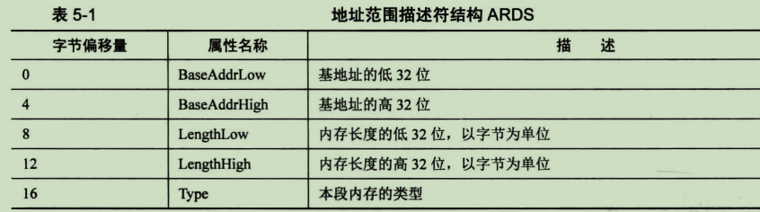
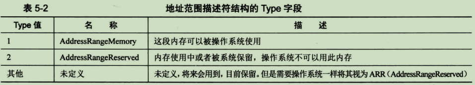
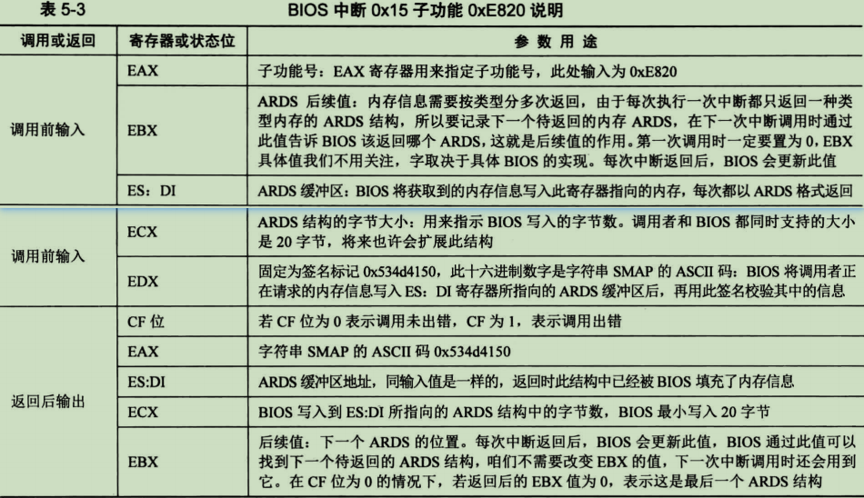
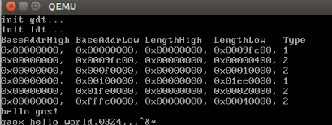

借助BIOS中断检测物理内存容量，详细内容请参考 《操作系统真象还原》一书中的第5.1章节 —— 5.1获取物理内容容量。

下面我简单记录一下。

# 利用BIOS中断0x15子功能0xe820获取内存
BIOS中断0x15的子功能0xe820能够获取系统的内存布局，每次BIOS只返回一种类型的内存信息，直到将所有内存类型返回完毕。 内存信息的内容是用地址范围描述符来描述的，用于存储这种描述符的结构称之为地址范围描述符(Address Range Descriptor Structure, ARDS)，如下表：



此结构中的字段大小都是4字节，共5个字段，所以此结构大小为20字节。每次 int 0x15 之后，BIOS就返回这样一个结构的数据。

其中的 Type 字段用来描述这段内存的类型，这里所谓的类型是说明这段内存的用途，即其是可以被操作系统使用，还是保留起来不能用。Type字段的具体意义如下表：



BIOS中断0x15的0xe820子功能的使用方法如下，下表中是使用此中断的方法，分输入和输出两部分：



表中的ECX寄存器和ES:DI寄存器是典型的"值-结果"型参数，即调用方提供了两个变量作为被调用函数的参数，一个变量是缓冲区指针，另一个变量是缓冲区大小。被调用函数在缓冲区中写入数据后，将实际所写入的字节数记录到缓冲区大小变量中。

根据表5-3中的说明，此中断的调用步骤如下：

(1) 填写好"调用前输入"中列出的寄存器
(2) 执行中断调用 int 0x15
(3) 在 CF 位为0的情况下，"返回后输出"中对应的寄存器便会有对应的结果

其它还有两种方式获取内存大小，但功能没有上面说的这种强大，自行看书了解。"利用BIOS中断0x15子功能0xe801获取内存"，"利用BIOS中断0x15子功能0x88获取内存"。

# 代码实例
内存检测代码如下：

```asm
ARDS_BUFFER equ 0x1102
ARDS_NR_BUFFER equ 0x1100   ;配合C语言结构体部分
ARDS_NR dw 0
CHECK_BUFFER_OFFER dw 0

memory_check:
    xor ebx, ebx
    mov di, ARDS_BUFFER     ;es:di指向一块内存，用于保存读出来的ARDS结构; es为0,前面已赋值为0
    mov edx, 0x534d4150
.loop:
    mov eax, 0xe820
    mov ecx, 20
    int 0x15
    jc memory_check_error   ;if(CF!=0),内存检测出错
    add di, cx              ;将下次读到的ARDS结构保存到下一个内在地址处
    inc word [ARDS_NR]      ;记录有多少个ARDS结构
    cmp ebx, 0              ;在检测的时候，ebx会被bios修改，ebx不等于0时需要继续检测
    jne .loop
    mov ax, [ARDS_NR]       ;保存ARDS结构的个数
    mov [ARDS_NR_BUFFER], ax
    mov [CHECK_BUFFER_OFFER], di    ;保存offset
.memory_check_success:
    mov si, memory_check_success_msg
    call print

memory_check_error_msg:
    db "memory check fail...", 10, 13, 0

memory_check_success_msg:
    db "memory check success...", 10, 13, 0
```

把获取到的ARDS结构依次保存到地址 0x1102 为起始地址后，然后使用C语言来获取，memory.c文件中代码如下：

```c
/*
 * Create by gaoxu on 2023.06.11
 * */
#include "kernel.h"
#include "mm.h"

#define ARDS_ADDR   0x1100
#define LOW_MEM     0x100000    //1M以下的物理内在给内核用

#define ZONE_VAILD      1       //ards可用内存区域
#define ZONE_RESERVED   2       //ards不可用内存区域

void check_memory(void)
{
    check_memory_info_t *p = (check_memory_info_t *)ARDS_ADDR;
    check_memory_item_t *ards = (check_memory_item_t *)(ARDS_ADDR + 2);
    unsigned short times = p->times;
    check_memory_item_t *temp;

    printk("BaseAddrHigh BaseAddrLow LengthHigh  LengthLow   Type\n");
    for (int i = 0; i < times; ++i) {
        temp = (ards + i);
        printk("0x%08x,  0x%08x, 0x%08x, 0x%08x, %d\n",
               temp->base_addr_high, temp->base_addr_low, temp->length_high, temp->length_low, temp->type);
    }
}
```

其结构体定义如下(mm.h文件中)：

```c
typedef struct {
    unsigned int base_addr_low;
    unsigned int base_addr_high;
    unsigned int length_low;
    unsigned int length_high;
    unsigned int type;
} check_memory_item_t;

typedef struct {
    unsigned short times;
    check_memory_item_t *data;
} check_memory_info_t;
```

可以看到，check_memory_info_t 结构体的定义规则就是汇编中保存的规则，在汇编中以0x1100为起始地址的前2个字节保存的是获取的ARDS的结构的数量，0x1102及以后的地址保存的就是ARDS结构。

实际代码运行结果如下图：



因为我们是32位系统，所以BaseAddrHigh和LengthHigh都是0。

完整的工程代码 sha:a6029228 (BIOS中断0x15获取内存信息，C语言输出内存检测结果)