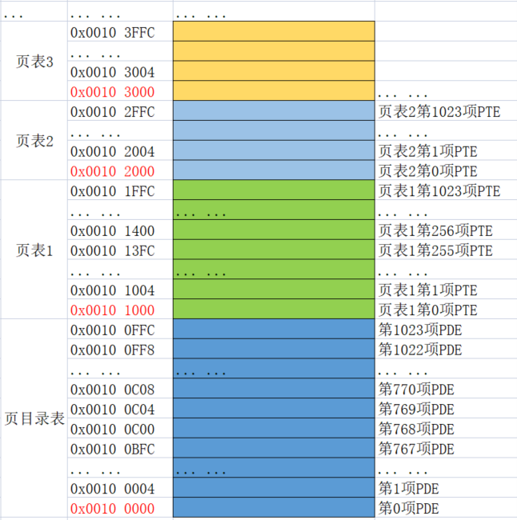
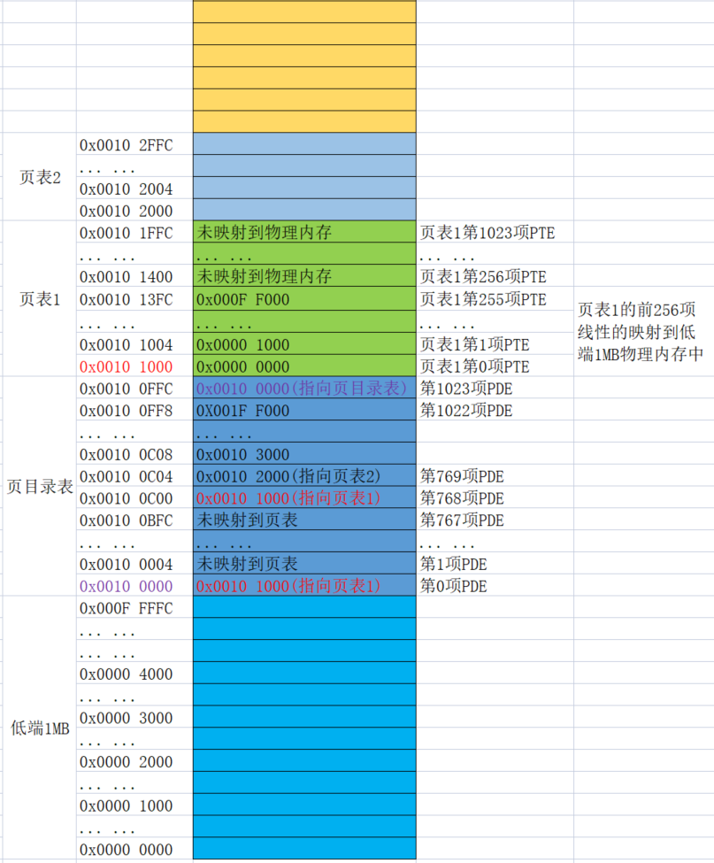
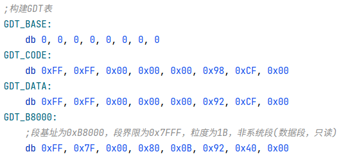
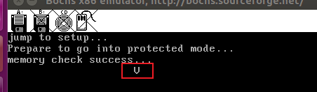
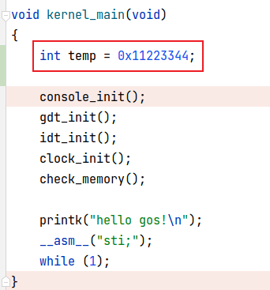
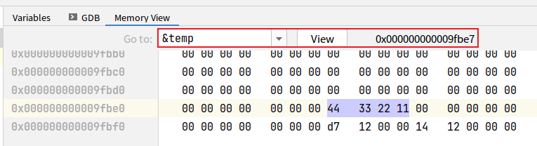
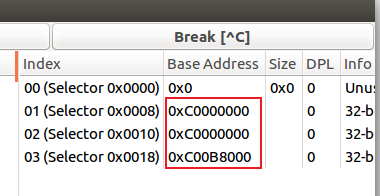
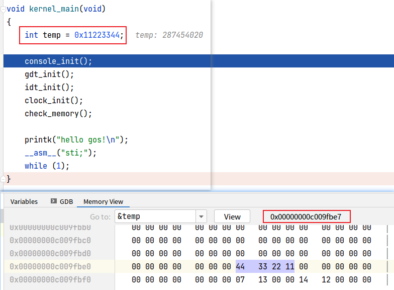
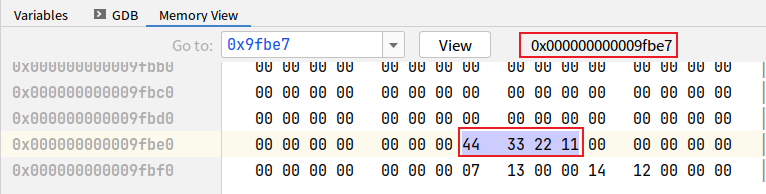

# PDE与PTE的设计
通过上一节的BIOS中断获取到物理内存后，可知，可用物理内存从0x100000开始，因为分页机制是需要创建页目录表及页表的，所以这里设计的页目录表存放地址为0x100000处，页目录表共1024项，每项占4个字节，所以一个页目录表共占物理内存为4KB，即物理地址 0x100000 ~ 0x100FFF 存放的是页目录表。页表就挨着页目录表依次往后存放，所以第1个页表的地址为 0x101000，第2个页表的地址为 0x102000...，布局如下图：



        图1

接下来就是填充各个PDE及PTE了。

我们在页目录表的第0项PDE中填充的地址为 0x101000，然后第1项PDE到第767项PDE中未填充地址，然后第768项PDE到第1022项PDE中依次填充的地址为 0x102000 \~ 0x1FF000。第1023项PDE中填充的地址为 0x100000。然后页表1中的前256项PTE中填充的地址依次是 0x00000000 \~ 0x000FF000(共1MB，也就是低端1MB内存)。至于为什么要这样设计页目录表及页表，后面再解释。现在来看一下最终形成的页表，如下图(注意，下图中的地址都是物理地址)：



        图2

# 第0项PDE及页表1的前256项
从图2中可以看到，页目录表的基地址为 0x00100000，其第0项PDE中保存的地址为 0x00101000 指向了页表1的首地址，而页表1的前256页PTE依次映射到了低端1MB内存中。虚拟地址到物理地址的映射是可以乱序的，但这里为什么选择了线性映射？因为我们在开启分页机制后，所有的地址都会被CPU识别成虚拟地址，需要通过MMU进行地址转换的，但如果这时我们的GDT表中记录的段基址如果没有进行相应的改变，则可能访问出错，但如果我们把页目录表的第0项所在的页表进行线性映射到低端1MB内存的话，CPU经过地址转换后依然能正确的访问到低端1MB的内存。举个例子：当前的GDT表有4项，如下图：



可以看到，代码段，数据段的段基址都是0，视频段的段基址为 0xB8000。如果这时按照图2中创建好页表后，开启分页机制，使用如下代码访问视频段：

```
TI_GDT equ 000b
RPL0 equ 00b

SELECTOR_VIDEO equ (0x0003 << 3) + TI_GDT + RPL0

mov ax, SELECTOR_VIDEO
mov gs, ax
mov byte [gs:80*6+40], 'V'
```

考虑一下这个字符 'V' 会不会写入到终端上？我们模拟一下开启分页机制后CPU的寻址方式：

1. 段选择子gs为3，所以选择到了GDT表中的第3项，即 GDT_B8000
2. 由GDT_B8000找到段基址为 0xB8000
3. 段基址+偏移组成虚拟地址为 0x000B8208
4. 由0x000B8208的高10位确定PDE(为0)，由0x000B8208的中间10位确定PTE(为184)，由0x000B8208的低12位确定偏移(520)
5. 由PDE找到页表1，由PTE从页表1中找到第184项，我们知道页表1中的前256项与低端1MB线性对应，每项PTE装的地址间隔都为4KB，所以第184项PTE中装的地址为：184*4096=0xB8000，这刚好就是低端1MB内的视频缓存区，再加上偏移520字节就是我们想写到的真实的物理地址。所以最终字符'V'是可以显示出来的，如下图：



看到了吧，这就是为什么页目录项的第0项PDE保存的是页表1，而页表1中的前256项要与低端1MB物理内存一一对应的原因了。

再来举个例子：在C语言环境中定义一个变量，由这个变量找到它的物理地址，如下图：



首先经过前面的理论介绍，我们可以推测出，temp的虚拟地址应该与其物理地址相同，原因是因为这个temp变量是局部变量，其存放在栈上，而我们设置的栈顶指针为 0x9FBFF，是在低端1MB内存中。调试一下如下图：



可以看到temp的虚拟地址为0x9fbe7，我们按照分页机制的寻址方式来拆解下：

1. 0x9fbe7的高10位为0，即页目录表的第0项，所以找到了页表1
2. 0x9fbe7的中间10位为159，所以页表1的第159项PTE中保存的地址为 159*4096=0x9F000
3. 0x9fbe7的低12位为0xbe7，所以最终访问的物理地址为 0x9F000+0xbe7=0x9Fbe7

怎么样，是不是虚拟地址与物理地址是一模一样的。

# 第768项PDE
接下来又有一个让人迷惑的点，就是为什么页目录表的第768项PDE保存的也是页表1的地址勒？

我们知道，Linux进程内存空间是0\~3G是用户空间，3G\~4G是内核空间，每个进程都有属于自己的用户空间，而所有进程都共用内核空间，这样就可以实现共享内存，进程间通信等诸多功能。既然所有进程都要共用内核空间，这也意谓着所有进程的3G\~4G的内存空间所对应的物理内存都是一样的。而我们自己实现的操作系统在低端1MB空间内，所以我们就要保证3G\~4G的虚拟内存空间最终映射到的物理内存还是低端1MB的物理内存。

怎么办呐？3GB对应的地址为0xc0000000，我们以0xc0000000为虚拟地址，其高10位为0x300=768，所以我们需要把页目录表中的第768项PDE中填写成页表1所在的物理地址，即0x00101000。这样的话，内核空间3GB开始访问的物理地址最终都映射到了低端1MB物理内存中。绝绝子呀\~

该PDE设置好后，我们可以修改GDT表中的每项的段基址从0xc0000000开始，这样内核空间使用到的虚拟地址都在3G\~4G之间了。

# 修改GDT表，开启分页机制
代码方式如下代码：

``` {.line-numbers}
;开启分页机制
turn_on_page:
    ;先保存未开启分页机制下的gdt表
    sgdt [gdt_ptr]
    ;获取到gdt表在内存中的起始地址，低2字节是GDT界限，所以要加2
    mov ebx, [gdt_ptr + 2]

    ;GDT的第0项为全0,跳过不修改，所以esi从1开始
    mov esi, 1
    mov cx, 3
.modify_gdt_item_base:
    ;修改GDT中每项的段基址，即从0xc000000开始
    ;esi*8代表GDT表中的每一项占8B
    ;+4代表偏移到GDT表中每项的高4个字节
    or dword [ebx + esi*8 + 4], 0xc0000000
    inc esi
    loop .modify_gdt_item_base

    ;修改gdt在内存中的起始地址
    add dword [gdt_ptr + 2], 0xc0000000
    ;记得同时修改栈顶指针
    add esp, 0xc0000000

    ;设置页目录表基地址
    mov eax, PAGE_DIR_TABLE_POS
    mov cr3, eax
    ;设置cr0的最高位为1开启分页机制
    mov eax, cr0
    or eax, 0x80000000
    mov cr0, eax

    lgdt [gdt_ptr]
    ret
```

上面代码中的注释已经很详细了，不再细说。

设置好后的GDT表如下图：



# 利用虚拟地址访问物理内存
老样子，还是在C环境中定义一个局部变量，然后由虚拟地址找到其物理地址，如下图：



可以看到，经过上一小节修改过后的GDT表后，这里的temp变量的虚拟地址变成了 0xc009fbe7 了。然后还是通过分页机制的寻址方式可以找到其对应的物理地址，这里就不细讲了，直接给出结果：虚拟地址0xc009fbe7对应的物理地址为0x0009fbe7，所以我们直接查看物理地址0x0009fbe7处的数据看是不是 44 33 22 11，如下图：



兄弟们，看到没，正如此。

该篇文章对应的代码分支为 gos_beta，sha:86913227(创建页表，开启分页机制) 及 sha:277b9b73(修改GDT表中每项的段基址为内核空间，利于虚拟地址访问物理内存)

