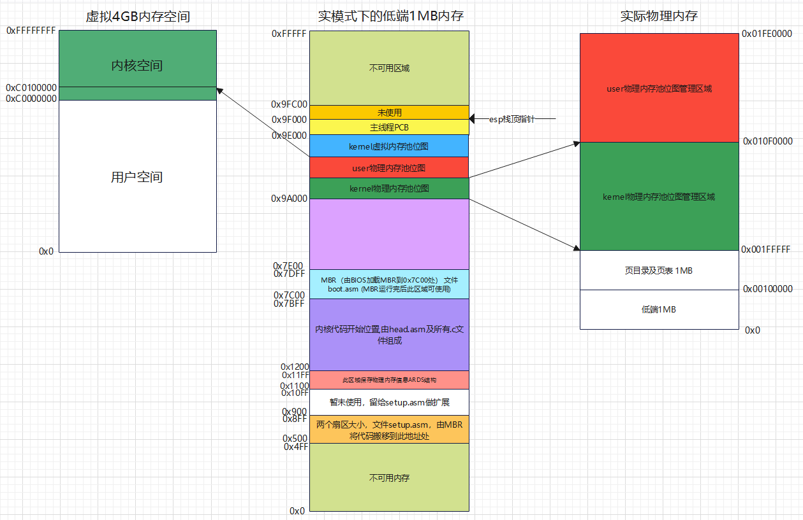

# 内存池
内存池设计成两个，一个用于内核内存池，一个用于用户内存池；本来我们操作系统的代码都是存放在低端1MB内存下，但是免不了操作系统运行时需要动态分配内存，所以需要一个专用于给内核分配内存空间的内存池。同样的，也就需要一个用户内存池。

程序在运行的过程中总会涉及到动态分配内存，这种动态申请的内存一般都在堆中申请。开启分页机制后，分配的内存的地址都是虚拟地址，但哪些虚拟地址是空闲的？所以也需要对虚拟地址进行管理，所以又引入了虚拟内存池的结构。

# 内存池结构
下面是物理内存池结构设计：

```c
struct pool {
    bitmap_t pool_bitmap;
    uint32_t phy_addr_start;
    uint32_t pool_size;
};
struct pool kernel_pool, user_pool; //定义内核内存池和用户内存池
```

物理内存池有三个成员：pool_bitmap 是用于管理物理内存的位图；phy_addr_start 是物理内存的起始地址；pool_size 是物理内存的大小。

下面是虚拟内存池的结构设计：

```c
/* 虚拟地址池，用于虚拟地址管理 */
typedef struct {
    bitmap_t vaddr_bitmap;  //虚拟地址用到的位图结构
    uint32_t vaddr_start;   //虚拟地址起始地址
} virtual_addr_t;
virtual_addr_t kernel_vaddr; //此结构用来给内核分配虚拟地址
```

可以看到虚拟内存池只有两个成员，与物理内存池的区别是没有了 size 限制，尽管在32位系统下虚拟地址为4GB，但对于我们来说相当于无限大，因此不用为其设置虚拟地址的大小。

# 内存池的初始化
初始化内存池的总入口为如下函数：

```c
void mem_init(void)
{
    mem_pool_init(mem_bytes_total);
}
```

可以看到 mem_init() 函数调用了 mem_pool_init() 对内存池进行初始化，而函数入参就是当前系统中可用的物理内存的总大小。这个物理内存的总大小就是通过 《01.借助BIOS中断检测物理内存.md》这一小节中获取物理内存总大小。

## 当前可用的物理内存
要初始化物理内存池，首先需要先搞清楚我们还有多少可用的物理内存。当前系统已使用的物理内存如下：

```
1. 低端1MB内存不可使用
2. 页目录表占1个页框, 起始地址为 0x100000
3. 页表占 255 个页框，起始地址为 0x101000
```

所以，目前已经被使用的物理内存不可以再被划入到内存池中进行管理。页表占256个页框请参考《02.创建页表及开启分页机制.md》一节。`页表大小 = 1页的页目录表 + 第0和第768个页目录项指向同一个页表 + 第769～1022个页目录项共指向254个页表，共256个页框`。

是否还有一个疑问？位图占用的物理地址在哪里？其实位图我们放在了低端1MB内存内。

## 初始化内存池
内存池的初始化主要就是通过 mem_pool_init() 函数完成的。

```c
/*
 * 初始化内存池
 * */
static void mem_pool_init(uint32_t all_mem)
{
    printk("mem_pool_init start.\r\n");
    /*
     * 页表大小 = 1页的页目录表 + 第0和第768个页目录项指向同一个页表 + 第769～1022个页目录项共指向254个页表，共256个页框
     * */
    uint32_t page_table_size = PAGE_SIZE * 256;
    uint32_t used_mem = page_table_size + 0x100000; //0x100000为低端1MB内存
    uint32_t free_mem = all_mem - used_mem;
    uint16_t all_free_pages = free_mem / PAGE_SIZE; //不考虑不足1页的内存
    uint16_t kernel_free_pages = all_free_pages / 2;
    uint16_t user_free_pages = all_free_pages - kernel_free_pages;
    /* 位图的一位表示一页，以字节为单位 */
    uint32_t kbm_length = kernel_free_pages / 8;
    uint32_t ubm_length = user_free_pages / 8;
    /* 内核与用户内存池的起始地址 */
    uint32_t kp_start = used_mem;
    uint32_t up_start = kp_start + kernel_free_pages * PAGE_SIZE;

    kernel_pool.phy_addr_start = kp_start;
    user_pool.phy_addr_start = up_start;

    kernel_pool.pool_size = kernel_free_pages * PAGE_SIZE;
    user_pool.pool_size = user_free_pages * PAGE_SIZE;

    kernel_pool.pool_bitmap.btmp_bytes_len = kbm_length;
    user_pool.pool_bitmap.btmp_bytes_len = ubm_length;

    kernel_pool.pool_bitmap.bits = (void *)MEM_BITMAP_BASE;
    user_pool.pool_bitmap.bits = (void *)(MEM_BITMAP_BASE + kbm_length);

    printk("kernel_pool_bitmap_start: 0x%08x\r\n", (int)kernel_pool.pool_bitmap.bits);
    printk("kernel_pool_phy_addr_start: 0x%08x\r\n", kernel_pool.phy_addr_start);
    printk("user_pool_bitmap_start: 0x%08x\r\n", (int)user_pool.pool_bitmap.bits);
    printk("user_pool_phy_addr_start: 0x%08x\r\n", user_pool.phy_addr_start);

    bitmap_init(&kernel_pool.pool_bitmap);
    bitmap_init(&user_pool.pool_bitmap);

    /*
     * 下面初始化内核虚拟地址的位图，按实际物理内存大小生成数组
     * 用于维护内核堆的虚拟地址，所以要和内核内存池大小一致
     * */
    kernel_vaddr.vaddr_bitmap.btmp_bytes_len = kbm_length;
    /* 位图的数组指向一块未使用的内存，目前定位在内核内存池和用户内存池之外 */
    kernel_vaddr.vaddr_bitmap.bits = (void *)(MEM_BITMAP_BASE + kbm_length + ubm_length);
    kernel_vaddr.vaddr_start = K_HEAP_START;
    bitmap_init(&kernel_vaddr.vaddr_bitmap);
    printk("mem_pool_init done.\r\n");
}
```

mem_pool_init() 函数实现的思路很简单：

```
1. 先计算出已使用的物理内存 used_mem ：页目录表及页表占用的物理内存 + 低端1MB内存
2. 计算出当前的空闲物理内存 free_mem ：总的物理内存大小 - used_mem
3. 把空闲的物理内存转换成页为单位 all_free_pages = free_mem / PAGE_SIZE
4. 然后把空闲页平均分成两份，一份用于内核内存池 kernel_free_pages，一份用于用户内存池 user_free_pages
5. 初始化内核内存池及用户内存池的结构
    5.1 计算出内存池的物理内存的起始地址
        kp_start = used_mem;
        up_start = kp_start + kernel_free_pages * PAGE_SIZE;
        kernel_pool.phy_addr_start = kp_start;
        user_pool.phy_addr_start = up_start;
    5.2 计算出内存池的物理内存的大小
        kernel_pool.pool_size = kernel_free_pages * PAGE_SIZE;
        user_pool.pool_size = user_free_pages * PAGE_SIZE;
    5.3 计算出管理物理内存池需要多少字节
        uint32_t kbm_length = kernel_free_pages / 8;
        uint32_t ubm_length = user_free_pages / 8;
        kernel_pool.pool_bitmap.btmp_bytes_len = kbm_length;
        user_pool.pool_bitmap.btmp_bytes_len = ubm_length;
    5.4 设置位图占用物理内存的起始地址
        kernel_pool.pool_bitmap.bits = (void *)MEM_BITMAP_BASE;
        user_pool.pool_bitmap.bits = (void *)(MEM_BITMAP_BASE + kbm_length);    
```

从上面的代码可以看出，内核内存池与用户内存池是紧挨着的。代码中的 MEM_BITMAP_BASE 值为 0xc009a000。因为0xc009f000是内核主栈程栈顶，0xc0009e000是内核主线程的pcb，一个页框大小的位图可以管理128MB内存，位图位置安排在地址 0xc009a000，这样本系统最大支持4个页框的位图，即512MB。

接下来的代码就是初始化虚拟内存池：

```c
    /*
     * 下面初始化内核虚拟地址的位图，按实际物理内存大小生成数组
     * 用于维护内核堆的虚拟地址，所以要和内核内存池大小一致
     * */
    kernel_vaddr.vaddr_bitmap.btmp_bytes_len = kbm_length;
    /* 位图的数组指向一块未使用的内存，目前定位在内核内存池和用户内存池之外 */
    kernel_vaddr.vaddr_bitmap.bits = (void *)(MEM_BITMAP_BASE + kbm_length + ubm_length);
    kernel_vaddr.vaddr_start = K_HEAP_START;
    bitmap_init(&kernel_vaddr.vaddr_bitmap);
```

上述代码中 K_HEAP_START 值为 0xc0100000，即为3GB之后的1MB地址，因为内核是从虚拟地址3G起，0x100000意指跨过低端1MB内存，使虚拟地址在逻辑上连续。

可以看到，三个位图的结构依次从地址 0xc009a000 开始，分别管理的是内核物理内存池，用户物理内存池，虚拟内存池。

## 内存布局图
截至到现在，我们可以根据代码中规划的内存，画一下整个系统的物理内存布局，以便更好的理解代码。



# 分配页内存
分配页内存需要涉及到以下几个步骤。
- 1. 在虚拟内存池中申请虚拟地址
- 2. 在物理内存池中申请物理页
- 3. 将虚拟地址和物理地址在页表中完成映射

## 申请虚拟页
由于上一节中内存初始化的时候，我们已创建并初始化了内核虚拟内存池相关结构，所以这里就可以直接使用了，看代码：

```c
/*
 * 在pf表示的虚拟内存池中申请pg_cnt个虚拟页
 * 成功则返回虚拟页的起始地址，失败则返回NULL
 * */
static void *vaddr_get(enum pool_flags pf, uint32_t pg_cnt)
{
    int vaddr_start = 0, bit_idx_start = -1;
    uint32_t cnt = 0;

    if (pf == PF_KERNEL) {
        bit_idx_start = bitmap_scan(&kernel_vaddr.vaddr_bitmap, pg_cnt);
        if (bit_idx_start == -1) {
            return NULL;
        }
        while (cnt < pg_cnt) {
            bitmap_set(&kernel_vaddr.vaddr_bitmap, bit_idx_start + cnt++, 1);
        }
        vaddr_start = kernel_vaddr.vaddr_start + bit_idx_start * PAGE_SIZE;
    } else {
        //todo:用户内存池，将来实现用户进程再补充
    }
    return (void *)vaddr_start;
}
```

参数pf是一个枚举类型，用于从内核内存池还是用户内存池中分配内存，其定义如下：

```c
/* 内存池标记，用于判断用哪个内存池 */
enum pool_flags {
    PF_KERNEL = 1,  //内核内存池
    PF_USER = 2     //用户内存池
};
```

所以，该分配虚拟页的函数就很好理解了，就是从内核内存池中申请 pg_cnt 个的连续虚拟页，如果申请成功则返回连续虚拟页的起始地址，否则返回NULL。

## 申请物理页
分配的虚拟内存必须要连续，但分配物理内存就不需要连续，所以我们只用实现一次只申请一页的物理内存，然后使用的时候把这些不连续的物理页映射到连续的虚拟页上即可。

分配一页物理页的代码如下：

```c
/*
 * 在m_pool指向的物理内存池中分配1个物理页
 * 成功则返回页框的物理地址，失败则返回NULL
 * */
static void *palloc(struct pool *m_pool)
{
    /* 扫描或设置位图要保证原子操作 */
    int bit_idx = bitmap_scan(&m_pool->pool_bitmap, 1); //找到一个物理页
    if (bit_idx == -1) {
        return NULL;
    }
    bitmap_set(&m_pool->pool_bitmap, bit_idx, 1);
    uint32_t page_phyaddr = (bit_idx * PAGE_SIZE) + m_pool->phy_addr_start;
    return (void *)page_phyaddr;
}
```

## 完成虚拟页与物理页的页表映射
从这里开始要秀操作了。这里就来揭秘为什么要把页目录表的第1023项PDE指向页目录表自己。先考虑下把物理页与虚拟页映射起来要怎么做？首先我们肯定有两个已知的入参，即虚拟页地址和物理页地址。要想把物理页装入到对应页表的PTE里面，那必须要知道由这个虚拟页可以定位到哪项PDE及哪项PTE，这样我们才可以把物理页装入到这个PTE里面。所以，现在的问题就是：由虚拟页地址怎么找到它可以定位到的PDE和PTE项？

想解决这个问题，那页目录表的第1023项就起到了关键性作用。

我们知道，虚拟地址的高10位定位PDE，中间10位定位PTE，低12位作为偏移。

问题一：由已知的虚拟地址计算出它定位到的PDE所对应的虚拟地址

> 1. 我们把入参(已知)虚拟地址的高10位强制置成 1111111111b = 0x3FF = 1023，所以MMU会帮我们从页目录表中找到第1023项，而该项被我们程序员填入了页目录表自身地址，所以就又指向了页目录表自己。
> 2. 我们再把入参(已知)虚拟地址的中间10位强制置成 1111111111b = 0x3FF = 1023，所以MMU会帮我们从页目录表中找到第1023项，怎么样，是不是又指回了页目录表自己。
> 3. 经过1，2步的构造，得到的新的虚拟地址此时指向页目录表的起始地址，但目的尚未达到，我们要得到具体的PDE，所以我们需要过滤到原虚拟地址的低22位，只保留高10位用来定位到PDE，(vaddr & 0xFFC00000) >> 22 \* 4，将该值做为新的虚拟地址的低12位。注意这里得到的值要乘以4，原因是因为对于MMU来说，计算到这一步就得到了直接的物理地址了，不用再替程序员\*4了，但是我们这边构造的并不是得到了真实的物理地址，所以这一步需要我们程序员手动\*4

以上3步用代码写出来就是：

```c
uint32_t *pde = (uint32_t *)(0xFFFFF000 + ((vaddr & 0xFFC00000) >> 22) * 4);
```

问题二：由已知的虚拟地址计算出它定位到的PTE所对应的虚拟地址

如果问题一理解了，那问题二也就不难了。

> 1. 我们把入参(已知)虚拟地址的高10位强制置成 1111111111b = 0x3FF = 1023，所以MMU会帮我们从页目录表中找到第1023项，而该项被我们程序员填入了页目录表自身地址，所以就又指向了页目录表自己。
> 2. 本来入参(已知)虚拟地址的中间10位是定位PTE的，但经过第1步的构造后，我们要把虚拟地址的高10位做为新的虚拟地址的中间10位来定位PDE
> 3. 把虚拟地址的中间10位做为新的虚拟地址的低12位来定位PTE(注意\*4)

以上3步用代码写出来就是：

```c
uint32_t *pte = (uint32_t *)(0xFFC00000 + (vaddr & 0xFFC00000) >> 10 + ((vaddr & 0x3FF000) >> 12) * 4);
```

以上就是由虚拟地址得到该虚拟地址对应的PDE和PTE对应的虚拟地址。有点拗口。

接下来就是映射工作了。看代码：

```c
/*
 * 页表中添加虚拟地址_vaddr与物理地址_page_phyaddr的映射
 * */
static void page_table_add(void *_vaddr, void * _page_phyaddr)
{
    uint32_t vaddr = (uint32_t)_vaddr;
    uint32_t page_phyaddr = (uint32_t)_page_phyaddr;
    uint32_t *pde = (uint32_t *)(0xFFFFF000 + ((vaddr & 0xFFC00000) >> 22) * 4);
    uint32_t *pte = (uint32_t *)(0xFFC00000 + (vaddr & 0xFFC00000) >> 10 + ((vaddr & 0x3FF000) >> 12) * 4);

    /* **************** 注意 ****************
     * 执行 *pte 会访问到空的 pde。所以确保 pde 创建完成后才能执行 *pte，
     * 否则会引发 page_fault。因此在 *pde 为0时，pte 只能出现在下面 else 语句块中的 *pde 后面
     * */
    /* 先在页目录内判断目录项的P位，若为1,则表示该表已存在 */
    if (*pde & 0x00000001) {
        /* 只要是创建页表，pte就应该不存在 */
        if (!(*pte & 0x00000001)) {
            *pte = (page_phyaddr | PG_US_U | PG_RW_W | PG_P_1);
        } else {
            printk("pte repeate.\r\n");
            *pte = (page_phyaddr | PG_US_U | PG_RW_W | PG_P_1);
        }
    } else {
        /*
         * 页目录项不存在，所以要先创建页目录再创建页表项
         * 页表中用到的页框一律从内核空间分配
         * */
        uint32_t pde_phyaddr = (uint32_t)palloc(&kernel_pool);
        *pde = (pde_phyaddr | PG_US_U | PG_RW_W | PG_P_1);
        /*
         * 分配到的物理页地址pde_phyaddr对应的物理内存清0,
         * 访问到pde对应的物理地址，用pte取高20位即可。
         * 因为pte基于该pde对应的物理地址内寻址，
         * 把低12位置0便是该pde对应的物理页的起始
         * */
        memset((void *)((int)pte & 0xfffff000), 0, PAGE_SIZE);
        if (*pte & 0x00000001) {
            printk("pte repeate..\r\n");
        }
        *pte = (page_phyaddr | PG_US_U | PG_RW_W | PG_P_1);
    }
}
```

上面的代码就很好理解了，不再赘述。有一点要说明的是，因为我们在head.asm文件中使用汇编语言创建了页表，当时是把页目录表中映射到3G及以上的虚拟地址的PDE都已填写了，所以上面代码中的 `if (*pde & 0x00000001)` 都会判断为真。


## 分配页内存
经过前面三个小节，现在终于可以分配内存了，直接上代码：

```c
/*
 * 分配pg_cnt个页空间，成功则返回起始虚拟地址，失败则返回NULL
 * */
void *malloc_page(enum pool_flags pf, uint32_t pg_cnt)
{
    if (pg_cnt <= 0 || pg_cnt >= 3840) {
        printk("pg_cnt param error.\r\n");
        return NULL;
    }
    /**************** malloc_page的原理是三个动作的合成：****************
     * 1.通过 vaddr_get 在虚拟内存池中申请虚拟地址
     * 2.通过 palloc 在物理内存池中申请物理页
     * 3.通过 page_table_add 将以上得到虚拟地址和物理地址在页表中完成映射
     * */
    void *vaddr_start = vaddr_get(pf, pg_cnt);
    if (vaddr_start == NULL) {
        return NULL;
    }

    uint32_t vaddr = (uint32_t)vaddr_start, cnt = pg_cnt;
    struct pool *mem_pool = pf & PF_KERNEL ? &kernel_pool : &user_pool;

    /*
     * 因为虚拟地址是连续的，但物理地址可以不连续，所以逐个做映射
     * */
    while (cnt-- > 0) {
        void *page_phyaddr = palloc(mem_pool);
        /*
         * 失败时要将曾经已申请的虚拟地址和物理页全部回滚，在将来完成内存回收时再补充
         * */
        if (page_phyaddr == NULL) {
            return NULL;
        }
        page_table_add((void *)vaddr, page_phyaddr);
        vaddr += PAGE_SIZE;
    }
    return vaddr_start;
}
```

# 对外暴露的分配内核内存的接口
代码如下：

```c
/*
 * 从内核物理内存池中申请pg_cnt页内存
 * 成功返回其虚拟地址，失败返回NULL
 * */
void *get_kernel_pages(uint32_t pg_cnt)
{
    void *vaddr = malloc_page(PF_KERNEL, pg_cnt);
    if (vaddr != NULL) {
        memset(vaddr, 0, pg_cnt * PAGE_SIZE);
    }
    return vaddr;
}
```

原码请参考 gos_beta 分支，sha:253cf33ebbdc0d2c679ea318c9ee37d5fc67535b （内存管理之分配页内存）