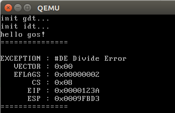
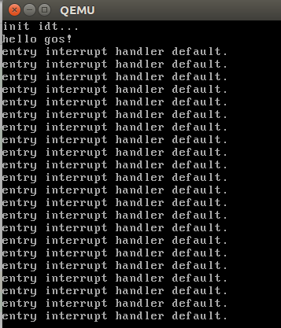

# 1. 编写中断描述符表
在保护模式下我们需要构建中断描述符表来实现中断。我们用汇编语言构建，新建一个 interrupt_handler.asm 的文件，该文件中编写中断描述符表。该中断描述符表包含x86支持的所有中断，见《专题四：中断、中断控制器.md》一文中的表7-1，中断向量号0\~19为不可屏蔽中断，20\~31保留，31\~255为外部可屏蔽中断。

代表实现方式如下：

先用宏实现一个模板：

```asm
%macro INTERRUPT_HANDLER 1
global interrupt_handler_%1
interrupt_handler_%1:
    pushad
    push %1
    call exception_handler
    add esp, 4
    popad
    iret
%endmacro
```

> 关于 %macro 的使用方法参见《专题一：nasm.md》一文中的宏一小节。

上述代码中的 add esp, 4 是为了让 pushad 和 popad 配合使用，因为我们在 pushad 后面多 push 了一个 %1，所以需要在 popad 前先恢复一下栈(即 add esp, 4)。

宏模块写好后，就依次写好中断，如下：

```asm
INTERRUPT_HANDLER 0x00; divide by zero
INTERRUPT_HANDLER 0x01; debug
INTERRUPT_HANDLER 0x02; non maskable interrupt
 ...
INTERRUPT_HANDLER 0x15; Control Protection Exception
INTERRUPT_HANDLER 0x16; reserved
 ...
INTERRUPT_HANDLER 0x1f; reserved
INTERRUPT_HANDLER 0x20; clock 时钟中断
INTERRUPT_HANDLER 0x21; 键盘中断
 ...
INTERRUPT_HANDLER 0x2f
```

这样的话，通过宏模块，就建立了 interrupt_handler_0x00、interrupt_handler_0x01、... interrupt_handler_0x2f 这些中断入口函数。再这些函数定义到一个表中就形成了中断描述符表，如下：

```asm
interrupt_handler_table:
    dd interrupt_handler_0x00
    dd interrupt_handler_0x01
    dd interrupt_handler_0x02
    ...
    dd interrupt_handler_0x2f
```

# 2. 不可屏蔽中断的实现
上一小节中的宏模块中使用到了一个外部函数，即 exception_handler，该函数主要作用是实现 中断向量号0\~19 的中断，其内容如下：

```c
void exception_handler(int idt_index,
                       int edi,
                       int esi,
                       int ebp,
                       int esp,
                       int ebx,
                       int edx,
                       int ecx,
                       int eax,
                       int eip,
                       char cs,
                       int eflags)
{
    printk("\n===============\n");
    printk("EXCEPTION : %s \n", messages[idt_index]);
    printk("   VECTOR : 0x%02X\n", idt_index);
    printk("   EFLAGS : 0x%08X\n", eflags);
    printk("       CS : 0x%02X\n", cs);
    printk("      EIP : 0x%08X\n", eip);
    printk("      ESP : 0x%08X\n", esp);
    printk("===============\n");
    while(1);
}
```

上一小节中我们明明把所有的中断的入口都调用到这个 exception_handler 函数，但这里为什么说只把 0\~19 的中断调用此函数？原因是因为后面我们在初始化 idt 表时会把中断号大于 0x15 的用其它中断服务函数替换掉(下一节会讲到)。

exception_handler 函数的参数顺序就是通过 pushad, push %1 压入的。可以看到 0\~19 中断一旦发生，就会调用exception_handler函数，打印当前一些寄存器信息，然后死循环，直到系统重启。

关于 messages[] 这个数组就是自定义的一个说明性信息，如下：

```c
char *messages[] = {
        "#DE Divide Error\0",
        "#DB RESERVED\0",
        "--  NMI Interrupt\0",
        "#BP Breakpoint\0",
        "#OF Overflow\0",
        "#BR BOUND Range Exceeded\0",
        "#UD Invalid Opcode (Undefined Opcode)\0",
        "#NM Device Not Available (No Math Coprocessor)\0",
        "#DF Double Fault\0",
        "    Coprocessor Segment Overrun (reserved)\0",
        "#TS Invalid TSS\0",
        "#NP Segment Not Present\0",
        "#SS Stack-Segment Fault\0",
        "#GP General Protection\0",
        "#PF Page Fault\0",
        "--  (Intel reserved. Do not use.)\0",
        "#MF x87 FPU Floating-Point Error (Math Fault)\0",
        "#AC Alignment Check\0",
        "#MC Machine Check\0",
        "#XF SIMD Floating-Point Exception\0",
        "#VE Virtualization Exception\0",
        "#CP Control Protection Exception\0",
};
```

# 3. 可屏蔽中断的模板
上一节说到当不可屏蔽中断发生时都会调用 exception_handler 函数，然后程序死在该函数中，直到系统重启，那可屏蔽中断发生时该怎么办？目前还没学习到键盘/时钟中断，所以就先写个可屏蔽中断的模板，让可屏蔽中断发生时都统一调用这个模板，其模板如下：

```asm
extern printk

interrupt_default_entry:
    push default_msg
    call printk
    add esp, 4
    iret

default_msg:
    db "entry interrupt handler default.", 10, 0
```

让 0x15 以后的中断号都指向 interrupt_default_entry 就可以实现发生可屏蔽中断时会在屏幕上打印"entry interrupt handler default."这句话。

下一节就讲述如何初始化 idt，从而实现上述两小节的功能。

# 4. 初始化 IDT 表
使用C语言定义好idt的结构(可以参考专题三：C语言接管GDT表.md)，如下：

```c
typedef struct {
    short offset0;                      //段内偏移0~15位
    short selector;                     //代码段选择子
    char reserved;                      //保留
    char type : 4;                      //任务门，中断门，陷阱门
    char segment : 1;                   //为0时表示系统段
    char dpl : 2;                       //使用int指令访问的最低权限
    char present : 1;                   //存在位
    short offset1;                      //段内偏移16~31位
} __attribute__((packed)) interrupt_gate_t;
```

然后在对应的 idt.c 文件中定义一张idt表，如下:

```c
#define INTERRUPT_TABLE_SIZE 256
interrupt_gate_t idt[INTERRUPT_TABLE_SIZE] = {0};
xdt_ptr_t idt_ptr;
```

接下来就是初始化这个有INTERRUPT_TABLE_SIZE个元素的 idt 表。

```c
void idt_init(void)
{
    printk("init idt...\n");

    interrupt_gate_t *item = NULL;
    int handler;

    for (int index = 0; index < INTERRUPT_TABLE_SIZE; ++index) {
        item = (interrupt_gate_t *)&idt[index];
        if (index <= 0x15) {
            //不可屏蔽中断
            handler = (int)interrupt_handler_table[index];
        } else {
            //可屏蔽中断
            handler = (int) interrupt_default_entry;
        }

        item->offset0 = handler & 0xffff;
        item->offset1 = (handler >> 16) & 0xffff;
        item->selector = 1 << 3;     //代码段
        item->reserved = 0;
        item->type = 0b1110;        //中断门
        item->segment = 0;          //系统段
        item->dpl = 0;              //内核态
        item->present = 1;           //有效
    }

    idt_ptr.base = (int)idt;
    idt_ptr.limit = sizeof(idt) - 1;

    __asm__("lidt idt_ptr;");
}
```
interrupt_handler_table 这个表可以在第1小节中看到，interrupt_handler_table 中存放到的就是 interrupt_handler_0x00、interrupt_handler_0x01、... interrupt_handler_0x2f 函数的入口地址，这些函数最终又会调用 exception_handler() 函数。 我们把向量号小于等于0x15的中断入口地址都用 interrupt_handler_table 表中的中断函数注册，这样不可屏蔽中断都会调用到 exception_handler() 函数；然后把大于 0x15 的向量号用 interrupt_default_entry 注册，这样可屏蔽中断最终都会调用到 interrupt_default_entry 这个函数，从而打印 "entry interrupt handler default."这句话。

# 5. 测试不可屏蔽中断
上述4个小节的内容完成后，就可以在主函数中使用一个除0的异常引发不可屏蔽中断。如下：

```c
void kernel_main(void)
{
    console_init();
    gdt_init();
    idt_init();

    printk("hello gos!\n");
    int i = 1/0;
    while (1);
}
```



# 6. 初始化中断控制芯片
这里说的中断控制芯片就是8259A，初始化8259A的过程就放在进入main()前的一刻进行，即放在 head.asm 汇编文件中，如下：

```asm
_start:
;配置8259a芯片，响应中断用
.config_8259a:
    ;向主片发送ICW1
    mov al, 11h
    out 20h, al
    ;向从片发送ICW1
    out 0a0h, al

    ;向主片发送ICW2
    mov al, 20h
    out 21h, al
    ;向从片发送ICW2
    mov al, 28h
    out 0a1h, al

    ;向主片发送ICW3
    mov al, 04h
    out 21h, al
    ;向从片发送ICW3
    mov al, 02h
    out 0a1h, al

    ;向主片发送ICW4
    mov al, 03h
    out 21h, al
    ;向从片发送ICW4
    out 0a1h, al

    ;向主片发送OCW1，只接收键盘中断
.enable_8259a_master:
    mov al, 1111_1101b
    out 21h, al

    ;向从片发送OCW1，屏蔽从片所有中断响应
.disable_8259a_slave:
    mov al, 1111_1111b
    out 0a1h, al

.enter_c_world:
    xchg bx, bx
    call kernel_main
    jmp $
```

至于上述8259A的初始化的数字都代表的什么含义请参考《专题四：中断、中断控制器.md》一文。

# 7. 测试可屏蔽中断
在第6小节中初始化了中断控制芯片，这时就可以对外部的可屏蔽中断进行管理，我们关注一下 .enable_8259a_master 这个标号，mov al, 1111_1101b 中的最后两位，bit0为1代表开启时钟中断，bit1为1代表开启键盘中断。比如：

```asm
    ;向主片发送OCW1，接收键盘和时钟中断
.enable_8259a_master:
    mov al, 1111_1100b
    out 21h, al
```

然后我们在主函数中允许接收中断：

```c
void kernel_main(void)
{
    console_init();
    gdt_init();
    idt_init();

    printk("hello gos!\n");
    __asm__("sti;");
    while (1);
}
```

这样屏幕就会周期性打印，如下图：



完整的工程代码 sha:62655226 (接管BIOS中断)