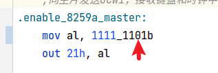
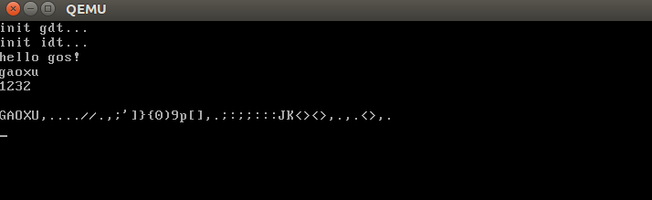

该笔记是在承接上一篇笔记《01.接管BIOS中断.md》。

# 1.打开键盘中断使能
在 head.asm 中打开键盘中断使能，才可以使用键盘中断，如下图：



# 2.实现键盘中断入口函数
在 interrupt_handler.asm 文件中添加键盘中断入口函数，代码如下：

```asm
extern keymap_handler
global keymap_handler_entry

keymap_handler_entry:
    push 0x21
    call keymap_handler
    add esp, 4
    iret
```

键盘中断处理函数入口为 keymap_handler_entry，而真正处理键盘中断的工作为函数 keymap_handler。add esp, 4 这行代码之前已解释过了，这里再说下，进入中断 CPU 会自动帮我们压栈一堆寄存器，然后我们需要手动使用 iret 来返回，但在 iret 之前我们又 push 了 0x21，相当于破坏了进入中断时的栈结构，所以我们需要手动 add esp, 4 把栈恢复一下，以便于配合使用 iret。

# 3.实现键盘中断处理函数
这里的键盘中断处理函数，即 keymap_handler。代码中新建了一个文件叫 keyboard.c 文件，这里面是实现了键盘驱动，这里没有研究的必要，日后需要做键盘驱动了再研究不迟。现在直接用即可。

# 4.在 idt 表中注册键盘中断入口函数
键盘中断号为 0x21，所以我们需要单独把 0x21 注册为 keymap_handler_entry。idt.c文件中代码如下：

```c
    for (int index = 0; index < INTERRUPT_TABLE_SIZE; ++index) {
        item = (interrupt_gate_t *)&idt[index];
        if (index <= 0x15) {
            //不可屏蔽中断
            handler = (int)interrupt_handler_table[index];
        } else {
            //可屏蔽中断
            handler = (int)interrupt_default_entry;
        }

        //键盘中断
        if (index == 0x21) {
            handler = (int)keymap_handler_entry;
        }

        item->offset0 = handler & 0xffff;
        item->offset1 = (handler >> 16) & 0xffff;
        item->selector = 1 << 3;     //代码段
        item->reserved = 0;
        item->type = 0b1110;        //中断门
        item->segment = 0;          //系统段
        item->dpl = 0;              //内核态
        item->present = 1;           //有效
    }
```

# 5.效果展示


完整的工程代码 sha:57eadce2 (支持键盘中断处理，键盘输入，屏幕输出)