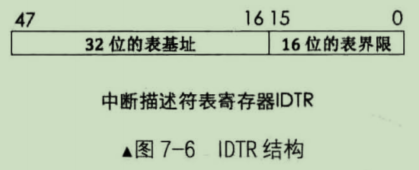

本篇内容参考《操作系统真象还原》书中的第7章——中断(7.4小节)

# 中断描述符表 IDT
中断描述符表(Interrupt Descriptor Table, IDT)是保护模式下用于存储中断处理程序入口的表，当CPU接收一个中断时，需要用中断向量在此表中检索对应的描述符，在该描述符中找到中断处理程序的起始地址，然后执行中断处理程序。

IGT里面保存的是各种"门"，用门来表示一段程序的入口。段描述符中描述的是一片内存区域，而门描述符描述的是一段代码。所有的描述符都是8个字节，而门也是描述符。

描述符高4字节的第8~12位是type字段，是用来表述描述符的类型的，第12位是S位，用来表示系统段或非系统段，S=0时表示系统段，S=1是表示非系统段。type字段要和S字段配合一起才能确定段描述符的确切类型。(描述符结构请参考《专题二的"段选择子、段描述符、GDT LDT表.md"》一文)。

以下是4种门的描述符结构：


门描述符中的各属性位与段描述符中的属性意义相同，以下只讨论32位保护模式：

- 任务门
  - 任务门和任务状态段(Task Status Segment, TSS)是Inter处理器在硬件一级提供的任务切换机制。所以任务门需要和TSS配合在一起使用，在任务门中记录的是TSS选择子，偏移量未使用。任务门可以存在于全局描述符表GDT、局部描述符表LDT、中断描述符表IDT中。描述符中任务门的type值为二进制0101。by the way，大多数操作系统(包括Linux)都未用TSS实现任务切换，这里就不讨论了。
- 中断门
  - 中断门包含了中断处理程序所在段的段选择子和段内偏移地址。当通过此方式进入中断后，标志寄存器eflags中的IF位自动置0，也就是在进入中断后，自动把中断关闭，避免中断嵌套。Linux就是利用中断门实现的系统调用，就是那个著名的 int 0x80。中断门只允许存在于IDT中。描述符中中断门的type值为二进制1110。
- 陷阱门
  - 陷阱门和中断门非常相似，区别是由陷阱门进入中断后，标志寄存器eflags中的IF位不会自动置0，陷阱门只允许存在于IDT中。描述符中陷阱门的type值为二进制1111。
- 调用门
  - 调用门是提供给用户进程进入特权0级的方式，其DPL=3。调用门中记录例程的地址，它不能用 int 指令调用，只能用 call 和 jmp 指令。调用门可以安装在GDT和LDT中，不允许存在于IDT中。其type值为二进制1100。

> 现代操作系统为了简化开发、提升性能和移植性等原因，很少用到调用门和任务门。重点关注中断门。

中断向量相当于子弹，门描述符相当于靶子，中断描述符表相当于狙击手。

还记得低端1MB内存布局吗？位于地址0~0x3ff的是中断向量表IVT，它是实模式下用于存储中断处理程序入口的表。已知0~0x3ff共1024个字节，又知IVT可容纳256个中断向量，所以每个中断向量用4个字节描述。

对于中断向量表，中断描述符表有两个区别：

(1) 中断描述符表地址不限制，在哪里都可以
(2) 中断描述符表中的每个描述符用8字节描述

既然IDT的位置不固定，当中断发生时，CPU是如何找到它的呢？这里就用到了IDTR寄存器，同GDTR原理一样，其结构也是一样的，IDTR寄存器结构如下：



之前说过GDT表中的第0个段描述符不可用，但对于IDT没有这个限制，默认IDT的第0个门描述符是除法错误。同加载GDTR一样，加载IDTR也有专门指令——lidt。在48位内存数据中，前16位是IDT表界限，后32位是IDT线性基地址。

# 中断处理过程及保护
从中断发生到中断处理的过程，该过程中涉及到特权级检查，也就是保护。完整的中断过程分为CPU外和CPU内两部分。

- CPU外：外部设备的中断由中断代理芯片接收，处理后将该中断的中断向量号发送给CPU
- CPU内：CPU执行该中断向量号对应的中断处理程序

关于中断代理芯片参考本专题的《中断、中断控制器.md》一文。本节只讨论CPU内的过程。

- (1) 处理器根据中断向量号定位中断门描述符。由于中断描述符是8个字节，所以处理器用中断向量号乘以8后，再与IDTR中的中断描述符表地址相加，所求的地址之和便是该中断向量号对应的中断描述符。
- (2) 处理器进行特权级检查。
  - （a）如果是由软中断 int n、int3 和 into 引发的中断，这些是用户进程中主动发起的中断，由用户代码控制，处理器要检查当前特权级CPL和门描述符DPL，这是检查进门的特权下限，如果CPL权限大于等于DPL，即数值上**CPL<=门描述符DPL**，特权级"门槛"检查通过，进入下一步"门框"检查。否则，处理器抛出异常。
  - （b）这一步检查特权级上限(门框)：处理器要检查当前特权级CPL和门描述符中所记录的选择子对应的目标代码段DPL，如果CPL权限小于目标代码段DPL，即数值上**CPL>目标代码段DPL**，检查通过。否则处理器引发异常。
- (3) 执行中断处理程序。将门描述符目标代码段选择子加载到代码段寄存器CS中，把门描述符中中断处理程序的偏移地址加载到EIP，开始执行中断处理程序。

其过程如下图：


# 中断发生时的压栈
> 只讨论32位保护模式下的中断情况。

## 进入中断的过程

- 特权级变化时新栈中的内容

(1) 处理器根据中断向量号找到对应的中断描述符后，拿CPL和中断门描述符中选择子对应的目标代码段的DPL对比，若CPL>DPL，这表示要向高特权级转移，需要切换到高特权级的栈。这也意味着当执行完中断处理程序后，若要正确返回到当前被中断的进程，需要将栈恢复为此时的旧栈。于是处理器先临时保存当前旧栈SS和ESP的值，记作SS_old和ESP_old，然后在TSS中找到同目标代码段DPL级别相同的栈加载到寄存器SS和ESP中，记作SS_new和ESP_new，再将之前临时保存的SS_old和ESP_old压入新栈备份，以备返回时重新加载到栈段寄存器SS和栈指针ESP。由于SS_old是16位数据，32位模式下的栈操作数是32位，所以将SS_old用0扩展其高16位，成为32位数据后入栈。此时新栈内容如图7-8中的A所示。

(2) 在新栈中压入EFLAGS寄存器，新栈内容如图7-8中B所示。

(3) 由于要切换到目标代码段，对于这种段间转换，要将CS和EIP保存到当前栈中备份，记作CS_old和EIP_old，以便中断程序执行结束后能恢复到被中断的进程。同样CS_old是16位数，高位用0扩展后入栈。此时新栈内容如图7-8中C所示。当前栈是新栈还是旧栈，取决于第(1)步中是否涉及到特权级转换。

(4) 某此异常会有错误码，此错误码用于报告异常是在哪个段上发生的，也就是异常发生的位置，所以错误码中包含选择子等信息，下一小节讲。错误码会紧跟在EIP之后入栈，记作ERROR_CODE。此时新栈内容如图7-8中D所示。


- 无特权级变化时栈中的内容

如果第(1)步中判断未涉及到特权级转换，便不会到TSS中寻找新栈，而是继续用当前旧栈，因此也谈不上恢复旧栈，此时中断发生时栈中数据不包括SS_old和ESP_old。比如中断发生时当前正在运行的是内核程序，这是0特权级到0特权级，无特权级变化，如图7-9所示。


处理器进入中断执行完中断处理程序后，还要返回到被中断的进程，这是进入中断的逆过程。中断返回是用 iret 指令实现的，该指令不检查栈中数据的正确性，它只负责把栈顶往上的数据，每次4字节，对号入座弹出到相关寄存器，所以我们一定要保存我们的压栈顺序是:

```
EFLAGS      高地址
CS  
EIP         低地址
```

如果涉及到特权级变化，则压栈顺序是：

```
SS          高地址
ESP
EFLAGS
CS
EIP         低地址
```

> 注意，如果中断有错误码，处理器并不会主动跳过它的位置，需要我们手动将其跳过。

## 中断返回的过程
处理器并不记得自己进入过中断处理程序，所以为了安全起见，处理器在返回到被中断过程中也要进行一次特权级检查。假设此时已经手动将ERROR_CODE从栈中弹出，栈顶已位于正确的位置，即指向EIP_old。

(1) 当处理器执行到iret指令时，它知道要执行远返回，首先需要从栈中返回被中断进程的代码段选择子CS_old及指令指针EIP_old。这时候它要进行特权级检查。先检查栈中CS选择子CS_old，根据其RPL位，即未来的CPL，判断在返回过程中是否要改变特权级。

(2) 栈中CS选择子是CS_old，根据CS_old对应的代码段的DPL及CS_old中的RPL做特权级检查。如果检查通过，随即需要更新寄存器CS和EIP。将CS_old和EIP_old加载到CS和EIP寄存器，之后栈指针指向EFLAGS。如果进入中断时未涉及特权级转移，此时栈指针是ESP_old(说明在之前进入中断后，是继续使用旧栈)。否则栈指针是ESP_new。

(3) 将栈中保存的EFLAGS弹出到标志寄存器EFLAGS。

(4) 如果在第(1)步中判断出返回时需要改变特权级，也就是说需要恢复旧栈，此时便需要将ESP_old和SS_old分别加载到寄存器ESP及SS，丢弃寄存器SS和ESP中原有的SS_new和ESP_new，同时进行特权级检查。

注意：如果在返回时需要改变特权级，将会检查数据寄存器DS, ES, FS 和 GS 的内容，如果在它们之中，某个寄存器中选择子所指向的数据段描述符的DPL权限比返回后的CPL高，处理器将把数值0填充到相应的段寄存器，原理是选择子0指向GDT中第0个段描述符，该段描述符不可用，从而故意使处理器抛出异常。

# 中断错误码
有些中断会在栈中压入错误码，有点"临终遗言，提供线索"的意味，用来指明中断发生在哪个段上。所以，错误码最主要的部分就是选择子，只不过此选择子可以在多种表中检索描述符。错误码由几部分组成，其格式如下：


- EXT 表示EXTernal event，即外部事件，用来指明中断源是否来自处理器外部，如果中断源是不可屏蔽中断NMI或外部设备，EXT为1，否则为0.
- IDT 表示选择子是否指向中断描述符表IDT，IDT位为1则表示此选择子指向中断描述符表，否则指向全局描述符表GDT或局部描述符表LDT
- TI 和选择子的TI是一个意思，为0表示选择子从GDT中检索，为1表示从LDT中检索
- 选择子高13位索引 就是选择子中用来在表中索引描述符用的下标
  
有时候错误码这32位全0，那一个全0的错误码能指明什么信息？当全0出现时，表示中断的发生与特定的段无关，或者引用了一个空描述符，引用描述符就是往段寄存器中加载选择子的时候，处理器发现选择子指向的描述符是空的。

通常能够压入错误码的中断属于中断向量号在0~32之内的异常，而外部中断(中断向量号在32~255之间)和 int 软中断并不会产生错误码。通常我们并不用处理错误码。


