本篇内容参考《操作系统真象还原》书中的第7章——中断

# 中断
把中断按事件来源分类，来自CPU外部的中断就称为**外部中断**，来自CPU内部的中断称为**内部中断**。其实还可以再细分，外部中断按是否导致宕机来划分，可分为**可屏蔽中断**和**不可屏蔽中断**，而内部中断按是否正常来划分，可分为**软中断**和**异常**。

## 外部中断
CPU为我们提供了两条信号线。外部硬件的中断是通过两根信号线通知CPU的，这两根信号线就是INTR(INTeRrupt)和NMI(Non Maskable Interrupt)。示意图如下：

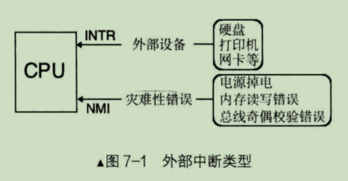

> 注意：本篇内容仅基于单核CPU讨论的。

CPU收到中断后，得知道发生了什么事情才能执行相应的处理办法。这是通过中断向量表或中断描述符表(中断向量表是实模式下的中断处理程序数组，在保护模式下已经被中断描述符表代替)来实现的，首先为每一种中断分配一个中断向量号，中断向量号就是一个整数，它就是中断向量表或中断描述符表中的索引下标，用来索引中断项。中断发起时，相应的中断向量号通过NMI或INTR引脚被传入CPU，中断向量号是中断向量表或中断描述符表里中断项的下标，CPU根据此中断向量号在中断向量表或中断描述符表中检索对应的中断处理程序并去执行。

## 内部中断
内部中断可分为软中断和异常。软中断就是由软件主动发起的中断，因为它来自于软件，所以称为软中断。由于该中断是软件运行中主动发起的，所以它是主观上的，并不是客观上的某种内部错误。

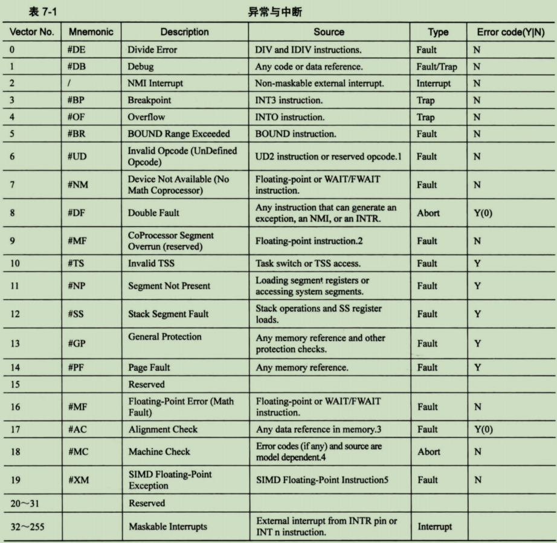

上表中Error code字段中，如果值是Y，表示相应中断会由CPU压入错误码。上表中的第一列的Vector No.就是中断向量号，其值范围0~255。

中断机制的本质是来了一个中断信号后，调用相应的中断处理程序。所以，CPU不管有多少种类型的中断，为了统一中断管理，把来自外部设备、内部指令的各种中断类型统一归结为一种管理方式，即为每个中断信号分配一个整数，用此整数作为中断的ID，而这个整数就是所谓的中断向量，然后用此ID作为中断描述符表中的索引，这样就能找到对应的表项，进而从中找到对应的中断处理程序。

中断向量的作用和选择子类似，它们都用来描述符表中索引一个描述符，只不过选择子用来在GDT或LDT中检索段描述符，而中断向量专用于中断描述符表，其中没有PRL字段。

异常和不可屏蔽中断的中断向量号是由CPU自动提供的，而来自外部设备的可屏蔽中断号是由中断代理提供的(咱们这里的中断代理就是中断控制芯片8259A)，软中断是由软件提供的。

# 可编程中断控制器8259A
8259A的作用是负责所有来自外设的中断，其中就包括来自时钟的中断，以后我们要通过它完成进程调度。

## 8259A介绍
前面提到过，可屏蔽中断通过INTR信号线进入CPU的，所有的可屏蔽中断都共用INTR这一根信号线，但任务是串行在CPU上执行的，同时有多个外设发出中断，到底先执行谁？还有，为了不使中断丢失，是不是还要维护一个中断队列？这此事让CPU来作用点大材小用，所以聘用了一个中断代理，由中断代理来负责对中断进行仲裁。而Intel 8259A芯片就是中断代理。

8259A用于管理和控制可屏蔽中断，它表现在屏蔽外设中断，对它们实行优先级判决，向CPU提供中断向量号等功能。

Intel处理器共支持256个中断，但8259A只可以管理8个中断，所以为了解决可以管理超过8个中断，就产生了8259A级联。8259A最多可以级联9个，也就是最多支持管理64个中断。n片8259A通过级联可运行7n+1个中断源，级联时只能有一片8259A为主片master，其余的均为从片slave。来自从片的中断只能传递给主片，再由主片向上传递给CPU，也就是说只有主片才会向CPU发送INT中断信号。

二级级联下的8259A与CPU的关系如下图：

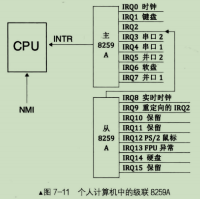

8259A芯片的内部结构大致如下：

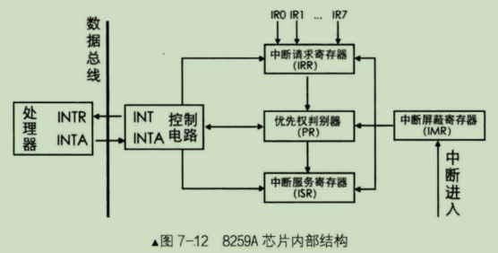

- INT: 8259A选出优先级最高的中断请求后，发信号通知CPU
- INTA: INT Acknowledge，中断响应信号。位于8259A中的INTA接收来自CPU的INTA接口的中断响应信号
- IMR: Interrupt Mask Register，中断屏蔽寄存器，宽度是8位，用来屏蔽某个外设的中断；为1表示中断屏蔽，为0表示中断放行。每个bit控制一路IRQ
- IRR: Interrupt Request Register, 中断请求寄存器，宽度是8位。它的作用是接受经过IMR寄存器过滤后的中断信号并锁存，此寄存器中全是等待处理的中断，"中当于"8259A维护的未处理的中断信号队列
- PR: Priority Resolver, 优先级仲裁器。当有多个中断同时发生，或当有新的中断请求进来时，将它与当前正在处理的中断进行比较，找出优先级更高的中断
- ISR: In-Service Register，中断服务寄存器，宽度是8位。当某个中断正在被处理时，保存在此寄存器中。

8259A收到中断后的流程：

当某个外设发出一个中断信号后，这个信号会送到8259A芯片的某个IRQ接口。8259A会首先检查IMR寄存器中是否已屏蔽了来自该IRQ接口的中断信号。如果该IRQ对应的IMR寄存器位置1，则丢弃该中断信号，否则，将其送入IRR寄存器，将该IRQ接口所在IRR害存器对应的bit置1。在某个恰当时机，优先级仲裁器PR会从IRR寄存器中挑选一个优先级最高的中断，此处的优先级决判很简单，就是IRQ接口号越低，优先级越大，所以IRQ0优先级最大。之后，8259A会在控制电路中，通过INT接口向CPU发送INTR信号。信号被送入了CPU的INTR接口后，这样CPU就知道有新的中断到来了，于是CPU将手里的指令执行完后，马上通过自己的INTA接口向8259A的INTA接口回复一个中断响应信号，表示现在CPU已准备好了，8259A可以继续后面的工作了。8259A在收到这个信号后，立即将刚才选出来的优先级最高的中断在ISR寄存器中对应的bit置1，表示当前正在处理中断，同时将该中断从"待处理中断队列"寄存器IRR中去掉(对应bit置0)。之后，CPU将再次发送INTA信号给8259A，这一次是想获取中断对应的中断向量号。由于大部分情况下8259A的起始中断向量号并不是0，所以用起始中断向量号+IRQ接口号便是该设备的中断向量号，由此可见，外部设备虽然会发中断号，但它并不知道还有中断向量号这回事，不知道自己会被中断代理分配一个这样的整数。随后，8259A将此中断向量号通过系统数据总线发送给CPU。CPU拿到中断向量号后去索引中断服务程序。

如果8259A的"EOI通知(End Of Interrupt)"若被设置为非自动模式，中断处理程序结束处必须有向8259A发送EOI的代码，8259A在收到EOI后，将当前正处理的中断在ISR寄存器中对应的bit置0。如果"EOI通知"被设置为自动模式，则不需要我们程序员发送EOI。

## 8259A的编程
在8259A内部有两组寄存器，一组是初始化命令寄存器，用来保存初始化命令字(Initialization Command Words, ICW)，ICW共4个，ICW1\~ICW4。另一组寄存器是操作命令寄存器组，用来保存操作命令字(Operation Command Word, OCW), OCW共3个，OCW1\~OCW3。

- 一部分是用ICW做初始化，用来确定是否需要级联，设置起始中断向量号，设置中断结束模式。其编程就是往8259A的端口发送一系列ICW。由于从一开始就要决定8259A的工作状态，所以要一次性写入很多设置，某此设置之间是具有关联、依赖性的，也许后面的某个设置会依赖前面某个ICW写入的设置，所以这部分要严格的顺序，必须依次写入ICW1, ICW2, ICW3, ICW4。
- 另一部分是用OCW来操作控制8259A，前面所说的中断屏蔽和中断结束，就是通过往8259A端口发送OCW实现的。OCW的发送顺序是不固定的，3个之中先发送哪个都可以。

先来看下ICW：

（1）ICW1用来初始化8259A的连接方式(单片还是级联)和中断信号的触发方式(电平还是边沿); **注意，ICW1需要写入到主片的0x20端口和从片的0xA0端口。**

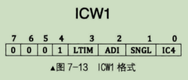

- IC4: 表示是否要写入ICW4，这表示并不是所有的ICW初始化控制字都需要用到。IC4为1时表示在后面写入ICW4，为0则不需要。注意，x86系统IC4必须为1.
- SNGL: 表示single,若为1表示单片，为0表示级联
- ADI: 表示call address interval，用来设置8085的调用时间间隔，x86不用设置
- LTIM: 表示level/edge triggered mode，用来设置触发方式。为0表示边沿触发，为1表示电平触发

（2）ICW2用来设置起始中断向量号，就是硬件IRQ接口到逻辑中断向量号的映射。由于每个8259A芯片上的IRQ接口是顺序排列的，所以咱们这里的设置是指定IRQ0映射到的中断向量号，其它IRQ接口对应的中断向量号会顺着自动排列下去。**注意，ICW2需要写入到主片的0x21端口和从片的0xA1端口。**

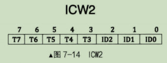

由于只需要设置IRQ0的中断向量号，IRQ1\~IRQ7的中断向量号是IRQ0的顺延，所以我们只负责填写高5位T3\~T7，ID0\~ID2这低3位不用负责。由于咱们只填写高5位，所以任意数字都是8的倍数，这个数字便是设定的起始中断向量号。

（3）ICW3仅在级联的方式下才需要，用来设置主片和从片用哪个IRQ接口互连。**注意，ICW3需要写入主片的0x21及从片的0xA1端口。**

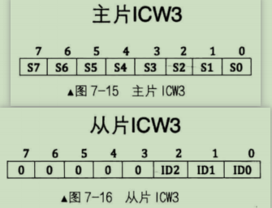

对于主片，ICW3中置1的那一位对应的IRQ接口用于连接从片，若为0则表示接外部设备。比如若主片IRQ2和IRQ5都接有从片，则主片的ICW3为0b00100100。

对于从片，要设置与主片8259A的连接方式，"不需要"指定自己的哪个IRQ接口与主片连接。比如主片用IRQ2接口连接从片A，用IRQ5接口连接从片B，从片A的ICW3的值就应该设为0b00000010，从片B的ICW3的值应该设为0b00000101。

（4）ICW4有些低位的选项基于高位，所以从高位介绍。

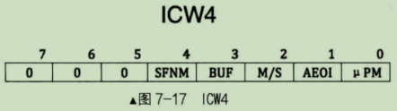

第7\~5位未定义，直接置0。

- SFNM 表示特殊全嵌套模式(Special Fully Nested Mode)，若为0则表示全嵌套模式，若为1，表示特殊全嵌套模式。
- BUF 表示本8259A芯片是否工作在缓冲模式，若为0则工作非缓冲模式，为1表示工作在缓冲模式；当多个8259A级联时，如果工作在缓冲模式下，M/S用来规定本8259A是主片还是从片。若M/S为1则表示是主片，若M/S为0则表示是从片。若工作在非缓冲模式，M/S无效。
- AEOI 表示自动结束中断(Auto End Of Interrupt)，8259A在收到中断结束信号时才能继续处理下一个中断，此项用来设置是否要让8259A自动把中断结束。若为0则表示非自动，即手动结束中断，咱们可以在中断处理程序中或主函数中手动向8259A的主、从片发送EOI信号。这种"操作"类命令，通过下面介绍的OCW进行。或AEOI为1表示自动结束中断。
- uPM 表示微处理器类型，此项是为了兼容老处理器。若为0表示8080或8085处理器，若为1表示x86处理器。

再来看下OCW：

（1）OCW1用来屏蔽连接在8259A上的外部设备的中断信号，实际上就是OCW1写入了IMR寄存器。这时的屏蔽是说是否把来自外部设备的中断信号转发给CPU。由于外部设备的中断都是可屏蔽中断，所以最终还是要受标志寄存器eflags中的IF位的管束，若IF为0，可屏蔽中断全部被屏蔽。**注意，OCW1要写入主片的0x21或从片的0xA1端口**

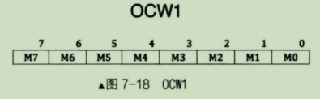

M0\~M7对应8259A的IRQ0\~IRQ7，某位为1，对应的IRQ上的中断信号就被屏蔽了。否则某位为0的话，对应的IRQ中断信号则被放行。

（2）OCW2用来设置中断结束方式和优先级模式。**注意，OCW2要写入到主片的0x20及从片的0xA0端口。**

OCW2的配置比较复杂，各种属性位要配合在一起，组合出8259A的各种工作模式。

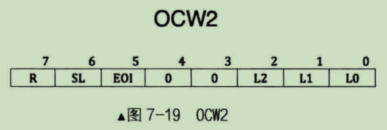

在OCW2中比较灵活的是有个开关位：SL，可以针对某个特定优先级的中断进行操作，以下的优先级模式设置和中断结束都可以基于此开关做细粒度的控制。

OCW2其中一个作用就是发EOI信号结束中断。如果使SL为1，可以用OCW2的低3位(L2\~L0)来指定位于ISR寄存器中的哪一个中断被终止，也就是结束来自哪个IRQ接口的中断信号。如果SL位为0，L2\~L0便不起作用了，8259A会自动将正在处理的中断结束，也就是把ISR寄存中优先级最高的位清0。

OCW2另一个作用就是设置优先级控制方式，这是用R位来设置的。

为表述方便，IRQ各个接口在此被表述为"IR数字"的形式，这也是微机接口中的命名规则。

如果R=0，表示固定优先级方式，即IRQ接口号越低，优先级越高。

如果R=1，表示用循环优先级方式，这样优先级会在0\~7内循环。如果SL=0，初始的优先级次充为 IR0>IR1>IR2>IR3>IR4>IR5>IR6>IR7。当某级别的中断被处理完成后，它的优先级别将变成最低，将最高优先级传给之前较之低一级别的中断请求，其他依次类推。所以，可循环方式多用于各中断源优先级相同的情况，优先级通过这种循环可以实现轮询处理。该循环可总结为如果IR(i)优先级最低，IR(i+1)则优先级最高。其优先级关系如下图：

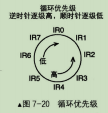

在上图中，顺时针方向的优先级是逐级减小，反之逆时针方向的优先级逐渐增大。比如，当前IR3为最高级别中断请求，处理完成后，IR3将变成最低级别，IR4变成最高级别，这一级循环之后的优先级就变成了：IR4>IR5>IR6>IR7>IR0>IR1>IR2>IR3

另外，还可以打开SL开关，使SL=1，再通过L2\~L0指定最低优先级是哪个IRQ接口。比如，在R,SL都等于1时，若想指定IR5为最低的优先级，需要要将L2\~L0置为101，这样，参看图7-20，新的初始优先级循环是：IR6>IR7>IR0>IR1>IR2>IR3>IR4>IR5

以上就是OCW2的原理，各字段属性含义如下：

- R, Rotation，表示是否按照循环方式设置中断优先级。R=1表示优先级自动循环，R=0表示不自动循环，采用固定优先级方式
- SL, Specific Level，表示是否指定优先等级。等级是用低3位来指定的。此处的SL只是开启低3位的开关，所以SL=1表示低3位有效，SL=0表示低3位无效
- EOI, End Of Interrupt，为中断结束命令位。令EOI为1则会令ISR寄存器中相应位清0，也就是将当前中断清掉，表示处理结束。向8259A主动发送EOI是手工结束中断的做法，所以，使用此命令前提是ICW4的AEOI位为0; 值得注意的是，如果中断来自主片，只需要向主片发送EOI就行了，如果中断来自从片，除了向从片发送EOI以外，还要再向主片发送EOI
- L2\~L0用来确定优先级的编码，这里分两种，一种用于EOI时，表示中断的优先级别，另一种用于优先级循环时，指定起始最低优先级别。

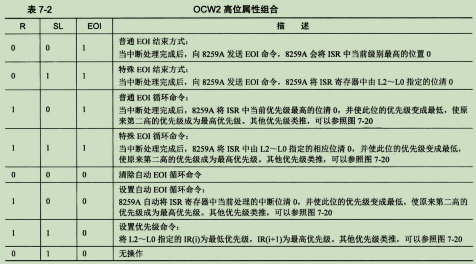

（3）OCW3用来设定特殊屏蔽方式及查询方式，**注意，OCW3要写入主片的0x20端口或从片的0xA0端口。**

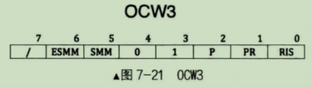

- 第7位未用到；
- 第6位ESMM(Enable Special Mask Mode)和第5位SMM(Special Mask Mode)是组合在一起用的，用来启用或禁用特殊屏蔽模式。ESMM是特殊屏蔽模式允许位，是个开关。SMM是特殊屏蔽模式位。只有在启用特殊屏蔽模式时，特殊屏蔽模式才有效。也就是若ESMM为0，则SMM无效。若ESMM为1，SMM为0，表示未工作在特殊屏蔽模式。若ESMM和SMM都为1，这才正式工作在特殊屏蔽模式下。
- 第3到4位01是OCW3的标识，8259A通过这两位来判断是哪个控制字
- P，Poll command，查询命令，当P为1时，设置8259A为中断查询方式，这样就可通过读取寄存器，如IRS，来查看当前中断处理情况
- RR, Read Register，读取寄存器命令，它和RIS位是配合在一起使用的。当RR为1时才可以读取寄存器。
- RIS，Read Interrupt register Select, 读取中断寄存器选择位。若RIS=1，表示选择ISR寄存器，或RIS=0，表示选择IRR寄存器。前提都是RR为1

8259A就2个端口地址，它是如何识别4个ICW和3个OCW？

ICW1和OCW2、OCW3是用偶地址端口0x20（主片）或0xA0(从片)写入；ICW2\~ICW4、OCW1是用奇地址端口0x21（主片）或0xA1(从片)写入；

以上 ICW 要保证一定的次序写入，所以 8259A 就知道写入端口的数据是什么了。ocw 的写入与顺序无关，并且 ICW1，OCW2, OCW3 的写入端口是一致的，那 8259A 怎样来辨识它们呢？又是自问自答，其实就是各控制字中的第4\~3标识位，通过这两位的组合来唯一确定某个控制字，见表 7-3

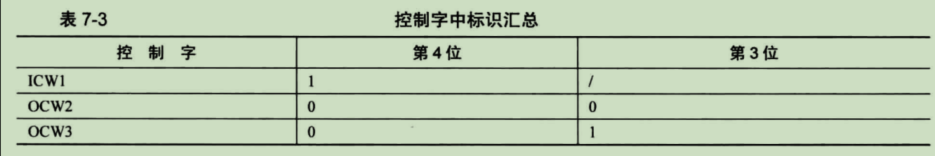

OCW1 是怎样确定的呢？ ocw 是在初始化之后才有效的，所以在初始化之后写入奇地址端口的数据便被认为是 OCW1。8259A 的编程就是写入 ICW和ocw，下面总结下写入的步骤。

对于 8259A 的初始化必须最先完成，步骤是：
- 无论 8259A 是否级联， ICW1和ICW2 是必须要有的，并且要顺序写入。
- 只有当 ICW1 中的 SNGL 位为0时，这表示级联，级联就需要设置主片和从片，这才需要在主片和从片中各写入 ICW3. 注意， ICW3 的格式在主片和从片中是不同的
- 只能当 ICW1 中的 IC4为1时，才需要写入 ICW4 。不过， x86 系统 IC4 必须为1

总结再总结，在 x86 系统中，对于初始化级联 8259A, 4个ICW 都需要，初始化单片 8259A, ICW3 不要，其余全要

在以上初始化 8259A 之后才可以用 ocw 对它操作。

